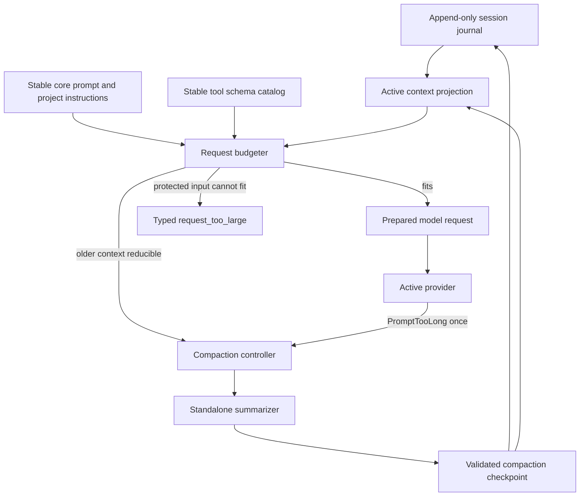

# Bounded Pi Context and Model-Backed Compaction

## Goal Capsule

- **Objective:** Replace Pi's local transcript flattening with model-backed compaction adapted from upstream Pi, and make every normal provider request pass through a measurable, bounded context projection so the agent no longer sends unnecessarily large messages.
- **Authority order:** User decisions in this plan, repository safety and proof contracts, current Pi documentation, then implementation convenience.
- **Execution profile:** Characterization-first from clean `main` at `f045706c`. Add request and persistence probes before changing behavior, preserve the newly landed DeepSeek/local provider and simulator work, then land small units in dependency order.
- **Stop conditions:** Stop before a provider call if mandatory instructions, the current user request, an unresolved tool pair, or active proof input cannot fit safely. Edit baselines, approval state, and proof receipts remain exact in host-owned state and do not need to enter the provider request. Never silently truncate or summarize protected provider inputs.
- **Tail ownership:** The implementation owns code, schema-version cutover, provider cassettes, full-flow simulator coverage, user documentation, formatting, focused Pi gates, and the full repository verification gate.

---

## Product Contract

### Summary

Pi will maintain an append-only, auditable session journal while deriving a smaller active model view from it. A request budgeter will account for the real system prompt, tools, retained messages, transient text, framing allowance, and response reserve before every provider request. It will reduce the stable fixed prefix, use retrieval-backed bounded tool results, compact older context when needed, and reject any request that still cannot fit without losing authoritative information.

Compaction will follow upstream Pi's useful semantics: keep recent work, summarize older work with the active model, use a fixed structured summary, preserve file tracking, support split turns, persist a typed checkpoint, and retry one failed provider request after an overflow compaction. Zttp-specific proof, veto, approval, receipt, and workspace authority remains outside the summary.

### Problem Frame

The current implementation treats transcript bytes divided by four plus a fixed 20,000-token allowance as the whole request estimate. The actual fixed prefix is much larger and variable: `expert_persona.zig` permits a 128 KiB system prompt, the full model tool catalog is sent on every request, project instructions are appended, and every later round trip resends the active transcript. The current product default and 19-case headline use DeepSeek. Its checked-in empirical corpus contains 83 requests from 28,747 to 51,573 prompt tokens, with a 33,123 median and 42,053 p95. The local corpus remains a calibration fixture with 195 requests from 28,463 to 36,393 and a 29,590 median; Anthropic cache fixtures remain relevant for provider-usage normalization.

The current generic 32 KiB tool-result truncation is not a safe fix. It can cut JSON and UTF-8 mid-value, and this repository has already recorded a file-destroying failure caused by treating a truncated read as an empty edit baseline. The request must become smaller through stable prompt design, typed projection policies, pagination, safe checkpoints, and fail-closed admission.

The current `compact()` is also not durable compaction. It renders the entire transcript into a `system_note`, destroys active entries, and resets `last_persisted_len` without appending a compaction event. A quit can lose the compacted state, a later turn can persist the summary after old events, and resume can reconstruct old history plus the summary instead of the intended active view.

### Key Decisions

- **Adapt upstream Pi semantics to Zttp's proof and persistence boundaries.** (session-settled: user-directed - chosen over exact parity and a minimal local summary because proof state and append-only audit history must remain authoritative.) Governs R5-R14.
- **Load persistent settings from built-in defaults, then user settings, then project settings.** (session-settled: user-directed - chosen over fixed constants and typed settings without persistence so compaction policy is consistent across launches.) Governs R17.
- **Cut the JSON-RPC `compact` method directly to a structured result.** (session-settled: user-approved - chosen over preserving the legacy string response or adding a second RPC version because the caller needs typed outcomes and metrics.) Governs R18.
- **Treat oversized normal requests as a first-class product defect.** (session-settled: user-directed - chosen over implementing compaction alone because the current fixed prompt and repeated tool payloads are already large before the context window is near overflow.) Governs R1-R4, R15-R16.
- **Make edit baselines host-authoritative in this slice.** (session-settled: user-approved - chosen over retaining model-authored `before` content, which would both duplicate a full file in later requests and preserve a known false-baseline hazard.) The baseline cutover is a prerequisite safety milestone rather than optional cleanup. Governs R8-R9.
- **Use a direct v3 persistence cutover.** (session-settled: user-approved - chosen over migration, deterministic ID synthesis, or dual writes.) New compaction identity and checkpoints replace the v2 session format; old v2 sessions fail with a specific unsupported-version diagnostic. Governs R15-R16.

### Requirements

**Request size and prompt design**

- R1. Every normal and summarization provider request must be assembled through one provider-neutral request preparation seam that reports system, tools, active-history, transient-text, framing, estimated-input, response-reserve, and wire-byte contributions. Normal requests have a 40,000-token soft input target in addition to the model-specific hard ceiling.
- R2. A versioned conservative estimator must prove `estimatedInputTokens <= contextWindowTokens - reserveTokens` before transport. It must upper-bound every pinned stable logical-usage fixture, may overestimate each fixture by at most 25 percent or 4,096 tokens, whichever is larger, and must normalize provider usage before calibration. Raw provider totals remain empirical evidence. A cache-discontinuous total that violates the estimate selected before the response is retained as raw usage but cannot replace the stable budgeting observation. The request's `max_output_tokens` must be clamped to the remaining model capacity and the model's configured request policy.
- R3. The stable expert system prompt must be reduced from the current monolith. It must retain identity, edit/veto/approval rules, essential tool dispatch, current policy identity, and complete applicable project instructions, while moving rule registries, feature matrices, module inventories, examples, witnesses, and recallable memory behind existing or explicit read-only retrieval tools.
- R4. The full-preset fixed prefix for this repository means the system prompt including complete applicable project instructions, the full tool schema, and provider framing with an empty transcript and no user text. It must fall from the measured roughly 31,000-token baseline to at most 20,000 conservatively estimated input tokens. A separate standardized first-request fixture must show at least a 35 percent provider-recorded reduction when empirical capture is available. Prompt and tool order must stay stable between checkpoints so size reduction does not destroy cache reuse on every round trip.

**Safe model-visible projection**

- R5. Session events and workspace/proof stores remain authoritative. The model sees a derived active projection, not the data structure used by ledger export, proof reconstruction, or patch-chain verification.
- R6. Generic byte slicing of tool results must be removed from the model path. Each model-allowed tool must declare an exhaustive context policy: exact, replayable preview with locator, or structured digest.
- R7. Replayable workspace reads, searches, and file lists must return valid UTF-8 and valid structured output with explicit completeness, omitted-byte or omitted-line counts, and a deterministic range or cursor for retrieval. Their default inline preview may not exceed 8 KiB. Process tools instead return a bounded structured digest containing exit status, UTF-8-safe head and tail, and omitted-byte counts; they do not promise a retrieval cursor in this slice.
- R8. Active veto diagnostics, unresolved tool pairs, and the current external user request must never be silently shortened or replaced by a summary. Approval previews, authoritative edit baselines, and receipts needed by proof reconstruction remain exact in host-owned journal or proof state and are not provider-input obligations. If no safe provider projection fits, return a typed `request_too_large` outcome before network I/O.
- R9. `apply_edit.before` must stop being model-authored or resent. The host must read the current workspace baseline at the effect boundary, bind it by content hash through veto and approval, and fail closed if it cannot obtain or revalidate that baseline. The raw journal retains the host baseline state and digest for proof and replay. Normal requests and summarizer prompts project `apply_edit` history to model-authored fields only, so the model cannot learn to echo host authority back in a later call.

**Compaction behavior**

- R10. Auto-compaction must attempt reduction when the best available full-request count is greater than `admittedInputLimit = min(maxInputTokens, contextWindowTokens - reserveTokens)`. The defaults are enabled, `maxInputTokens = 40000`, `reserveTokens = 16384`, and `keepRecentTokens = 20000`. `summaryAllowanceTokens = min(4096, modelMaxOutputTokens, floor(reserveTokens / 4))`, and the standalone summarizer may not emit more than that allowance. Cut selection computes `effectiveKeepRecentTokens` as no more than `admittedInputLimit - fixedInputTokens - normalRequestFramingTokens - summaryAllowanceTokens`, then respects whole-turn and protected-pair boundaries. If that capacity is not positive or no valid boundary fits, compaction is not compactable. Settings and the derived allowance are cross-validated again on model change. Disabling auto-compaction disables soft-threshold and overflow recovery; manual compaction remains available and hard admission still rejects an oversized request.
- R11. Compaction must prefer whole external-user turns. It may split an oversized current turn only at a valid assistant boundary and may never cut between a tool call and its result. An unresolved pair or a single oversized user message produces a typed not-compactable outcome without mutation.
- R12. Each summary call must use the active model and provider in a standalone request with no normal transcript, no tools, no recursive overflow recovery, and no prompt-cache write. The summary request itself passes through the same hard admission seam; an oversized summary input fails without mutation. Summarization copies cap each tool result at 2,000 UTF-8-safe bytes and leave the journal and retained suffix untouched.
- R13. Regular continuation summaries must validate the exact sections `Goal`, `Constraints & Preferences`, `Progress` with `Done`, `In Progress`, and `Blocked`, `Key Decisions`, `Next Steps`, and `Critical Context`, followed by deterministic `read-files` and `modified-files` blocks. Host-checkable entry identity, protected-state, and file-operation invariants must also match the source span. A frozen continuation corpus must prove preservation of goals, constraints, decisions, blocked state, file facts, and tool facts across the cut. A malformed, empty, tool-calling, provider-error, or invariant-violating response fails closed.
- R14. Repeated compaction must pass the previous summary plus only the newly summarized span. Split turns use and separately validate a prefix-summary schema with `Original Request`, `Early Progress`, and `Context for Suffix`, then merge that validated prefix before the retained assistant suffix.

**Persistence, recovery, and surfaces**

- R15. Transcript entries and persisted v3 events must carry stable logical entry IDs and explicit external turn identity. Multi-tool calls from one assistant entry share one entry ID and distinct part indices. This is a direct cutover: v2 logs are not migrated or reconstructed by the new binary and return a specific unsupported-version diagnostic; all new writes use v3 only.
- R16. A typed compaction checkpoint must persist summary, first-kept entry ID, reason, tokens before, estimated tokens after, summary usage, cumulative read files, cumulative modified files, and retry intent. V3 uses length-and-checksum framed records. Before an append, the writer scans to the last valid frame and may truncate only a provably incomplete final frame; a complete frame with a bad checksum or malformed payload is corruption. Compaction flushes preceding raw frames, writes and synchronizes the complete checkpoint frame, then swaps the already-built in-memory projection. Resume and fork must preserve the raw ancestry and reconstruct a byte-equivalent active provider projection from the latest valid checkpoint.
- R17. Settings must load in this order: built-in defaults, `$HOME/.zttp/settings.json`, then `<cwd>/.zttp/settings.json`. The supported `compaction` keys are `enabled`, `maxInputTokens`, `reserveTokens`, and `keepRecentTokens`. Malformed JSON or any unknown key rejects that settings file with its path and exact key, integers are range-checked against the active model, and secrets are never accepted in this file.
- R18. `/compact [instructions]` must preserve an optional trimmed focus without allowing it to replace the fixed summary contract. JSON-RPC `compact` accepts optional `instructions` and returns the exhaustive structured statuses `compacted`, `no_change`, `not_compactable`, `unavailable`, or `failed`; only protocol and transport faults use JSON-RPC errors. TTY, print/json, RPC, simulator, and resumed sessions share the same request-admission and compaction controller.
- R19. When auto-compaction is enabled, `PromptTooLong` from a normal generation request compacts with reason `overflow` and retries the same pending logical generation once using the compacted projection and unchanged transient input, without restarting the external turn. With auto-compaction disabled, that error is terminal. `PromptTooLong` from the standalone summarizer fails compaction without recovery. A second normal-generation overflow is terminal and must not duplicate a user entry, tool effect, edit, approval, receipt, or turn-end event.
- R20. Normal generation usage, summarization usage, provider attempt counts, estimated request components, raw provider input, stable budgeting input, cache reads, and cache writes must remain separately observable. Anthropic raw logical input is uncached input plus cache-read plus cache-creation input; providers whose reported input already includes cached tokens use that total without addition. Cache-discontinuous raw totals are never discarded or rewritten, but the stable budgeting observation is explicitly labeled when it projects prior density. Summary usage contributes to cost totals but not to the product metric for normal round trips to a verified edit.

### Acceptance Examples

- AE1. A fresh full-tool session in this repository prepares a request under the fixed-prefix target, retains the complete applicable `AGENTS.md`, and records a component breakdown before transport.
- AE2. A 40 KiB source read returns valid structured preview metadata and a next range. Neither the live model, resumed session, nor stand-in interprets the preview as a complete empty or partial baseline.
- AE3. A long tool-heavy turn crosses the compaction threshold. Pi summarizes closed history, retains the active tool pair and veto state, commits a checkpoint, then sends the pending request once.
- AE4. A provider rejects a mid-turn request as too long after tools and a failed draft. Pi compacts once and retries only that request; no tool, edit, or approval runs twice.
- AE5. A session compacts, exits immediately, resumes, and produces the same provider-visible summary plus retained suffix while ledger export still contains the original raw events.
- AE6. An oversized single user message cannot fit even with no compactable history. Pi performs no provider call and returns a component-level `request_too_large` diagnostic.
- AE7. A summary response contains a tool call or omits `Critical Context`. Pi records a failed compaction outcome and leaves the active view and persisted checkpoint unchanged.
- AE8. Forking after repeated compactions copies full ancestry and checkpoints, preserves the same active view at the fork point, then diverges independently.
- AE9. A representative editing flow moved behind prompt retrieval reaches the same verified outcome, does not increase median normal generation calls, and reduces cumulative `estimated_logical_input_v2` including retrieval and summarization.

### Success Criteria

- The checked-in request-size regression fixture proves at least a 35 percent reduction from the current fresh fixed-prefix baseline and enforces the at-most-20,000 conservative-token target for this repository's full tool preset.
- No prepared provider request exceeds the model-specific hard input ceiling under the conservative estimator.
- Representative normal requests remain at or below the 40,000-token soft target at p50 and p95. Any protected-current-turn exception is named in the fixture and remains below the hard ceiling.
- Every model-allowed tool has an explicit context policy, and deleting any policy row fails a floor or exhaustiveness test.
- Compaction, resume, fork, and one-shot overflow recovery pass provider-neutral full-flow tests without duplicated effects.
- The large-file regression crosses both the 8 KiB preview boundary and the historical 32 KiB boundary and proves fail-closed authoring through the real loop.
- The mandatory offline representative flow corpus uses `estimated_logical_input_v2` over captured provider-neutral request snapshots. It preserves every currently passing verified-edit outcome, does not increase median cumulative estimated logical input or median normal generation calls, reduces p95 cumulative estimated logical input by at least 20 percent, and permits at most one extra retrieval call in a named flow only when that flow's cumulative estimated logical input decreases. Normalized provider-reported logical input is a separate conditional empirical check.

### Scope Boundaries

**Included**

- Fixed-prefix reduction, typed tool-result projection, request accounting and admission, model-backed compaction, v3 session checkpoints, persistent compaction settings, manual command, direct structured RPC cutover, provider integration, simulator/cassette coverage, and documentation.

**Deferred**

- Branch or tree summarization.
- Extension hooks that replace summaries or budgets.
- A separate summarization model.
- Provider-specific tokenizer dependencies or a network token-count call before every request. This slice implements one pure versioned estimator parameterized by explicit model data; an interface is added only when a second estimator exists.
- Dynamic per-round tool loadout changes. This slice keeps a stable tool prefix and shrinks schemas and prompt content instead.

### Sources

- Upstream design narrative: `https://earendil.com/posts/compaction-in-pi/`
- Current Pi compaction reference and summary contract: `https://pi.dev/docs/latest/compaction#summary-format`
- Repository safety learning: `docs/solutions/logic-errors/empty-baseline-made-a-file-destroying-edit-prove-clean.md`
- Mid-turn continuation learning: `docs/solutions/integration-issues/a-veto-retry-read-as-a-new-ask-and-restarted-the-turn.md`
- Current request projection: `packages/pi/src/providers/model_request.zig`
- Current prompt and project context: `packages/pi/src/expert_persona.zig`, `packages/pi/src/context/project_context.zig`
- Current turn and persistence paths: `packages/pi/src/loop.zig`, `packages/pi/src/transcript.zig`, `packages/pi/src/session/events.zig`, `packages/pi/src/session/reconstructor.zig`

---

## Planning Contract

### Key Technical Decisions

- KTD1. **Separate journal identity from model projection.** `Transcript` becomes an append-only logical event view with stable IDs; a pure projection builds the provider-visible sequence. Ledger and proof code never scan a compacted summary as evidence.
- KTD2. **Use separate soft and hard request budgets.** Replace `non_transcript_token_allowance` and the 70 percent transcript heuristic with complete component accounting. The 40,000-token soft target triggers reduction early; `contextWindowTokens - reserveTokens` is the hard transport ceiling. Only a typed `not_compactable` result caused by a protected current turn may exceed the soft target, and only as an explicit measured exception below the hard ceiling. Provider, summary-validation, checkpoint, and other reduction failures do not fall through to an over-soft-target normal request.
- KTD3. **Use a versioned conservative estimator plus normalized fresh usage.** The pure estimator is parameterized by explicit model data and counts UTF-8 bytes plus per-item framing. Its pinned stable-logical corpus must never undercount and has a bounded overestimate. When the last normal request belongs to the same model and projection checkpoint, project its stable whole-request density with measured headroom. If a raw provider total violates the calibration envelope selected before the response, retain it for cost and empirical evidence while labeling the projected value used by the next budget. Clear the anchor on model change and compaction.
- KTD4. **Shrink stable input before adding more lossy rewriting.** The expert prompt keeps the non-negotiable protocol and project instructions but replaces embedded reference corpora with concise routing and read-only retrieval. Tools remain in deterministic order. This reduces local latency and remote input while preserving cacheable prefixes.
- KTD5. **Make result bounding a tool contract.** Add a tagged `ContextPolicy` to `ToolDef` and require exhaustive handling. A tool returns exact bounded text, a structured replayable preview backed by an authoritative locator, or a bounded structured digest that states it is not replayable. Unknown or oversized unprojectable output becomes an error, never a sliced pseudo-result.
- KTD6. **Make the workspace the edit baseline authority.** Remove `before` and host baseline metadata from the model-facing tool schema and provider-visible retry projection. `prepareEdit` reads and hashes the current file, veto and approval borrow that baseline, and apply revalidates the hash before write. The raw journal keeps the host metadata for proof and replay. This removes duplicated input without teaching the model to forge host authority.
- KTD7. **Use Pi-compatible compaction cuts with Zttp-specific protected state.** Whole turns are preferred, split turns cut only at assistant entries, and tool pairs stay closed. Proof cards remain display-only, while active veto inputs and receipts are protected by typed eligibility rules rather than text prefixes.
- KTD8. **Summarization is a dedicated effect.** A `Summarizer` capability borrows the active provider/model but sends a separate fixed system prompt, one user message, no tools, bounded output, a fresh routing identity, and cache writes disabled. It cannot invoke the normal turn loop.
- KTD9. **Commit checkpoints transactionally and recover crash tails.** Prepare and validate the replacement projection first. Encode v3 events as length-and-checksum frames, flush earlier raw frames, write and synchronize the complete checkpoint frame, then swap the in-memory projection without allocation. Reconstruction ignores and the next writer truncates only a provably incomplete final frame; corruption inside a complete frame fails closed. Any allocation, validation, provider, or event-write failure leaves the pre-compaction active view intact.
- KTD10. **Preserve append-oriented cache behavior.** Normal requests append to a stable fixed prefix and stable active projection. Tool previews are bounded before first append. A successful compaction is an intentional cache reset; the standalone summary does not populate a reusable prompt cache.
- KTD11. **Retry only the failed normal generation.** Overflow recovery lives at the normal model-call seam inside `runTurnWith`; it captures the pending logical generation and transient retry text, compacts once, and rebuilds the call from the compacted projection. It never restarts `runTurnWith` and never runs for summarization.
- KTD12. **Direct structured RPC cutover.** `compact` returns typed data and optional focus input in the current RPC method. RPC event accounting moves from transcript length deltas to stable IDs or a turn-local event sink so shrinking the active projection cannot corrupt counts.

### High-Level Technical Design

The pure core owns IDs, turn classification, token estimation, cut selection, serialization, file-operation extraction, summary prompt construction, summary validation, projection reconstruction, and request admission. `AgentSession` owns model calls, event writes, settings, the last stable usage observation, retry state, and atomic projection swaps. Provider adapters own wire serialization and cache flags but receive one already-admitted `ModelRequestSnapshot`.

### Data and Error Contracts

- `EntryId` and `TurnId` are distinct validated scalar types, not interchangeable strings.
- `RequestEstimate` records `system`, `tools`, `history`, `transient`, `framing`, `total`, `context_window`, `reserve`, and `max_output` token counts plus semantic and wire bytes where known.
- `Admission` is a tagged union: `ready`, `needs_compaction`, `request_too_large`, or `unavailable`.
- `CompactionResult` is a tagged union: `compacted`, `no_change`, `not_compactable`, `unavailable`, or `failed` with structured reasons.
- `CompactionReason` is `manual`, `threshold`, or `overflow`.
- `ContextPolicy` is `exact`, `replayable_preview`, or `structured_digest`; there is no permissive default.
- `estimated_logical_input_v2` is the sum of U1's versioned estimates for every provider-neutral request snapshot in one flow, including retrieval and standalone summarization requests. Normalized provider-reported logical input remains a separate empirical metric.
- Corrupt or missing `first_kept_entry_id`, dangling tool pairs, malformed v3 events, invalid settings, and checkpoint projection mismatch are explicit errors, not fallback paths.

### Assumptions and Constraints

- The implementation starts from clean `main` at `f045706c` and preserves the landed DeepSeek, local-provider, simulator, documentation, and corpus work. It must not reset or overwrite later user changes if the checkout becomes dirty during execution.
- Provider-neutral `ModelClient`, capture sink, cassettes, and simulator remain the integration boundary. `ModelRequestSnapshot` is the target universal request authority, not yet the universal seam: current local and DeepSeek clients rebuild wire bodies from `Transcript`, and simulator capture is conditional. U1 must make snapshot construction unconditional and require provider serializers to consume the admitted snapshot rather than re-read the transcript.
- v3 is a direct session-format cutover. Old v2 logs remain on disk but resume and fork return `SessionSchemaUnsupported` with the session path and version; no migration, deterministic ID synthesis, or dual-write mode is added.
- Project instructions are authoritative. If complete applicable instructions plus the protected core cannot fit, initialization or request admission fails with an actionable error rather than silently dropping the tail.
- `no_persist_tool_output` remains supported by persisting structural redacted tool-result placeholders so resume never creates dangling tool calls.
- Compaction settings are policy, not secrets. Provider credentials remain in the existing auth path.

### Sequencing

1. Characterize fixed-prefix, per-round growth, end-to-end `estimated_logical_input_v2`, normalized provider-reported input, normal call counts, and verified outcomes, then introduce pure request accounting without changing request bytes.
2. Reduce the stable prompt and define safe per-tool projection policies until the fresh-request target is met.
3. Add stable IDs and v3 persistence before compaction can depend on checkpoints.
4. Add the pure compaction core and standalone summarizer.
5. Wire admission, threshold compaction, and one-shot overflow retry at the model-call seam.
6. Cut over manual, settings, RPC, resume, fork, and all user surfaces.
7. Re-record provider request fixtures only after the wire contract is stable, then run full-flow and repository gates.

---

## Implementation Units

### U1. Characterize and budget complete model requests

- **Goal:** Create one pure request-size authority and pin the current regression baseline before behavior changes.
- **Requirements:** R1, R2, R4, R20.
- **Files:** `packages/pi/src/providers/model_request.zig`, new `packages/pi/src/context_budget.zig`, `packages/pi/src/providers/capture_sink.zig`, `packages/pi/src/providers/models.zig`, `packages/pi/src/providers/chat_completions.zig`, `packages/pi/src/providers/*/client.zig`, `packages/pi/src/agent.zig`, `packages/pi/src/simulator/model_client.zig`, `packages/pi/src/simulator/artifact_contract.zig`, `packages/pi/src/tests.zig`, `packages/pi/src/simulator_tests.zig`.
- **Approach:** Add component spans and a versioned pure estimator to the provider-neutral snapshot. Make snapshot construction unconditional for normal requests, route local, Anthropic, OpenAI, and DeepSeek through the same preparation path, and make provider serialization consume the admitted snapshot instead of re-reading `Transcript`. Normalize logical provider input usage and pin actual usage against the no-undercount and bounded-overestimate contract. Use the DeepSeek 19-case product-default corpus as the primary before-state; retain local and Anthropic measurements as estimator-calibration fixtures. Record provider-neutral request snapshots for the exact fixed-prefix fixture, standardized first request, representative tool-heavy growth, cumulative `estimated_logical_input_v2`, normal call counts, and verified outcomes. Record normalized provider-reported input separately when empirical capture is available. Keep request output byte-identical in this unit.
- **Test scenarios:** Empty transcript; current `AGENTS.md`; minimal and full tool presets; transient retry text; multi-tool entry; model switch invalidates exact usage and revalidates settings; checkpoint invalidates exact usage; Anthropic cached-input normalization; other-provider total-input normalization; actual usage plus trailing estimate; fallback full estimate; soft and hard equality and greater-than; the 40,960-token Qwen model; estimator undercount and overestimate failure.
- **Verification:** `zig build test-expert-app --summary all`; `zig build test-simulator --summary all`.

### U2. Replace the monolithic expert prompt with a stable core and retrieval

- **Goal:** Cut the always-sent fixed prefix without weakening the edit, proof, approval, or project-instruction contract.
- **Requirements:** R3, R4.
- **Files:** `packages/pi/src/expert_persona.zig`, `packages/pi/src/prompts/catalog.zig`, `packages/pi/src/skills/catalog.zig`, `packages/pi/src/tools/zts_expert_meta.zig`, `packages/pi/src/tools/zts_expert_features.zig`, `packages/pi/src/tools/zts_expert_modules.zig`, `packages/pi/src/tools/zts_expert_describe_rule.zig`, `packages/pi/src/context/project_context.zig`, `packages/pi/src/app.zig`, `packages/pi/src/standin_tests.zig`.
- **Approach:** Classify prompt sections as mandatory protocol, applicable project instruction, or retrievable reference. Keep the first two verbatim and convert the third to a concise stable index pointing at existing read-only tools. Add one narrowly named read-only reference tool only if a removed canonical artifact has no existing owner. Remove duplicate prose that restates tool schemas. Set a protected core size gate and a complete-instructions gate rather than truncating project context.
- **Test scenarios:** Core identity and veto rules remain; every model tool is still discoverable; current project instructions are complete; nested project instructions preserve order; oversized instructions fail explicitly; full preset meets the at-most-20,000 estimated-token target; prompt bytes and tool order are stable across identical launches.
- **Verification:** `zig build test-expert-app --summary all`; `zig build test-standin --summary all`; request-size fixture comparison from U1.

### U3. Make tool output projection typed, bounded, and retrieval-backed

- **Goal:** Prevent tool results from inflating every later request without producing malformed or misleading context.
- **Requirements:** R5-R8.
- **Files:** `packages/pi/src/registry/tool.zig`, `packages/pi/src/registry/registry.zig`, `packages/pi/src/tools/common.zig`, `packages/pi/src/tools/workspace_read_file.zig`, `packages/pi/src/tools/workspace_search_text.zig`, `packages/pi/src/tools/workspace_list_files.zig`, process and ZTS tool modules with model access, `packages/pi/src/loop.zig`, `packages/pi/src/transcript.zig`, `packages/pi/src/standin/request.zig`, `packages/pi/src/standin/playbook.zig`, `packages/pi/src/standin_tests.zig`.
- **Approach:** Add exhaustive `ContextPolicy` to `ToolDef`. Make replayable tools render valid preview envelopes with completeness and retrieval locators. Process tools emit a non-replayable structured digest with exit status, UTF-8-safe head and tail, and omitted-byte counts. Delete generic substring truncation. Keep exact active veto diagnostics and return `request_too_large` if protected output cannot fit. Add a compile-time or test-floor assertion that every model-allowed tool chooses a policy.
- **Test scenarios:** 8 KiB boundary; historical 32 KiB boundary; multibyte UTF-8 boundary; JSON remains parseable; pagination reconstructs exact bytes; missing and too-large files remain distinct from empty files; stand-in refuses incomplete source; tool batch cumulative growth; exact proof result stays intact; missing policy fails.
- **Verification:** `zig build test-expert-app --summary all`; `zig build test-standin --summary all`; `zig build test-cassette --summary all`.

### U4. Make edit baselines host-authoritative and compact on the wire

- **Goal:** Remove duplicated `before` content and bind veto, approval, and apply to one authoritative workspace baseline.
- **Requirements:** R8, R9, R19.
- **Files:** `packages/pi/src/providers/tool_catalog.zig`, `packages/pi/src/providers/anthropic/apply_edit.zig`, `packages/pi/src/turn.zig`, `packages/pi/src/loop.zig`, `packages/pi/src/veto.zig`, `packages/pi/src/session/events.zig`, provider request fixtures, stand-in and loop tests.
- **Approach:** Remove `before` from the model-facing `apply_edit` schema and remapper. At `prepareEdit`, read the current file or represent confirmed absence, compute a hash, and carry a typed baseline through veto and approval. Immediately before write, re-read and compare the hash; a mismatch restarts review or fails without writing. Keep baseline state and hash in raw retry history for proof and replay, but strip all host-owned baseline fields from normal request snapshots and compaction serialization.
- **Test scenarios:** Existing file; confirmed new file; unreadable file; file larger than read policy; model attempts forged `before`; workspace changes between veto and apply; approval preview uses authoritative bytes; retry request contains one draft and no duplicated baseline; replay mode performs no write.
- **Verification:** `zig build test-expert-app --summary all`; `zig build test-standin --summary all`; large-file full-flow regression.

### U5. Add stable entry identity and durable projection checkpoints

- **Goal:** Make raw ancestry, active model context, resume, fork, RPC event counting, and compaction coexist without destructive transcript mutation.
- **Requirements:** R5, R15, R16, R20.
- **Files:** `packages/pi/src/transcript.zig`, `packages/pi/src/session/events.zig`, `packages/pi/src/session/persister.zig`, `packages/pi/src/session/reconstructor.zig`, `packages/pi/src/session/replay_test.zig`, `packages/pi/src/ledger.zig`, `packages/pi/src/session_state.zig`, `packages/pi/src/rpc_mode.zig`, `packages/pi/src/providers/model_request.zig`.
- **Approach:** Wrap each logical transcript entry in stable IDs and typed external turn identity. Write v3 events and typed compaction checkpoints as streaming length-and-checksum frames. Reject v2 resume and fork explicitly. Reconstruct without reading the complete journal through the current 64 MiB ceiling, recover only a provably incomplete final frame before the next append, and copy raw journal bytes when forking before divergence. Flush pending raw frames and synchronize a complete checkpoint before swapping projections. Reconstruct the active projection as latest summary plus entries from `first_kept_entry_id`, while ledger and proof scanners consume raw events. Replace transcript-length delta accounting with IDs or a turn-local event sink.
- **Test scenarios:** explicit v2 unsupported result; multi-tool part IDs; journal larger than 64 MiB; immediate exit after compaction; repeated checkpoint resume; partial header write; partial payload write; crash tail followed by another append; complete frame checksum mismatch; malformed or missing cut ID; allocator, short-write, sync, and event-write failure; fork after one and repeated compactions; `no_persist_tool_output` structural placeholders; ledger and proof state unchanged by projection compaction.
- **Verification:** `zig build test-expert-app --summary all`; `zig build test-simulator --summary all`; `zig build test-cassette --summary all`.

### U6. Implement the pure compaction core and standalone summarizer

- **Goal:** Generate validated Pi-format summaries without coupling to the normal tool-enabled turn loop.
- **Requirements:** R10-R14, R16, R20.
- **Files:** new `packages/pi/src/compaction.zig`, `packages/pi/src/providers/model_request.zig`, `packages/pi/src/providers/capture_sink.zig`, provider client configs and cache controls, `packages/pi/src/agent.zig`, `packages/pi/src/tests.zig`, provider cassette fixtures.
- **Approach:** Implement pure token selection, turn and split-turn cuts, tool-pair eligibility, explicit-role serialization, 2,000-byte summary-copy caps, cumulative file extraction, prompts, regular-summary and split-prefix validators, and host-checkable identity and file invariants. Derive and reserve `summaryAllowanceTokens` before selecting the retained suffix. Add a dedicated `Summarizer` effect implemented by the active backend with no tools and no normal transcript, and cap its output at that allowance. Admit each summary request through U1's hard budget seam. Build and validate the replacement projection before the synchronized checkpoint commit and in-memory swap.
- **Test scenarios:** Empty and too-small sessions; whole-turn cut; split turn with its separate schema; multi-tool assistant entry; never cut at result; unresolved pair; oversized single ask; oversized summary serialization; maximum-size summary plus retained suffix on the 40,960-token Qwen model; no positive post-summary capacity; previous-summary iteration; deterministic file sets; exact labels and args JSON; UTF-8-safe summary cap; custom focus containment; valid, empty, malformed, tool-calling, provider-error, and invariant-violating summaries; frozen continuation facts across cuts; cache-write disabled for every provider.
- **Verification:** `zig build test-expert-app --summary all`; `zig build test-cassette --summary all`; `zig build test-simulator --summary all`.

### U7. Centralize request admission, triggers, and one-shot overflow recovery

- **Goal:** Ensure every model surface uses the same bounded request lifecycle and never duplicates mid-turn effects.
- **Requirements:** R1, R2, R8, R10, R18-R20.
- **Files:** `packages/pi/src/agent.zig`, `packages/pi/src/loop.zig`, `packages/pi/src/repl.zig`, `packages/pi/src/print_mode.zig`, `packages/pi/src/rpc_mode.zig`, `packages/pi/src/autoloop.zig`, `packages/pi/src/expert_codegen_record.zig`, `packages/pi/src/simulator/model_client.zig`, `packages/pi/src/simulator/runner.zig`.
- **Approach:** Put admission immediately before each normal `ModelClient.request`. If projection exceeds the soft target, attempt compaction and continue the same pending logical generation. Only a typed `not_compactable` result caused by protected current-turn content may warn and send above the soft target when hard preflight proves it fits. Any other soft-target reduction failure returns a typed failure without sending the over-target normal request; a hard-ceiling failure returns `request_too_large`. When auto-compaction is enabled, a normal-generation `PromptTooLong` compacts once with unchanged transient text and retries only that generation from the new projection. Capture final rendered output before any post-turn projection change.
- **Test scenarios:** TTY, skill/template expansion, print, JSON, RPC, simulator, and resume; equality does not trigger while greater-than does at both soft and hard boundaries; effective keep-recent including summary allowance on the 40,960-token Qwen model; auto disabled with manual available and terminal overflow; stale usage after model switch; protected-current-turn exception below hard limit; provider, validation, and checkpoint failures do not send above the soft target; hard-limit failure; first overflow success; summary overflow has no retry; second normal overflow terminal; no duplicate user entry, tool effect, edit, approval, or turn end; ordered compaction notifications before retried model events.
- **Verification:** `zig build test-expert-app --summary all`; `zig build test-cassette --summary all`; `zig build test-simulator --summary all`.

### U8. Add settings, commands, structured RPC results, and documentation

- **Goal:** Expose the behavior consistently without adding a general settings subsystem or leaking raw summaries by default.
- **Requirements:** R17, R18, R20.
- **Files:** new `packages/pi/src/settings.zig`, `packages/pi/src/agent.zig`, `packages/pi/src/repl.zig`, `packages/pi/src/rpc_mode.zig`, `packages/pi/src/ui_payload.zig`, `packages/pi/README.md`, `docs/user-guide.md`, `docs/cli.md`, `docs/internals/architecture.md`, `docs/internals/testing.md`.
- **Approach:** Load and validate only the four `compaction` keys from user and project settings, rejecting a malformed or unknown-key file precisely. Implement `/compact [instructions]` and the structured RPC cutover. Return all five compaction statuses, reason, first-kept ID, tokens before, estimated tokens after, and summary usage without printing the summary. Document request composition, soft and hard budgets, protected inputs, settings precedence, direct v3 cutover, tool paging, cache reset behavior, error outcomes, and verification paths.
- **Test scenarios:** Missing files; user-only and project override; malformed JSON; exact unknown-key rejection; negative and too-large values; model-switch revalidation; manual focus; every internal and RPC result status; protocol-error separation; no summary content in ordinary notice; redacted settings diagnostics.
- **Verification:** `zig build test-expert-app --summary all`; `zig build test-docs-drift --summary all`; `zig build test-doc-links --summary all`.

### U9. Lock the full flow and request-size regression gates

- **Goal:** Prove the integrated design across providers, persistence, replay, local runtime, and repository gates.
- **Requirements:** R1-R20.
- **Files:** `packages/pi/src/cassette_tests.zig`, `packages/pi/src/simulator_tests.zig`, `packages/pi/src/simulator/testdata/`, `packages/pi/src/providers/testdata/`, `packages/pi/src/mlx_e2e_test.zig`, `packages/pi/src/standin_tests.zig`, `build.zig` only if a new test root is unavoidable.
- **Approach:** Extend existing request checkpoints with size, normalized usage, and projection metadata. Re-record provider fixtures after the request contract stabilizes. Add full-flow cases for threshold, overflow, resume, fork, split turns, large files, veto retries, request rejection, prompt retrieval, and compaction continuation fidelity. Use captured provider-neutral snapshots to compare verified outcomes, cumulative `estimated_logical_input_v2`, normal call counts, and p50/p95/max request sizes against U1's mandatory offline baseline. Assert fixture floors and complete consumption so an empty corpus cannot pass. Run the real local MLX flow when the pinned server is available and record normalized provider-reported prompt-token improvement separately from deterministic harness evidence.
- **Test scenarios:** Anthropic, OpenAI, DeepSeek, and local request bodies; exact system/tools/summary roles; no tools on summary; normal body unchanged except intended prompt/projection changes; cache flags; all acceptance examples AE1-AE9; fixed-prefix, standardized first-request, per-round, cumulative-flow, call-count, outcome, and summary-fidelity gates; interrupted persistence; fault injection; real local verified edit.
- **Verification:** All commands in the Verification Contract.

---

## Execution Status - 2026-08-15

- U1-U8 are implemented on local `main`. The fixed full-preset estimate fell from 31,477 to 8,524 tokens, a 72.9 percent reduction.
- U9 deterministic coverage is implemented. The provider cassette suite passes 339/339, the full-flow simulator passes 815/815, and the stand-in suite passes 53/53.
- The Pi suite passes 910 tests and skips 1. Its sole failure is the explicit stale-corpus guard for all 19 DeepSeek empirical codegen recordings after the intentional request-contract change.
- The aggregate repository suite reaches 6,132 passing tests and 5 skips. Its sole failure is the same stale DeepSeek corpus guard. Module-boundary, proof-swallow, docs-drift, docs-links, and runtime-purity gates pass.
- The optional local MLX E2E remains unverified because no pinned local server is available. It fails explicitly with `LocalServerUnavailable`; synthetic evidence is not substituted.
- Remaining external verification: re-record and review the 19 DeepSeek cases with credentials, then rerun `zig build test-expert-app --summary all` and `bash scripts/verify.sh`; start the pinned MLX server before running `zig build test-expert-mlx-e2e --summary all`.

---

## Verification Contract

| Layer | Command | Done signal |
|---|---|---|
| Formatting | `zig fmt --check packages/pi/src` | All touched Zig files are formatted |
| Pi unit and integration | `zig build test-expert-app --summary all` | Request budgets, prompt, tools, compaction, settings, persistence, loop, RPC, and docs-facing contracts pass |
| Stand-in safety | `zig build test-standin --summary all` | Large or incomplete reads cannot become authoring baselines and all filtered test floors execute |
| Provider cassettes | `zig build test-cassette --summary all` | All provider request and response shapes, summarizer isolation, usage, and cache controls pass offline |
| Full-flow simulator | `zig build test-simulator --summary all` | Request checkpoints, effects, approvals, workspaces, compaction, resume, and overflow recovery pass with complete fixture consumption |
| Local structural E2E | `zig build test-expert-mlx-e2e --summary all` | Conditional on the pinned MLX server: one real flow reaches a verified patch and records actual prompt usage below the agreed target; unavailability is reported, never converted to synthetic evidence |
| Architecture boundary | `zig build test-module-boundary` | No unreviewed Pi reach into ZTS internals is introduced |
| Proof swallowing | `zig build test-proof-swallow` | No new discarded proof-path error weakens a verdict |
| Full repository | `bash scripts/verify.sh` | The CI-mirroring repository gate passes without unrelated lint, test, or flake failures |

Provider-backed empirical recapture is evidence of real token behavior, not a substitute for deterministic assertions. The mandatory regression authority is `estimated_logical_input_v2` over checked-in provider-neutral request snapshots. If credentials or the local server are unavailable, the implementation may not manufacture responses; it must leave normalized provider-reported logical input explicitly unverified while all offline gates remain mandatory.

---

## Definition of Done

- [ ] The fixed full-preset request for this repository is at most 20,000 conservatively estimated input tokens and at least 35 percent below the pinned pre-change baseline.
- [ ] Every normal request is admitted or rejected from a complete component budget, and no over-budget request reaches transport by construction.
- [ ] The 40,000-token soft target reduces p50 and p95 request size while the hard model-specific ceiling remains fail-closed.
- [ ] Every model-allowed tool has a tested typed context policy; no generic byte truncation remains in the provider-visible path.
- [ ] Edit baselines are host-read, hash-bound, revalidated before write, and never supplied or duplicated by the model.
- [ ] Manual, threshold, and overflow compaction produce validated structured summaries and transactional v3 checkpoints.
- [ ] Resume and fork preserve raw ancestry and reconstruct the exact intended active provider projection after repeated compactions.
- [ ] Overflow recovery retries only one failed model call and cannot duplicate user input, tool effects, edits, approvals, proof receipts, or end events.
- [ ] Persistent settings, CLI notices, JSON/print streams, and the direct structured RPC contract are documented and tested.
- [ ] The large-file E2E regression proves that incomplete context fails closed through the same path an end user runs.
- [ ] The frozen representative corpus preserves all passing verified outcomes, reduces p95 cumulative `estimated_logical_input_v2` by at least 20 percent, and meets the call-count constraints in Success Criteria; normalized provider-reported input is recorded when empirical capture is available.
- [ ] Formatting, focused Pi tests, simulator and cassette suites, boundary gates, and `scripts/verify.sh` pass.
- [ ] Dead-end experimental code, stale fixed allowances, the old 70 percent heuristic, destructive `compact()`, obsolete tests, and superseded documentation are removed from the final diff.
