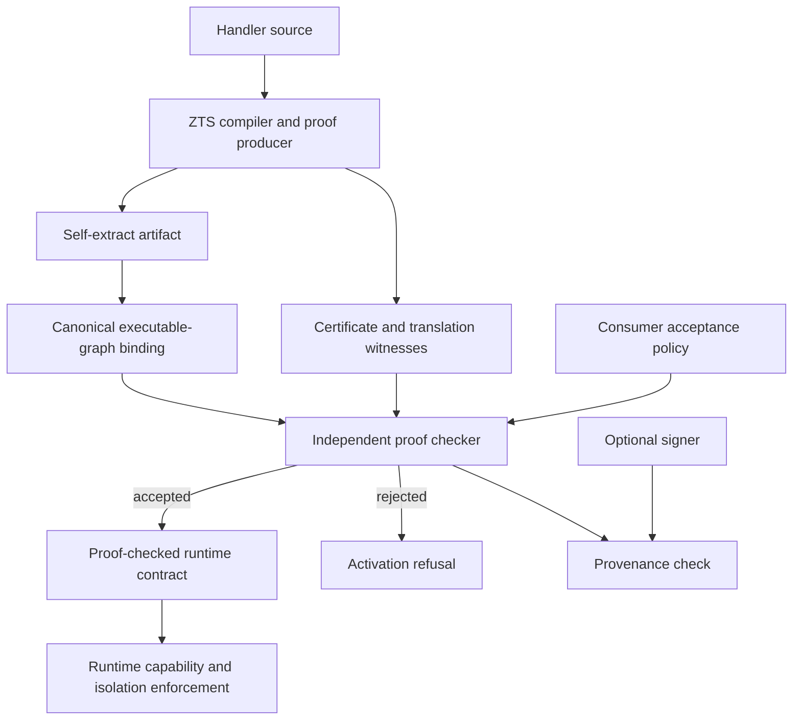
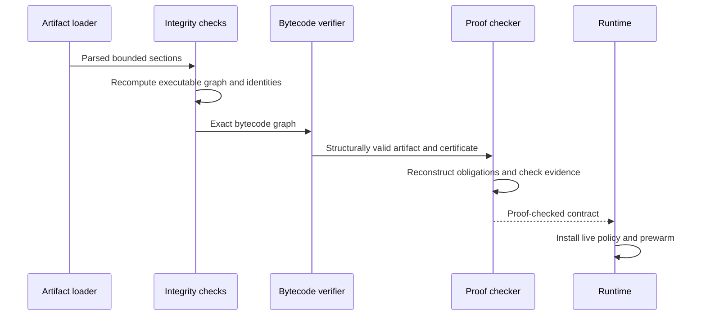
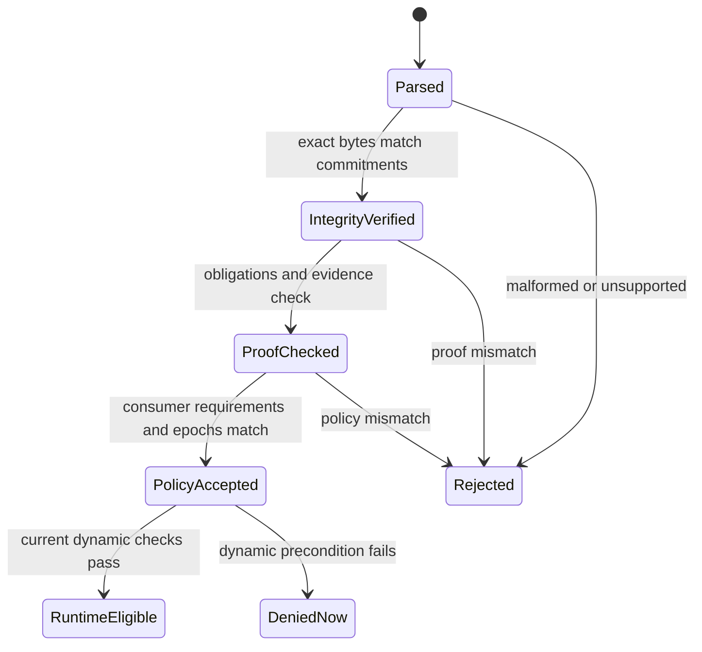
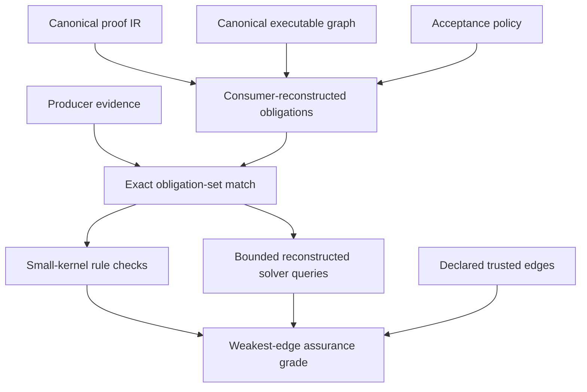
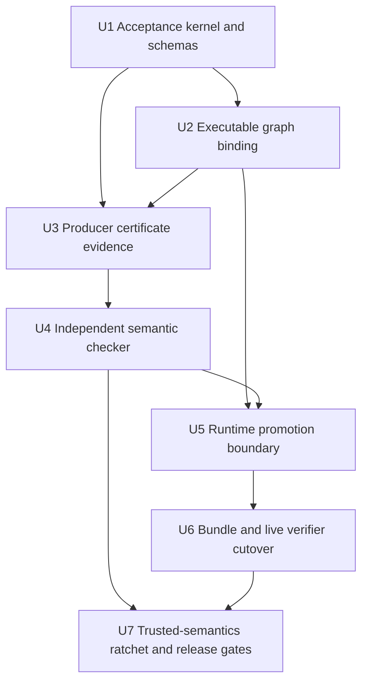

# Artifact-Level Proof-Carrying Code - Plan

## Goal Capsule

- **Objective:** A Zttp artifact is accepted for production only when a consumer-owned checker establishes that the exact executable graph satisfies the consumer's required static safety properties.
- **Means:** Add a small independent proof-checker package, a closed certificate format, translation witnesses, and strict artifact acceptance before runtime activation. (KTD1, KTD2, KTD3)
- **Authority:** The Product Contract owns required behavior. The Planning Contract owns implementation choices. The consumer acceptance policy and checker own semantic acceptance. Signatures supply provenance only.
- **Execution profile:** Implement in dependency order as seven reviewable units. Keep proof search and certificate production outside the acceptance kernel.
- **Stop conditions:** Stop if the checker must trust producer verdicts, if any executable byte is outside the artifact commitment, or if proof failure can weaken runtime capability enforcement.
- **Tail ownership:** Complete local implementation, verification, review, and local commits. Remote push, release, and deployment remain user-owned.

---

## Product Contract

### Summary

Zttp will add artifact-level proof-carrying code as a strict production acceptance path. The producer may perform expensive analysis and proof search, but the consumer reconstructs the required obligations from the exact artifact and checks bounded evidence with its own policy and checker. Existing contracts, bundles, and attestations remain useful integrity and provenance inputs, but they do not become semantic authority until the checker accepts them.

### Problem Frame

The current compiler emits strong proof-shaped claims, and runtime startup checks source, policy, capability, and artifact identities. The current proof bundle verifies component hashes, while remote verification checks a signed attestation. Neither consumer reconstructs semantic obligations or checks a producer-supplied derivation against the exact executable artifact.

The deployment artifact also contains dependency bytecode that is loaded at runtime but is not part of the current main-bytecode attestation commitment. A certificate over only the main handler would leave executable code outside the theorem boundary.

### Key Decisions

- **Independent consumer checking is the production authority.** (session-settled: user-approved - chosen over signed compiler claims: the paper's useful trust reduction comes from consumer-owned obligation reconstruction and checking.) Governs R1, R3, R5, R11.
- **The change is a direct format cutover.** (session-settled: user-approved - chosen over permissive legacy fallback: this pre-1.0 project already favors clean security-boundary changes.) Governs R4, R10, R13.
- **Static certification does not replace dynamic enforcement.** (session-settled: user-approved - chosen over proof-controlled runtime bypasses: request state and external effects remain mutable.) Governs R8, R9.

### Requirements

**Consumer authority and assurance states**

- R1. The consumer must reconstruct required obligations from the exact proof IR, executable graph, acceptance policy, and proof-system identity instead of accepting serialized producer verdicts.
- R2. The artifact commitment must cover the main bytecode, every dependency bytecode, nested functions, constant pools, ordered module identities, native-module identities, contract bytes, runtime-policy bytes, and source-profile identities.
- R3. Public results must distinguish `integrity_verified`, `signature_verified`, `proof_checked`, `policy_accepted`, and `runtime_eligible`; no weaker result may be presented as a stronger one.
- R4. Certificate, artifact, and acceptance-policy schemas must be closed and versioned; unknown, missing, extra, duplicate, or unsupported semantic members must fail closed.
- R5. The semantic checker must be deterministic, resource-bounded, free of ambient I/O, and independent from producer analysis and proof search.

**Proof and translation evidence**

- R6. The producer must emit canonical proof IR, an exact requested-obligation set, checkable property evidence, an IR-to-bytecode witness, and optimizer rewrite and compaction evidence for the final executable graph.
- R7. Every certificate must disclose remaining trusted semantics, tested translations, solver assumptions, and other theorem-chain edges so assurance is capped by the weakest edge.
- R8. Only a proof-checked runtime contract may expose proof-authoritative properties to caching, pooling, result-safety, isolation, or durable-workflow optimizations.

**Activation and verification**

- R9. Bytecode structural verification, capabilities, isolation, request validation, authorization, limits, leases, and live policy checks must remain mandatory dynamic controls.
- R10. Production activation must reject a missing contract, missing certificate, zero commitment, unsupported proof system, unsupported semantics epoch, or mismatched executable graph before pool prewarm.
- R11. Offline and live verification must apply semantic acceptance before provenance and must require consumer-selected proof systems, properties, and trust anchors for an accepted verdict.
- R12. Development artifacts with ephemeral identities or unpinned runtime policy may be semantically checked, but they must be labeled development-only and cannot satisfy production acceptance.
- R13. Existing self-extract, bundle, attestation, and certificate versions must be rejected by the strict path with a rebuild diagnostic rather than downgraded or reinterpreted.

**Safety and usability**

- R14. Every decoder and checker stage must enforce per-section size, count, depth, work, and solver limits before allocation or expensive evaluation.
- R15. Rejection diagnostics must name the failed stage, stable reason code, artifact member or obligation, expected identity, actual identity, and whether recertification can resolve the failure.

### Success Criteria

- A valid certificate attached to the exact artifact reaches `policy_accepted`, while a mutation to any executable or authority-bearing section is rejected before activation.
- A compiler or signer cannot cause acceptance by fabricating a property, omitting an obligation, or changing the supplied obligation list.
- The proof checker has a smaller dependency and authority surface than the compiler and runtime server.
- Existing dynamic security controls behave identically for accepted, rejected, signed, and unsigned artifacts.
- Every semantic family promoted from `trusted` has a real code-generation case, a positive checker case, and a deliberate mutation that the checker rejects.

### Key Flows

- F1. Build and activate
  - **Trigger:** A handler is compiled for production.
  - **Steps:** The producer emits the final artifact and certificate. Startup recomputes the executable graph. The consumer checker reconstructs and checks obligations. The runtime installs dynamic policy and prewarms only after acceptance.
  - **Outcome:** Only the exact accepted artifact can serve requests.
  - **Covered by:** R1, R2, R5, R6, R8, R9, R10.
- F2. Offline bundle verification
  - **Trigger:** An operator verifies a deployment bundle.
  - **Steps:** The verifier bounded-decodes the bundle, checks exact component binding, checks the certificate under a consumer policy, and checks optional provenance last.
  - **Outcome:** The result states the precise assurance level without conflating integrity, proof, policy, and provenance.
  - **Covered by:** R3, R4, R11, R14, R15.
- F3. Live endpoint verification
  - **Trigger:** A consumer verifies a running deployment.
  - **Steps:** The consumer obtains bounded artifact evidence, verifies that it represents the bytes that execute, applies semantic acceptance, and then applies a pinned trust policy.
  - **Outcome:** The command reports proof acceptance only when exact executable bytes are available; otherwise it reports provenance only.
  - **Covered by:** R2, R3, R11, R12.

### Acceptance Examples

| ID | Given | When | Then | Covers |
|---|---|---|---|---|
| AE1 | A supported certificate and exact production artifact | The consumer checks all required properties under a pinned policy | The result is `policy_accepted`, then runtime checks determine `runtime_eligible` | R1, R3, R10, R11 |
| AE2 | A certificate for one artifact | A dependency bytecode, nested function, constant pool, or main bytecode is changed | Executable-graph binding fails before semantic acceptance | R2, R10 |
| AE3 | A self-consistent manifest with attacker-replaced contract and binary | Integrity verification succeeds | Policy acceptance fails because no valid certificate establishes the reconstructed obligations | R1, R3, R11 |
| AE4 | A producer omits, duplicates, reorders, or adds an obligation | The checker compares reconstructed and supplied sets | The certificate is rejected with an obligation-set reason code | R1, R4, R15 |
| AE5 | A valid signature over an unsupported proof-system or semantics identity | The strict verifier runs | Signature validity is reported separately and policy acceptance fails | R3, R4, R11, R13 |
| AE6 | A certificate contains an unknown rule, cycle, excessive depth, or oversized section | The bounded decoder or checker runs | Verification stops within configured limits and rejects | R4, R5, R14 |
| AE7 | An optimizer witness names the wrong rewrite or target offset | The checker relates proof IR to final bytecode | Translation checking rejects the artifact | R2, R6 |
| AE8 | A valid unsigned artifact built with `--no-attest` | The local consumer checks it | Semantic acceptance can succeed, but signature and provenance remain absent | R3, R11 |
| AE9 | A development receipt uses an ephemeral key or unpinned live policy | Production acceptance is requested | The result is development-only and not accepted for production | R11, R12 |
| AE10 | A statically accepted artifact lacks a current environment capability | Startup or a request runs | Dynamic enforcement denies the action without changing artifact proof validity | R8, R9 |
| AE11 | An old bundle or self-extract format has a valid historical signature | The new strict path reads it | The artifact is rejected with a rebuild diagnostic | R4, R13, R15 |
| AE12 | A live service exposes claims but not the exact executable evidence | `zttp verify` runs | It may report provenance, but it cannot report proof or policy acceptance | R3, R11 |

### Scope Boundaries

**In scope**

- A small independent checker, closed certificate schema, executable-graph identity, producer evidence, strict runtime promotion, bundle v2, and verifier UX.
- A measured ratchet that reduces the declared trusted semantics boundary one family at a time.
- Direct cutovers for pre-1.0 artifact and evidence versions.

**Deferred to follow-up work**

- A solver-free general proof-object language for semantic obligations that cannot be checked by the initial small kernel.
- Broad remote distribution infrastructure if bounded exact executable evidence cannot fit the current attestation endpoint.
- Removal of every trusted semantic member after the first honest certificate ships.

**Outside this plan**

- Full functional correctness, termination, availability, constant-time behavior, or side-channel freedom.
- Replacement of the compiler, runtime VM, capability model, isolation model, or request-time authorization.
- A shared proof protocol with Metadoor.

### Sources

- Necula, [Proof-Carrying Code, POPL 1997](https://homes.cs.washington.edu/~mernst/teaching/6.893/readings/necula-popl97.pdf), especially the consumer-owned safety policy, verification-condition generation, and small proof checker.
- `docs/zts-formal-spec-northstar-advanced.md` for the existing build-report, checked-report, and independent-certificate distinction.
- `docs/solutions/tooling-decisions/zts-rich-surface-small-kernel.md` for the rich producer and small certified-kernel boundary.
- `docs/solutions/security-issues/self-extract-runtime-policy-attestation-binding.md` for serialize-once artifact binding at the activation boundary.
- `docs/solutions/conventions/a-gate-that-counts-nothing-still-reports-a-pass.md` for non-empty floors and deliberate gate invalidation.
- Z3, [Proof Logs](https://microsoft.github.io/z3guide/programming/Proof%20Logs/), for the current limits of proof-log checking and the need to distinguish small-kernel rules from steps that require solver replay.

---

## Planning Contract

### Key Technical Decisions

- KTD1. **Create an independent leaf checker package.** (session-settled: user-approved - chosen over placing verification in the runtime or compiler: a narrow dependency boundary makes the acceptance TCB inspectable.) Add `packages/proof-checker/` with certificate decoding, proof-system identities, consumer policy, bounded checking, and exhaustive verdicts. It must not import the compiler, analyzer, runtime server, signing, clock, or I/O layers. Implements R1, R3, R4, R5.
- KTD2. **Bind one canonical executable graph.** (session-settled: user-approved - chosen over main-bytecode-only binding: dependency bytecode and nested code execute in the same deployment.) Serialize each authority-bearing section once, hash those exact bytes, and derive one deterministic root over ordered members. Implements R2, R6, R10.
- KTD3. **Use a staged certificate with explicit assurance grades.** (session-settled: user-approved - chosen over waiting for a fully proved semantics: honest partial assurance can ship while the trusted boundary ratchets down.) The certificate records proved rules, translation-validated rules, tested edges, trusted edges, and solver assumptions. The consumer caps the result at the weakest edge. Implements R4, R5, R7.
- KTD4. **Emit translation evidence while IR and final bytecode coexist.** Capture stable IR member identities before code generation, record jump and emission relations during generation, and record optimizer rewrites during optimization. Do not derive authority from source lines or stale pre-optimization offsets. Implements R2, R6.
- KTD5. **Split integrity-bound and proof-checked runtime contracts.** Only the proof-checked type exposes proof-authoritative properties. Existing runtime checks remain prerequisites and runtime defenses. Implements R3, R8, R9, R10.
- KTD6. **Cut all strict artifact formats together.** Bump self-extract, attestation, bundle, and proof-system versions in one dependency-ordered change. Reject old or unknown formats in production and provide rebuild diagnostics. Implements R4, R10, R13, R15.
- KTD7. **Use consumer-reconstructed bounded solver queries when the initial kernel cannot check a proof object.** The checker may run an isolated solver under limits, but it must never execute unrestricted producer-supplied SMT-LIB. This is an interim theorem-chain edge, not a claim of a solver-free proof kernel. Implements R1, R5, R7, R14.

### High-Level Technical Design

These sketches describe boundaries and data flow. They do not prescribe exact APIs.

**Component topology**

**Activation sequence**

**Assurance-state flow**

**Certificate data flow**

### Implementation Constraints

- Keep the checker pure and allocation-bounded. Inject any optional solver capability at the outer adapter boundary.
- Use exhaustive switches for schema versions, proof systems, semantic members, rules, and verdicts. Do not add permissive `else` handling.
- Preserve `verifyBytecodeRecursive` as a separate mandatory layer.
- Serialize authority-bearing bytes once and use the same bytes for hashing, embedding, checking, and signing.
- Add non-empty input floors to every corpus, coverage, mutation, and module-boundary gate.
- Protect proof endpoints against path traversal, symlink substitution, oversized chunks, nesting bombs, and high-work certificates.
- Treat `ProofTrace`, `HandlerProperties`, contract properties, and signatures as explanatory or provenance data until consumer verification promotes them.

### Sequencing

### Risks and Dependencies

- Optimizer compaction can invalidate instruction-offset witnesses. U3 must record rewrite and compaction evidence during optimization.
- Exact proof IR or static literals can expose application data. U6 must define bounded disclosure and redaction rules before live proof evidence is enabled.
- Solver replay adds availability and resource risks. U4 must enforce time, memory, query-shape, and output limits and report an inconclusive result as rejection.
- A new checker package affects build wiring, module boundaries, test collection, and documentation drift gates.
- Live reload does not use the self-extract container. U5 must require equivalent in-memory certificate generation and checking before swapping the active handler.

---

## Implementation Units

### U1. Establish the consumer acceptance kernel and closed schemas

- **Goal:** Create the independent authority boundary that can represent artifact inputs, proof-system identities, consumer policy, and exhaustive verification outcomes without trusting producer code.
- **Requirements:** R1, R3, R4, R5, R14, R15. Implements KTD1 and KTD3.
- **Dependencies:** None.
- **Files:** `packages/proof-checker/build.zig`, `packages/proof-checker/src/root.zig`, `packages/proof-checker/src/certificate.zig`, `packages/proof-checker/src/proof_system.zig`, `packages/proof-checker/src/policy.zig`, `packages/proof-checker/src/checker.zig`, `packages/proof-checker/src/verdict.zig`, `build.zig`, `scripts/module-boundary.allow`, `docs/internals/testing.md`.
- **Approach:** Define bounded wire decoding separately from owned domain projection. Use closed tagged unions for versions, rules, policy requirements, assurance grades, and rejection reasons. Keep the package a leaf with no compiler or runtime imports. Add a dedicated build step and a gate that fails when it collects zero checker tests.
- **Execution note:** Write failing decode, resource-limit, and dependency-boundary tests before accepting the first valid certificate fixture.
- **Test scenarios:**
  - A minimal supported empty-program fixture with an explicit non-empty obligation floor decodes deterministically and produces a typed non-accepted result until evidence checking exists.
  - Unknown schema, proof system, rule, semantic member, field, duplicate member, and trailing data each reject with stable reason codes.
  - Excessive section size, member count, nesting depth, rule count, or work budget rejects before unbounded allocation.
  - Reordered semantically equivalent input produces the same canonical identity only where ordering is defined as irrelevant.
  - The checker package cannot import compiler, analyzer, server, signing, clock, filesystem, or network modules.
- **Verification:** Dedicated checker tests pass, the new test collector proves a non-zero count, and module-boundary gates reject an intentional forbidden import probe.

### U2. Bind the full executable graph and cut artifact identities

- **Goal:** Make one canonical commitment represent every byte and identity that can affect deployed execution.
- **Requirements:** R2, R4, R10, R13, R14, R15. Implements KTD2 and KTD6.
- **Dependencies:** U1.
- **Files:** `packages/tools/src/precompile.zig`, `packages/runtime/src/build_command.zig`, `packages/runtime/src/self_extract.zig`, `packages/runtime/src/attest/envelope.zig`, `packages/runtime/src/attest/build_receipt.zig`, `packages/runtime/src/server.zig`, `packages/zts/src/contract_types.zig`, `packages/zts/src/contract_builder.zig`, `packages/zts/src/contract_json_writer.zig`.
- **Approach:** Define deterministic ordered graph members for main and dependency bytecode, nested executable structures, contracts, runtime policy, source identity, grammar, semantics, capabilities, and native modules. Serialize each section once. Thread the resulting root and member inventory from precompile through self-extract and attestation. Apply the direct version cutover and reject missing or zero commitments in production.
- **Execution note:** Establish mutation fixtures for every member class before allowing startup to consume the new root.
- **Test scenarios:**
  - Identical artifacts built from stable inputs produce identical member inventories and executable roots across allocation and map order changes.
  - Mutating main bytecode, dependency bytecode, a nested function, constant pool, module order, native-module identity, contract, or runtime policy changes the root and causes rejection.
  - Missing, duplicate, malformed, or oversized sections reject during bounded artifact parsing.
  - Old self-extract and attestation versions reject with a rebuild diagnostic.
  - The bytes hashed for each member are the exact bytes embedded and later loaded.
- **Verification:** Self-extract, precompile, attestation, runtime, module-boundary, and deliberate-mutation tests pass with non-empty member coverage.

### U3. Emit canonical proof IR and translation witnesses

- **Goal:** Produce evidence that relates source-derived proof obligations to the final optimized executable graph while the necessary compiler state is available.
- **Requirements:** R1, R2, R6, R7, R14. Implements KTD3 and KTD4.
- **Dependencies:** U1, U2.
- **Files:** `packages/tools/src/precompile.zig`, `packages/zts/src/parser/codegen.zig`, `packages/zts/src/bytecode_opt.zig`, `packages/zts/src/ir_identity.zig`, `packages/zts/src/kernel_identity.zig`, `packages/zts/src/semantics.zig`, `packages/zts/src/semantics_check.zig`, `packages/zts/src/proof_trace.zig`.
- **Approach:** Keep proof traces explanatory. Add stable proof-IR member identities, a canonical requested-obligation set, property proof objects, code-generation relations, jump-resolution evidence, optimizer rewrite evidence, and an explicit trusted-edge inventory. Normalize existing independent analysis walkers only at the certificate boundary.
- **Execution note:** Start with a small vertical slice that includes one control-flow family and one optimizer rewrite, then extend the same schema without adding open-ended escape fields.
- **Test scenarios:**
  - The same handler yields deterministic proof IR, obligations, witnesses, and certificate bytes.
  - A valid control-flow case relates stable IR members to resolved final jump targets.
  - Peephole fusion and instruction compaction produce checkable rewrite evidence for final offsets.
  - Missing, extra, duplicate, reordered, or mismatched obligations are observable in producer fixtures and cannot be normalized away.
  - Source-line table changes do not alter proof identity, while semantic IR or generated bytecode changes do.
  - The trusted-edge inventory exactly covers every semantics member used by the handler that lacks a checked rule.
- **Verification:** ZTS, precompile, semantics, optimizer, and corpus tests pass; a deliberate witness mutation reaches the consumer checker test fixtures.

### U4. Implement independent obligation reconstruction and evidence checking

- **Goal:** Make the consumer, not the compiler or signer, decide whether the exact artifact satisfies the required static policy.
- **Requirements:** R1, R3, R4, R5, R6, R7, R14, R15. Implements KTD1, KTD3, KTD4, and KTD7.
- **Dependencies:** U3.
- **Files:** `packages/proof-checker/src/checker.zig`, `packages/proof-checker/src/certificate.zig`, `packages/proof-checker/src/policy.zig`, `packages/proof-checker/src/verdict.zig`, `packages/zts/src/bytecode_verifier.zig`, `packages/tools/src/smt_solver.zig`.
- **Approach:** Bounded-decode the artifact and certificate, recompute all roots, reconstruct the exact obligation set from proof IR and policy, check set equality, check small-kernel proof rules, validate translation and optimizer witnesses, and calculate the weakest-edge assurance grade. Isolate any solver adapter and reconstruct canonical queries from owned data.
- **Execution note:** Use test-first adversarial probes. Each positive family must have a single-field mutation that converts acceptance to a specific rejection.
- **Test scenarios:**
  - A supported certificate over the exact fixture reaches `proof_checked` with the expected weakest-edge grade.
  - A producer-fabricated property, omitted obligation, duplicate proof node, cycle, unknown rule, or wrong dependency binding rejects.
  - A valid certificate attached to another artifact rejects even when its own signature and internal hashes are valid.
  - An IR-to-bytecode or optimizer mutation rejects before any proof-controlled property is exposed.
  - Solver timeout, crash, unavailable binary, malformed output, excessive query, or `unknown` yields fail-closed rejection.
  - Unsigned valid semantic evidence can pass proof checking, while signed invalid evidence cannot.
  - The recursive structural bytecode verifier still runs and can reject independently of semantic proof results.
- **Verification:** Checker, bytecode, SMT adapter, mutation, resource-budget, and empty-corpus floor tests pass without ambient I/O in the checker kernel.

### U5. Promote runtime authority only after proof acceptance

- **Goal:** Prevent integrity-bound compiler claims from controlling proof-sensitive runtime behavior and enforce proof checking before activation or live reload.
- **Requirements:** R3, R8, R9, R10, R12, R15. Implements KTD5 and KTD6.
- **Dependencies:** U2, U4.
- **Files:** `packages/runtime/src/contract_runtime.zig`, `packages/runtime/src/server.zig`, `packages/runtime/src/handler_instance.zig`, `packages/runtime/src/live_reload.zig`, `packages/runtime/src/zruntime_tests.zig`, `packages/runtime/src/attest/envelope.zig`.
- **Approach:** Split integrity-bound and proof-checked contract states. Require source, policy, capability, graph binding, bytecode verification, and certificate acceptance before proof-authoritative access or pool prewarm. Apply the same in-memory boundary to live-reload candidates before swap. Keep capability enforcement independent and mandatory.
- **Execution note:** Characterize current capability, isolation, pooling, and reload behavior before changing the promotion types.
- **Test scenarios:**
  - Production startup refuses a missing certificate, zero commitment, unsupported epoch, failed proof, or graph mismatch before handler pool initialization.
  - A proof-checked contract enables only properties established by its accepted grade and requested policy.
  - An integrity-only contract cannot be passed to caching, pooling, result-safety, isolation, or workflow APIs that require proof authority.
  - Accepted artifacts still fail current environment, request, egress, auth, limit, lease, and workflow checks when their dynamic inputs deny.
  - A rejected live-reload candidate leaves the active handler unchanged.
  - `--no-attest` removes provenance only; it does not remove certificate checking.
- **Verification:** Runtime unit and end-to-end startup tests prove activation order, no prewarm on rejection, unchanged dynamic enforcement, and safe live-reload rollback.

### U6. Replace hash-only proof surfaces with semantic acceptance

- **Goal:** Make bundle, CLI, attestation, and agent-protocol outputs report the strongest assurance that the consumer actually established.
- **Requirements:** R3, R4, R11, R12, R13, R14, R15. Implements KTD1, KTD2, KTD5, and KTD6.
- **Dependencies:** U5.
- **Files:** `packages/runtime/src/proofs/bundle.zig`, `packages/runtime/src/proofs_cli.zig`, `packages/runtime/src/verify_cli.zig`, `packages/runtime/src/attest/well_known.zig`, `packages/runtime/src/attest/envelope.zig`, `packages/tools/src/agent_protocol.zig`, `packages/runtime/src/dev_cli.zig`, `docs/verification.md`, `docs/user-guide.md`.
- **Approach:** Build bundle v2 from one final deployment artifact and include bounded proof IR, certificate, executable-graph inventory, contract, and optional provenance. Delegate all semantic decisions to the proof checker. Require consumer policy and pinned trust inputs for acceptance. Expose exact bounded artifact evidence for live checking or limit the live command to provenance language.
- **Execution note:** Preserve existing CLI output as characterization fixtures, then replace ambiguous success strings with tagged assurance results and stable reason codes.
- **Test scenarios:**
  - Bundle v2 over an exact valid deployment reaches policy acceptance under matching consumer requirements.
  - Hash-valid but semantically invalid bundles report integrity success and policy rejection as separate states.
  - Unknown versions, missing proof sections, path escapes, symlinks, omitted components, large chunk boundaries, and decompression bombs reject.
  - A valid unpinned signature reports signature validity without trusted-origin or policy acceptance.
  - A live endpoint with exact executable evidence can be checked; one with claims only cannot report proof acceptance.
  - Agent protocol emits `proven` only for a fresh accepted artifact and uses a weaker status for producer-only analysis.
- **Verification:** CLI, bundle, attestation, well-known endpoint, agent-protocol, and release-build tests pass with golden JSON and human-readable outputs for every assurance state.

### U7. Ratchet trusted semantics and install durable release gates

- **Goal:** Reduce the disclosed TCB without allowing assurance claims or gates to drift beyond what the checker exercises.
- **Requirements:** R5, R6, R7, R9, R14, R15. Implements KTD3 and KTD7.
- **Dependencies:** U4, U6.
- **Files:** `packages/zts/src/semantics.zig`, `packages/zts/src/semantics_check.zig`, `packages/zts/src/semantics_corpus.zig`, `docs/spec/semantics.spec.ts`, `scripts/check-semantics-spec.sh`, `scripts/verify.sh`, `docs/coverage.md`, `docs/convergence.md`, `docs/threat-model.md`, `docs/internals/architecture.md`, `docs/internals/testing.md`, `CONCEPTS.md`.
- **Approach:** Promote one node or opcode family per reviewable change. Require a checker rule or translation witness, a real compiler case, an exact coverage assertion, and a deliberate mutation for every promotion. Document the residual TCB and ensure all generated coverage documents derive from non-empty executable gates.
- **Execution note:** Start with security-relevant control flow, calls, effects, labels, and result handling. Do not select families only because they are easy to count.
- **Test scenarios:**
  - Each promoted member is exercised by real generated code, accepted with valid evidence, and rejected after its evidence or artifact is mutated.
  - Deleting a corpus input, disabling a checker rule, or filtering out all members causes the relevant gate to fail.
  - A new unclassified or trusted semantic member changes the disclosed grade and fails drift checks when policy forbids it.
  - Runtime dynamic capability probes produce the same decisions before and after semantic promotion.
  - Documentation regeneration reports exact proved, translation-validated, tested, and trusted counts from the checker corpus.
- **Verification:** Semantic spec audit, coverage drift, proof-swallow, module-boundary, full repository, optimized build, and release verification gates all pass with deliberate negative probes restored after confirmation.

---

## Verification Contract

### Required Commands

| Gate | Command | Proves |
|---|---|---|
| Checker kernel | `zig build test-proof-checker --summary all` | Closed decoding, obligation reconstruction, evidence checking, resource bounds, and non-empty test collection |
| ZTS semantics | `zig build test-zts --summary all` | Proof IR, semantics identities, producer evidence, and compiler regressions |
| Precompile path | `zig build test-precompile --summary all` | Full executable-graph and certificate production at the deployed producer boundary |
| Tool CLI | `zig build test-zts-cli --summary all` | Semantics and checker command behavior |
| Runtime CLI | `zig build test-cli --summary all` | Bundle, live verification, reason codes, and assurance-state output |
| Runtime end to end | `zig build test-zruntime` | Production activation, dynamic enforcement, attestation, and live reload |
| Architecture | `zig build test-module-boundary` | Independent checker remains a leaf and dependency exceptions are intentional |
| ZTS layering | `zig build test-zts-layering` | Compiler and checker tier boundaries remain valid |
| Proof hygiene | `zig build test-proof-swallow` | Proof-deciding analysis does not discard errors without an explicit reviewed exception |
| Semantics audit | `bash scripts/check-semantics-spec.sh` | Semantic alphabets, dispositions, and coverage floors match the checked registry |
| Aggregate tests | `zig build test -j1` | Repository unit and policy gates pass in the supported serialized mode |
| Optimized build | `zig build -Doptimize=ReleaseFast` | Production artifact and new proof sections build in release mode |
| CI-equivalent gate | `bash scripts/verify.sh` | Format, tests, scripts, generated docs, and repository release checks pass together |

### Mandatory Adversarial Matrix

- Mutate every executable-graph member class and every authority-bearing identity independently.
- Exercise missing, extra, duplicate, reordered, unknown, malformed, cyclic, and unsupported proof inputs.
- Exercise solver timeout, crash, unavailable solver, malformed output, excessive work, and `unknown`.
- Exercise oversized sections, excessive nesting, large chunk boundaries, traversal, symlink substitution, and decompression bombs.
- Prove that an empty certificate corpus, zero-obligation input, or non-compiling probe fails the gate that cites it.
- Compare unsigned valid evidence with signed invalid evidence and verify that semantic acceptance wins over provenance.
- Prove startup and live reload reject before prewarm or swap.
- Prove dynamic capabilities remain mandatory after certificate acceptance.

### Review Gates

- Review the checker dependency graph and public surface separately from compiler changes.
- Review canonical serialization and full executable-graph membership with an explicit byte inventory.
- Review every assurance label against the exact consumer work performed.
- Review proof endpoints for information disclosure and resource exhaustion.
- Review each trusted-semantics promotion as a theorem-chain change, not a coverage-only change.

---

## Definition of Done

- The strict production path cannot activate an artifact without an accepted certificate over the full executable graph.
- The independent checker reconstructs exact obligations and rejects every adversarial mismatch in the Verification Contract.
- Integrity, signature, proof, policy, and runtime eligibility are distinct tagged outcomes in APIs, CLI output, and docs.
- Only proof-checked runtime contracts control proof-authoritative optimizations or guarantees.
- Dynamic bytecode, capability, isolation, authorization, limit, lease, and workflow checks remain mandatory and regression-tested.
- Bundle, self-extract, attestation, and proof-system versions use one direct cutover with clear rebuild diagnostics.
- Live verification either checks exact executable evidence or states that it verifies provenance only.
- Every new gate has a non-empty floor and at least one deliberate invalidation test.
- The residual trusted semantics and solver assumptions are visible and cap the assurance grade.
- `docs/verification.md`, `docs/threat-model.md`, `docs/internals/architecture.md`, `docs/internals/testing.md`, `docs/user-guide.md`, and `CONCEPTS.md` match shipped behavior.
- All commands in the Verification Contract pass from a clean checkout.
- Abandoned prototypes, temporary certificate formats, unused compatibility readers, and dead proof paths are absent from the final diff.
- No generated or vendor artifact is edited by hand, and no remote push, release, or deployment is performed by the implementation run.
