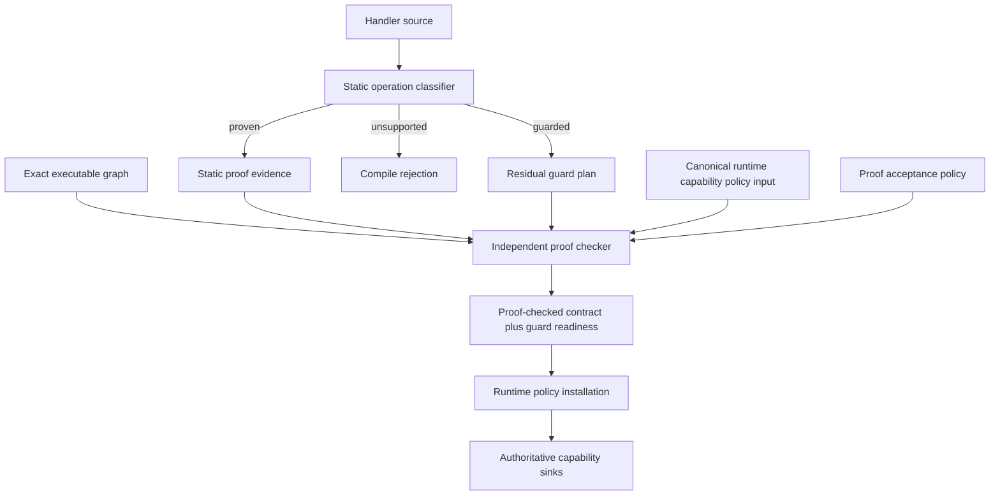
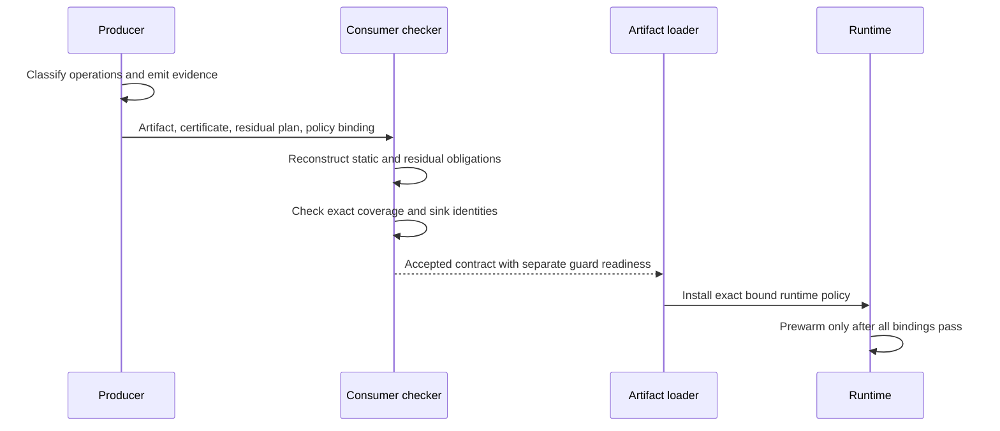
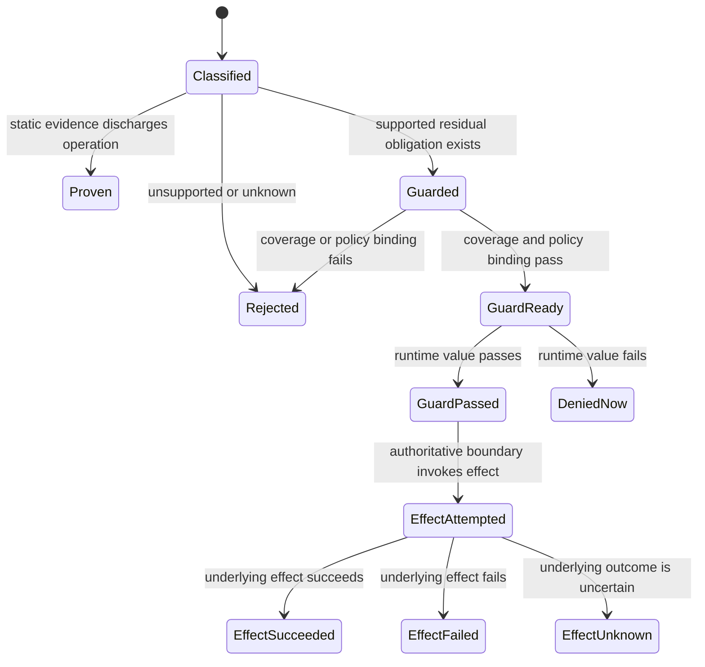
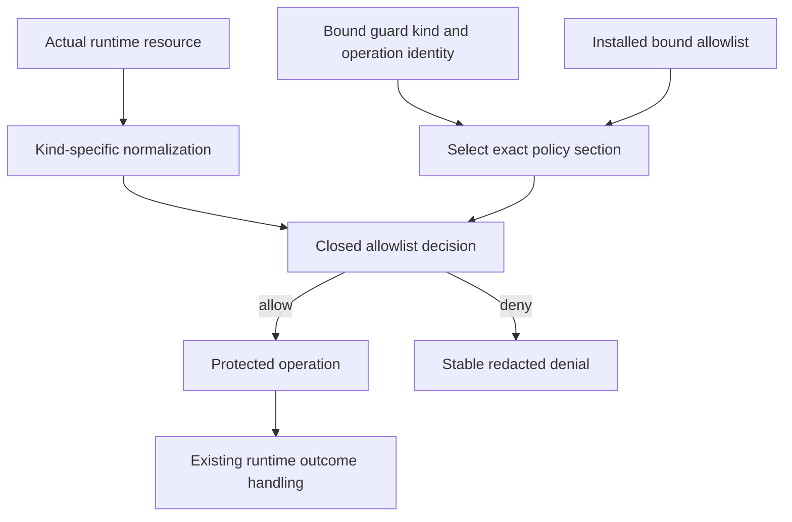
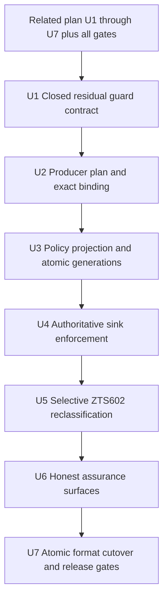

# Residual Runtime Guard Addendum - Plan

## Goal Capsule

- **Objective:** Zttp developers can safely ship useful handlers with runtime-selected capability resources, while consumers retain exact proof claims and fail-closed control over every live resource decision.
- **Means:** Add a closed residual-guard contract to the proof-carrying artifact, bind it to the existing capability policy and guard implementation, remove permissive dynamic policy projection, and then reclassify supported `ZTS602` cases. (KTD1, KTD2, KTD3, KTD5)
- **Authority:** Static proof owns Property claims. The proof checker owns residual-guard coverage. The configured capability policy owns finite resource allowlists. The runtime sink owns each live guard decision. A guarded operation is never a proven Property.
- **Execution profile:** Implement seven dependency-ordered units only after the related artifact-level PCC plan completes U1 through U7 and all required gates pass.
- **Stop conditions:** Stop if the runtime cannot observe the actual resource before the effect, if a producer can omit a guard obligation, if an absent policy becomes allow-all, or if guarded evidence can unlock a proof-only optimization.
- **Tail ownership:** Complete local implementation, verification, review, and local commits. Remote push, release, and deployment remain user-owned.

---

## Product Contract

### Summary

This addendum introduces a CCured-style hybrid acceptance path for a narrow class of Zttp operations. The compiler continues to prove every Property it claims. When it cannot resolve the resource selected by a supported capability operation, it may emit a residual runtime obligation instead of rejecting the handler, but only when the consumer proves complete guard coverage and the runtime enforces the bound policy before the operation crosses its effect boundary.

This is a separate companion to `docs/plans/2026-08-31-1147-feat-artifact-proof-carrying-code-plan.md`. It does not amend, renumber, or delay that in-flight plan. It starts from the checker, executable-graph binding, and proof-checked runtime contract that plan delivers.

### Problem Frame

The strict checker currently reports every non-literal capability argument as `ZTS602`. That unconditional refusal prevents an unsafe path: `contractToRuntimePolicy` maps a dynamic contract section to a disabled allowlist, and a disabled allowlist permits every value. The current build is therefore safe because strict checking returns before such a dynamic contract reaches runtime policy construction.

The runtime already observes several actual resource values near their effects. Environment reads check the requested key, outbound HTTP parses the endpoint before transport, cache operations check the namespace, and SQL execution checks the registered query name and access mode. The current HTTP check is host-only, so this plan extends it to scheme, effective port, redirect targets, and resolved-address scope before admitting computed endpoints. CCured shows how to preserve static assurance while assigning only residual uncertainty to runtime checks. Zttp can use that pattern if guard coverage is consumer-checked, policy is explicit, and guarded operations remain distinct from proven Properties.

### Key Decisions

- **Ship this work as a separate companion plan.** (session-settled: user-directed - chosen over updating the in-flight artifact-level PCC plan: implementation of that plan has already started.) Governs R12.
- **Guard only locally observable capability resources in the first release.** (session-settled: user-approved - chosen over treating all unproved properties as runtime-checkable: global semantic properties cannot be established at one effect boundary.) Governs R2, R5, R10.
- **Keep guarded and proven assurance distinct.** (session-settled: user-approved - chosen over one accepted state: a passing runtime allowlist check does not prove noninterference, determinism, retry safety, or translation correctness.) Governs R1, R2, R3, R11.

### Requirements

**Assurance classification**

- R1. Every proof-relevant operation must have one exhaustive disposition: `proven`, `guarded`, or `rejected`; an unknown or unclassified disposition must reject.
- R2. A residual guard may authorize one locally observed operation, but it must not discharge a Property or strengthen a static assurance grade.
- R3. Contracts, checker verdicts, CLI output, attestations, and agent protocol results must report proven Properties and guarded operations as separate fields.
- R4. A guarded artifact may reach policy acceptance only when static obligations pass and every residual guard obligation is covered; any request-time guard may still deny that operation.

**Residual guard contract**

- R5. The first residual guard schema must be closed to dynamic environment keys, effective egress endpoints, cache namespaces, named SQL reads, and named SQL writes. An endpoint consists of scheme, canonical host, effective port, and allowed resolved-address scope.
- R6. The consumer must reconstruct the exact residual obligation set from proof IR, the executable graph, a checker-owned supported-capability catalog, and consumer policy instead of trusting the producer's list or metadata.
- R7. Each residual obligation must bind its guard kind, operation identity, resource normalization rule, policy section, authoritative sink identity, guard implementation identity, and semantics epoch; the certificate identity must associate the canonical residual-plan digest with the artifact root and runtime-policy hash without embedding the executable root inside a graph-committed guard record.
- R8. Every guarded category must have an explicit configured allowlist, including an explicit empty deny-all list; an absent, malformed, or disabled category must reject production acceptance.
- R9. The authoritative runtime boundary must evaluate the actual normalized resource before any protected read, write, redirect, DNS resolution, socket attempt, transport, or query and must deny with a stable redacted reason when the value is outside policy.

**Language and rollout boundary**

- R10. Dynamic route paths, service names, durable keys, schemas, reflection, arbitrary predicates, and non-local semantic properties must remain rejected until a separate plan proves a complete enforcement boundary.
- R11. Compiler-visible literals must retain the existing static path and must not pay an additional residual-obligation lookup; existing mandatory runtime capability checks remain in force.
- R12. Implementation must begin only after U1 through U7 of the related artifact-level PCC plan are complete and all of that plan's required gates pass; the addendum must preserve that plan's stable IDs and acceptance semantics.
- R13. Startup and live reload must reject a missing, stale, mismatched, unknown, or uncovered guard plan before pool prewarm or handler swap. Live reload must atomically install one generation containing the executable root, proof-checked contract, residual plan, and policy; a failed candidate leaves the prior generation intact, and each in-flight request remains pinned to one generation.
- R14. Guard coverage and failure telemetry must use non-empty tested registries, stable guard IDs, bounded counters, and redacted resource data.
- R15. At the R12 drift checkpoint, the implementation must assign the next incompatible certificate-schema and proof-system versions after the versions delivered by the related plan, cut all strict production artifacts to those successor versions, and reject predecessor evidence after cutover instead of maintaining mixed strict formats.
- R16. The leaf checker must receive bounded exact canonical runtime-capability-policy bytes as a separate `RuntimeCapabilityPolicyInput`, independently recompute their digest, decode them with checker-owned code, and keep this resource authority distinct from its proof-acceptance `Policy`.
- R17. Egress checks must authorize the normalized endpoint before each redirect or transport attempt and must validate the resolved address scope after DNS but before descriptor registration or socket I/O, preventing scheme, port, redirect, DNS-rebinding, loopback, link-local, or private-network substitution outside explicit policy.
- R18. The first format must cap canonical runtime-policy input at 256 KiB, each guard category at 256 entries, non-endpoint resource identifiers at 255 bytes, and normalized endpoints at 512 bytes. Runtime lookup must use a verified immutable index with at most eight key comparisons at the category maximum; oversized or duplicate-normalized input rejects before activation.
- R19. Before enabling a guard family, the frozen corpus or a checked-in real-handler fixture must contain at least one previously rejected operation from that family that becomes guarded without changing any proven Property. An unobserved family remains rejected.
- R20. Supported `ZTS602` diagnostics must name the residual guard kind, required policy section, assurance consequence, and exact next verification command; unsupported and literal-only cases must explain why no residual policy edit applies.

### Success Criteria

- A computed environment key, egress host, cache namespace, or registered SQL query name can ship only with an explicit matching policy section and a consumer-checked residual guard plan.
- A producer cannot gain acceptance by omitting an operation, changing its guard kind, pointing it at a weaker sink, or changing the supplied obligation order.
- A disallowed runtime value is denied before the protected operation and does not change externally visible state.
- A guarded operation never appears in the proven Property set and never enables proof-only caching, pooling, result-safety, isolation, or workflow behavior.
- Literal-only handlers keep their current proof results and do not carry residual obligations.
- Removing a guard, disabling its test corpus, or changing the guard implementation identity makes the corresponding gate fail.
- A strict production artifact cannot use the related plan's predecessor certificate or proof-system identity after addendum cutover and receives a rebuild diagnostic instead of fallback interpretation.
- A live-reload failure leaves the complete prior generation installed, and concurrent requests never mix executable, contract, residual-plan, or policy generations.
- A passing guard is reported as guard authorization only; the underlying effect may still succeed, fail, or become unknown under its existing outcome model.
- Every enabled guard family converts at least one measured real or frozen-corpus rejection into a guarded artifact without reducing static proof results.
- A developer can move from a supported `ZTS602` diagnostic to the exact policy edit and verification command without consulting compiler internals.

### Key Flows

- F1. Build a guarded artifact
  - **Trigger:** A supported capability export receives a resource that is not compiler-visible.
  - **Steps:** The producer marks the operation guarded. It emits a residual obligation. The consumer reconstructs the set, checks exact coverage and policy binding, and produces a proof-checked contract with separate guard readiness.
  - **Outcome:** The artifact is accepted only when static proof and residual coverage both pass.
  - **Covered by:** R1, R2, R4, R5, R6, R7, R8.
- F2. Execute a guarded operation
  - **Trigger:** An accepted handler supplies the actual resource to a protected operation.
  - **Steps:** The authoritative sink normalizes the resource, selects the bound policy section, evaluates the allowlist, and either performs the operation or returns a stable denial before the effect.
  - **Outcome:** Only a policy-allowed runtime resource crosses the boundary.
  - **Covered by:** R7, R8, R9, R13, R14.
- F3. Report assurance
  - **Trigger:** A developer, operator, verifier, or agent inspects the artifact or a runtime denial.
  - **Steps:** The surface reports proof stages, proven Properties, residual guard coverage, and live denial separately.
  - **Outcome:** No consumer mistakes guarded execution for a static theorem.
  - **Covered by:** R2, R3, R4, R14.
- F4. Atomically activate a guarded generation
  - **Trigger:** Startup or live reload receives a candidate executable and its proof material.
  - **Steps:** The loader validates one candidate tuple containing executable root, proof-checked contract, residual plan, and policy. It prewarms and swaps only that accepted tuple. Failure preserves the entire previous tuple, while in-flight requests retain their pinned generation.
  - **Outcome:** No request can combine code or proof evidence from one generation with policy or guard evidence from another.
  - **Covered by:** R7, R8, R12, R13.
- F5. Resolve a supported authoring rejection
  - **Trigger:** A developer receives `ZTS602` for a computed capability resource.
  - **Steps:** The diagnostic identifies the supported guard kind, exact `zttp.json` policy section, assurance change from static to guarded, and the check command. The developer supplies an explicit allowlist or deny-all list and reruns verification.
  - **Outcome:** Supported cases become consumer-checked guarded operations; unsupported cases remain compile-time errors with no misleading policy workaround.
  - **Covered by:** R1, R3, R8, R10, R19, R20.

### Acceptance Examples

| ID | Given | When | Then | Covers |
|---|---|---|---|---|
| AE1 | `env(requestedKey)` and an explicit env allowlist | The exact key is allowed at runtime | The read proceeds and the operation is reported as guarded, not proven | R2, R3, R5, R8, R9 |
| AE2 | `env(requestedKey)` and no env policy section | Production acceptance runs | Acceptance rejects before activation | R4, R8, R13 |
| AE3 | A guarded environment read outside the allowlist | The module attempts the read | The value is not read and a redacted guard denial is emitted | R9, R14 |
| AE4 | A computed outbound URL | Its normalized endpoint and resolved-address scope are allowed | Transport may proceed under existing capability and transport checks | R5, R9, R11, R17 |
| AE5 | A computed outbound URL whose endpoint or resolved-address scope is denied | The fetch path runs | The request is rejected before descriptor registration or socket I/O | R5, R9, R17 |
| AE6 | A computed cache namespace or SQL name | The actual value is outside policy | The cache mutation or SQL preparation and execution do not occur | R5, R9 |
| AE7 | A producer omits one guarded call from its certificate | The consumer reconstructs obligations | Exact-set comparison rejects the artifact | R6, R7 |
| AE8 | A certificate points a cache obligation at a non-authoritative pre-check | The checker validates sink identity | Coverage rejects because the effect boundary is not guarded | R7, R9 |
| AE9 | A valid guard plan is attached to different bytecode or policy bytes | Startup validates it | Artifact-root or policy-hash binding rejects before prewarm | R7, R13 |
| AE10 | A handler uses a dynamic route, service name, durable key, or arbitrary predicate | Strict checking runs | The existing fail-closed diagnostic remains an error | R1, R10 |
| AE11 | A literal-only handler | Build and runtime verification run | The artifact has no residual obligations and retains current proof and runtime behavior | R1, R11 |
| AE12 | A guarded artifact passes startup and later sees a denied value | Assurance is reported | Static proof remains valid, the operation is denied, and the artifact is not relabeled unproven | R2, R3, R4, R9 |
| AE13 | A predecessor PCC certificate is attached to any production artifact after the addendum cutover | The strict path runs | The artifact is rejected with a rebuild diagnostic | R13, R15 |
| AE14 | A guarded live-reload candidate has a missing contract, contract-diff failure, upgrade-analysis failure, plain-swap fallback, or `--force-swap` request | Reload runs while the old generation serves requests | The candidate cannot bypass verification, the old tuple remains intact, and in-flight requests stay pinned | R7, R8, R13 |
| AE15 | An outbound request retries after a connection failure or retryable response | Each DNS or socket attempt begins | The attempt uses the request's pinned generation and rechecks the bound endpoint and resolved-address scope before transport; cached delivery performs no false transport check | R7, R9, R13, R17 |
| AE16 | An allowed host appears under a disallowed scheme, port, redirect target, or resolved address scope | The request reaches the authoritative network boundary | The endpoint is denied before descriptor registration or socket I/O | R5, R9, R17 |
| AE17 | Runtime policy bytes are missing, oversized, digest-mismatched, malformed, or decode differently from producer metadata | The leaf checker runs | Independent policy decoding rejects before activation | R6, R8, R16, R18 |
| AE18 | A supported computed-resource diagnostic is shown | The developer follows it | The message identifies the guard kind, policy section, assurance consequence, and exact check command | R19, R20 |

### Scope Boundaries

**In scope**

- A closed residual guard schema, exact coverage checking, configured policy binding, fail-closed dynamic policy projection, authoritative sink checks, selective `ZTS602` reclassification, assurance output, and release gates.
- A direct-cutover `zttp.json` capability policy for env, normalized egress endpoints and address scopes, cache, and SQL as the external source of finite allowlists.
- A bounded checker-owned runtime-policy input and immutable runtime lookup index.
- Startup, self-extract, development serve, in-process dispatch, and live reload paths that install runtime policy.

**Deferred to follow-up work**

- Additional locally guardable resource families after each has an authoritative sink and a mutation-tested checker rule.
- Lookup representations beyond the fixed 256-entry category limit.
- Portable guard receipts for remote per-request audit beyond bounded aggregate telemetry.

**Outside this plan**

- Runtime substitutes for noninterference, determinism, retry safety, result safety, isolation, termination, translation correctness, or full functional correctness.
- A general predicate language, producer-defined guard code, unrestricted callbacks, or an allow-all development escape hatch.
- Changes to the related artifact-level PCC plan or a shared protocol with Metadoor.

### Sources

- Necula, [Proof-Carrying Code, POPL 1997](https://homes.cs.washington.edu/~mernst/teaching/6.893/readings/necula-popl97.pdf), for consumer-owned policy, obligation generation, small independent checking, and safe activation only after acceptance.
- Necula, McPeak, and Weimer, [CCured: Type-Safe Retrofitting of Legacy Code](https://dl.acm.org/doi/10.1145/2442776.2442786), for inferring the minimum dynamic portion and inserting runtime checks for residual uncertainty.
- `docs/plans/2026-08-31-1147-feat-artifact-proof-carrying-code-plan.md` for the independent checker, executable-graph binding, proof-checked contract, and unchanged dynamic-control boundary this addendum requires.
- `packages/zts/src/strict_checker.zig` for the current unconditional `ZTS602` rejection of non-literal capability resources.
- `packages/zts/src/handler_policy.zig` for the current permissive projection of dynamic contract sections and configured policy validation.
- `packages/zts/src/module_binding/capabilities.zig`, `packages/modules/src/data/cache.zig`, and `packages/modules/src/data/sql.zig` for current env, cache, and SQL policy checks near protected operations.
- `packages/runtime/src/runtime_http.zig` for effective outbound-host enforcement before transport.
- `docs/internals/capabilities.md` and `docs/contracts-and-sandboxing.md` for the separate module-capability, per-resource policy, and sandbox authority layers.
- `docs/solutions/security-issues/self-extract-runtime-policy-attestation-binding.md` for serialize-once policy binding at activation.
- `docs/solutions/conventions/a-gate-that-counts-nothing-still-reports-a-pass.md` for non-empty coverage floors and deliberate invalidation.

---

## Planning Contract

### Key Technical Decisions

- KTD1. **Represent residual guards as a closed consumer-owned obligation set in a successor certificate version.** After R12 completes, assign the next incompatible certificate-schema and proof-system versions rather than adding optional semantics to the related plan's delivered formats. Build successor readers and writers behind non-authoritative test entry points, then make U7 the only strict cutover. The independent checker reconstructs obligations from owned artifact data and rejects unknown, missing, extra, duplicate, or mismatched members. Implements R1, R4, R5, R6, R7, R15.
- KTD2. **Use independently decoded configured capability policy as guard authority.** A dynamic contract category requires its corresponding policy section. The leaf checker receives bounded canonical policy bytes, recomputes their digest, and decodes them independently from proof-acceptance policy. Build and activation bind those bytes into the artifact and guard plan. No dynamic section may construct an allow-all runtime policy. Implements R7, R8, R13, R16, R18.
- KTD3. **Enforce at the authoritative operation boundary.** Env reads, normalized egress endpoints and resolved address scopes, cache operations, and named SQL execution evaluate the actual resource immediately before the protected operation. Redirects and retries repeat the network check. Optional pre-check helpers do not count as coverage. Implements R5, R7, R9, R17.
- KTD4. **Keep assurance two-dimensional.** (session-settled: user-approved - chosen over promoting a passing guard to proof: static theorems and live authorization decisions answer different questions.) Preserve the related plan's acceptance stages while reporting proven Properties and guarded operations independently. Implements R2, R3, R4, R11.
- KTD5. **Relax `ZTS602` only after fail-closed guard infrastructure exists.** (session-settled: user-approved - chosen over a broad dynamic mode: the language may admit only the closed export and argument positions covered by R5.) Unsupported dynamic capability uses remain compile errors. Implements R1, R5, R10, R13.
- KTD6. **Layer the addendum after the in-flight PCC plan.** (session-settled: user-directed - chosen over editing its stable units: implementation is already in progress.) Reuse its checker, certificate, artifact root, policy hash, and proof-checked runtime types. Do not create a parallel certificate or activation path. Implements R12.

### High-Level Technical Design

These sketches describe boundaries, stages, and assurance relationships. They do not prescribe exact APIs.

**Component topology**

**Build and activation sequence**

**Operation disposition**

**Request-time guard data flow**

A `GuardPassed` event is not a durable effect receipt. It proves neither effect application, idempotency, retry safety, nor the final effect outcome.

### Implementation Constraints

- Preserve the related plan's checker leaf boundary and its distinction between integrity, proof, policy acceptance, and runtime eligibility.
- Treat guard coverage as certificate evidence about enforcement placement, not evidence that a future runtime value will pass.
- Keep guard kinds, normalization rules, sink identities, and verdicts as closed tagged unions with exhaustive handling.
- Maintain a checker-owned guard catalog keyed by module specifier, export, argument position, normalization rule, sink, and implementation identity. Compare it against module metadata without trusting producer-declared coverage.
- Keep graph commitments acyclic. The graph may commit the residual-plan digest, while the certificate binds that digest to the graph root and policy hash.
- Reuse the configured capability policy format. Reject a missing category for a guarded operation instead of deriving permissions from observed runtime values.
- Pass exact canonical runtime-policy bytes and their independently recomputed digest to the checker. Never substitute proof-acceptance policy, producer metadata, or a digest without bytes for resource-policy decoding.
- Replace the permissive dynamic branches in `contractToRuntimePolicy` before any `ZTS602` case becomes non-fatal.
- Count only checks inside the authoritative env, HTTP, cache, and SQL operation paths. A caller-visible `allows*` helper alone is insufficient.
- Enforce R18's byte, entry, and comparison limits before allocation or expensive parsing. Build one immutable verified lookup index per installed generation; static-only handlers allocate and consult none.
- Keep resource values and resource-derived hashes out of default logs, receipts, and portable evidence. Report only guard kind, stable obligation ID, outcome, and policy generation. Any future cross-event resource correlation requires a separate retention and keyed-digest design.
- Preserve all existing capability, active-module-scope, bytecode, isolation, request, authorization, limit, lease, and workflow checks.
- Treat the executable root, proof-checked contract, residual plan, and policy as one immutable runtime generation. Reject guarded candidates on missing-contract, contract-diff, upgrade-analysis, plain `doSwap(null)`, and `--force-swap` fallback branches. Failed candidates preserve the prior tuple, and requests pin a generation for their full lifetime.
- Re-evaluate scheme, canonical host, effective port, redirect target, and allowed address scope at every actual DNS or socket attempt, including automatic connection and retryable-response retries. A cached result that performs no transport must not emit a transport guard pass.
- Keep guard telemetry separate from effect outcome and receipt semantics. It may record a bounded authorization decision but must not claim application, idempotency, or retry safety.
- Do not hand-edit generated coverage documents or other generated artifacts.

### Sequencing

### Risks and Dependencies

- **Prerequisite drift:** The related plan may choose different checker or certificate names while it is implemented. Each unit must re-resolve current symbols but preserve KTD6 and the related plan's public acceptance semantics.
- **Fail-open ordering:** Relaxing `ZTS602` before removing permissive dynamic policy projection creates an allow-all path. U4 depends on mutation-tested completion of U3.
- **Check-placement drift:** A refactor can leave a pre-check intact while moving the effect around it. U4 and U7 must prove denial prevents the observable operation, not only that a helper returned false.
- **Normalization mismatch:** Producer, checker, policy parser, and runtime can disagree on host case, URL parsing, or identifier bytes. U1 owns one versioned rule per guard kind, and runtime tests use the same acceptance fixtures.
- **Assurance inflation:** Existing `proven` summaries may aggregate all accepted operations. U6 must audit every public assurance surface and keep guarded counts separate.
- **Policy cardinality:** Large allowlists can increase startup time and per-operation lookup cost. U3 and U7 enforce R18's deterministic limits and lookup-work bound before release.
- **Checker input confusion:** A policy digest alone cannot prove category presence or normalization. U1 and U2 must keep runtime capability policy bytes separate from proof-acceptance policy and mutation-test both inputs independently.
- **Network endpoint substitution:** Host-only checks do not prevent scheme, port, redirect, or DNS-rebinding attacks. U4 owns endpoint and post-resolution address-scope enforcement at every transport attempt.
- **Cutover ordering:** Successor decoders and producers cannot become the strict default in separate commits. U7 switches all strict producer, checker, loader, CLI, fixture, and runtime paths atomically after U1 through U6 pass behind non-authoritative test entry points.
- **Artifact-graph recursion:** Embedding the executable root inside a guard-plan member that contributes to that root is circular. U1 and U2 must bind graph root, residual-plan digest, and policy hash at the certificate layer.
- **Service-registry gap:** Dynamic service names remain rejected because the current executable graph does not bind the loaded service registry and a registry check alone does not cover the final egress effect.

### System-Wide Impact

- **Authoring:** Supported computed resources move from unconditional `ZTS602` rejection to a guarded disposition only when the configured policy supplies the required category and the family has a measured real or frozen-corpus use. Diagnostics give the exact policy and verification path. Veto, check, simulate-edit, and build must agree.
- **Artifacts:** The successor certificate and proof-system versions add one canonical residual-plan digest and directly reject predecessor evidence. Exact version numbers are chosen after the related plan lands. Existing graph, policy, and proof identities remain the sole acceptance chain.
- **Runtime:** Self-extract, serve, in-process dispatch, prewarm, and live reload install one atomic executable, contract, residual-plan, decoded policy index, and policy generation before execution. Requests remain pinned to one generation across redirects and retries.
- **Assurance surfaces:** Contracts, CLI, bundles, attestations, agent protocol, and documentation report static Properties and guarded operations independently.
- **Operations:** Denial telemetry gains bounded guard identities and redacted outcomes, while security logs remain best-effort audit signals rather than authority evidence.

---

## Implementation Units

### U1. Define the closed residual guard contract

- **Goal:** Give the consumer checker an exhaustive successor-format representation of guarded operations, runtime policy, normalization, authoritative sinks, and exact coverage without changing the current strict default.
- **Requirements:** R1, R2, R4, R5, R6, R7, R12, R15, R16, R18. Implements KTD1, KTD4, and KTD6.
- **Dependencies:** Related plan U1 through U7 complete with all required gates passing.
- **Files:** `packages/proof-checker/src/certificate.zig`, `packages/proof-checker/src/proof_system.zig`, `packages/proof-checker/src/executable_graph.zig`, `packages/proof-checker/src/policy.zig`, `packages/proof-checker/src/limits.zig`, `packages/proof-checker/src/checker.zig`, `packages/proof-checker/src/verdict.zig`, `packages/zts/src/builtin_modules.zig`, `packages/zts/src/contract_types.zig`, `CONCEPTS.md`.
- **Approach:** Resolve the versions delivered by the completed related plan and define their next incompatible schema and proof-system versions behind checker-internal test entry points. Add closed guard kinds, endpoint and identifier normalization identities, operation and sink identities, exact policy-section bindings, `RuntimeCapabilityPolicyInput`, and an orthogonal guard-coverage result. Independently hash and decode bounded canonical policy bytes. Reconstruct the required set through a checker-owned catalog without trusting producer metadata. Keep Property proof results independent and keep root association outside graph-committed guard records.
- **Execution note:** Start with decoder, exact-set, and unknown-member rejection tests before accepting the first positive guarded fixture.
- **Test scenarios:**
  - One fixture for each supported guard kind reconstructs the expected obligation and reaches guard coverage only with an exact member.
  - Missing, extra, duplicate, reordered, unknown, malformed, or unsupported guard members reject with stable reasons.
  - Changing operation identity, argument position, normalization rule, sink identity, guard implementation identity, policy section, semantics epoch, artifact root, policy bytes, or policy hash rejects.
  - Missing, malformed, oversized, duplicate-normalized, or digest-mismatched runtime policy input rejects independently from proof-acceptance policy.
  - Env, endpoint, cache, SQL, entry-count, and canonical-policy byte limits reject at their exact boundaries.
  - A valid residual obligation changes no proven Property and cannot satisfy a proof-only consumer policy requirement.
  - Zero guarded operations produce an explicit empty residual set without weakening the checker's non-empty static-obligation floor.
  - Successor evidence decodes only through the internal test path, predecessor evidence retains current strict behavior until U7, and unknown successor fields cannot be ignored.
  - A graph root and residual-plan digest bind successfully without either committed record containing a circular reference to the final root.
- **Verification:** Checker tests prove exhaustive decoding, consumer reconstruction, exact coverage, Property separation, resource bounds, and non-zero collection for every supported guard kind.

### U2. Emit and bind the exact residual guard plan

- **Goal:** Make producer output identify every supported dynamic capability operation and bind the plan to the final artifact and configured policy.
- **Requirements:** R1, R3, R5, R6, R7, R8, R12, R15, R16, R18. Implements KTD1, KTD2, and KTD6.
- **Dependencies:** U1 and satisfied R12 prerequisite.
- **Files:** `packages/zts/src/contract_types.zig`, `packages/zts/src/contract_builder.zig`, `packages/zts/src/contract_json_writer.zig`, `packages/zts/src/contract_json_parser.zig`, `packages/zts/src/handler_policy.zig`, `packages/tools/src/precompile.zig`, `packages/runtime/src/build_command.zig`, `packages/runtime/src/self_extract.zig`.
- **Approach:** Preserve dynamic call-site facts through contract construction and canonical proof IR. Emit one residual member per guarded operation and canonical policy bytes through an explicit non-authoritative test path. Require the matching configured policy section. Commit the residual-plan digest as an artifact member, then bind that digest, the final graph root, and canonical policy bytes through the certificate identity without creating a second artifact identity or circular hash.
- **Execution note:** Keep `ZTS602` fatal while building this unit. Producer fixtures may exercise dynamic contracts directly until U3 proves fail-closed runtime behavior.
- **Test scenarios:**
  - Repeated builds over the same handler and policy emit identical residual plan and binding bytes.
  - Multiple guarded calls with the same category retain distinct operation identities where omission of either call matters.
  - A missing policy file, missing guarded category, malformed policy, disabled allowlist, or unbounded entry rejects build and check paths.
  - An explicit empty list is encoded as enabled deny-all and remains distinguishable from an absent section.
  - Policy, artifact, contract, proof IR, or guard-plan mutation changes the bound identity and rejects prior evidence.
  - Literal-only handlers emit an explicit empty residual plan and keep their current contract projection.
  - A predecessor certificate cannot encode or silently omit residual obligations; the final rejection remains assigned to U7.
- **Verification:** ZTS contract, policy, precompile, self-extract, artifact-binding, deterministic-serialization, and mutation tests pass while user-facing `ZTS602` behavior remains unchanged.

### U3. Install fail-closed policy as an atomic generation

- **Goal:** Make verified policy projection and activation non-bypassable before any guarded operation is admitted.
- **Requirements:** R7, R8, R12, R13, R15, R16, R18. Implements KTD2 and KTD6.
- **Dependencies:** U1, U2, and satisfied R12 prerequisite.
- **Files:** `packages/zts/src/handler_policy.zig`, `packages/runtime/src/contract_runtime.zig`, `packages/runtime/src/runtime_config.zig`, `packages/runtime/src/handler_instance.zig`, `packages/runtime/src/live_reload.zig`, `packages/runtime/src/in_process_dispatch.zig`, `packages/runtime/src/self_extract.zig`, `packages/runtime/src/zruntime_tests.zig`.
- **Approach:** Replace permissive dynamic projection with a verified enabled policy and immutable bounded lookup index. Verify and atomically install the executable root, proof-checked contract, residual plan, policy bytes, policy index, and policy identity as one generation before startup, prewarm, dispatch, or reload swap. Pin each request to that generation. Keep successor activation reachable only from internal tests until U7 performs the strict cutover.
- **Execution note:** First turn the current permissive dynamic-policy test into a failing security probe, then make the explicit-policy path pass without changing literal-only behavior.
- **Test scenarios:**
  - A dynamic category with no verified policy installs no handler and cannot fall back to the embedded allow-all stub.
  - A guard-plan, policy-hash, sink-identity, or implementation-identity mismatch rejects startup and live reload before prewarm or swap.
  - Missing-contract, contract-diff, upgrade-analysis, plain-swap, and `--force-swap` reload branches cannot activate a guarded candidate; concurrent failure preserves the complete old generation and in-flight request pins.
  - An explicit empty category installs deny-all, while an absent, disabled, malformed, or oversized category rejects activation.
  - The maximum policy builds one immutable index with bounded construction work and at most eight key comparisons per category lookup.
  - Literal-only handlers preserve current mandatory runtime enforcement and do not perform a residual-plan lookup.
- **Verification:** Handler policy, startup, self-extract, live reload, in-process dispatch, generation pinning, policy-index, and end-to-end tests prove fail-closed atomic installation.

### U4. Enforce guards at authoritative capability sinks

- **Goal:** Check the actual normalized env, endpoint, cache, or SQL resource immediately before its protected operation.
- **Requirements:** R5, R7, R8, R9, R11, R13, R14, R17, R18. Implements KTD2 and KTD3.
- **Dependencies:** U3.
- **Files:** `packages/runtime/src/runtime_http.zig`, `packages/runtime/src/handler_instance.zig`, `packages/runtime/src/zruntime_tests.zig`, `packages/zts/src/module_binding/capabilities.zig`, `packages/zts/src/module_binding/bridge.zig`, `packages/modules/src/net/fetch.zig`, `packages/modules/src/data/cache.zig`, `packages/modules/src/data/sql.zig`, `packages/runtime/src/security_logger.zig`, `packages/runtime/src/incident_log.zig`, `packages/zts/src/security_events.zig`.
- **Approach:** Put the guard inside each authoritative operation path. Environment checks precede `getenv`; cache checks precede reads and mutations; SQL checks precede database open and execution. Network checks normalize scheme, host, and effective port before DNS, validate every redirect target, validate resolved address scope before descriptor registration, and repeat for every retry under the pinned generation. Emit only obligation ID, kind, outcome, and generation.
- **Execution note:** Land one sink family at a time with a bypass probe, but keep `ZTS602` fatal and successor activation non-production until every family passes.
- **Test scenarios:**
  - Allowed and denied environment keys are distinguished before `getenv`, including a third-party SDK module that skips optional helpers.
  - Scheme, canonical host, effective port, redirect target, and resolved public, private, loopback, and link-local scopes enforce exact endpoint policy before network I/O.
  - DNS rebinding between attempts, connection failures, retryable responses, sequential calls, parallel calls, and races cannot change generation or bypass the endpoint guard.
  - A cached result performs no transport and emits no false endpoint-guard pass.
  - Cache get, set, delete, increment, and namespaced stats deny before reading or mutating store state.
  - SQL read and write names deny before database open, preparation, or execution and preserve read-versus-write distinction.
  - Guard success remains separate from effect success, failure, unknown outcome, idempotency, and retry safety.
  - Maximum-length valid resources pass; the first oversized byte rejects before protected work.
- **Verification:** Module-binding, runtime HTTP, cache, SQL, security-event, and end-to-end tests prove denial before every named observable operation.

### U5. Reclassify only supported dynamic capability calls

- **Goal:** Replace unconditional `ZTS602` rejection with residual classification only for measured export argument positions that U4 guards completely.
- **Requirements:** R1, R4, R5, R8, R10, R11, R13, R19, R20. Implements KTD5.
- **Dependencies:** U4.
- **Files:** `packages/zts/src/strict_checker.zig`, `packages/zts/src/builtin_modules.zig`, `packages/zts/src/rule_registry.zig`, `packages/zts/src/diagnostic_catalog.zig`, `packages/zts/src/contract_builder.zig`, `packages/zts/src/contract_types.zig`, `packages/zts/src/pipeline.zig`, `packages/modules/src/net/fetch.zig`, `packages/pi/src/standin/defect_seeds.zig`, `scripts/unseeded-rules.allow`.
- **Approach:** Baseline the frozen corpus and checked-in real handlers by guard family. Enable only families with at least one observed conversion. Replace the binary literal-required decision with an exhaustive classification over the supported export and argument-position registry. Emit residual obligations for supported computed resources and actionable diagnostics naming guard kind, policy section, assurance consequence, and exact command. Keep every unsupported dynamic use as a closed error.
- **Execution note:** Land this unit only after U4's deliberate bypass probes fail correctly. Keep public behavior unchanged until U7. Update advertised-rule seeds and allowlists in both directions.
- **Test scenarios:**
  - Each enabled family has a checked-in measured rejection that converts to the expected residual kind when policy exists.
  - The same calls without the required policy remain build errors and cannot create a development allow-all artifact.
  - Dynamic SQL registration statements, route paths, service names, durable keys, schemas, and unregistered exports remain errors.
  - An unknown virtual module export or changed argument position cannot fall into a generic guarded bucket.
  - Static templates and literals retain current diagnostics, contract literals, and proof results.
  - Supported, unsupported, missing-policy, explicit-deny-all, and literal-only diagnostics give accurate distinct next actions.
  - Stand-in and coverage gates fail when the guarded and rejected sides of the classifier are not both exercised.
- **Verification:** Strict checker, diagnostic catalog, contract builder, pipeline, stand-in, advertised-rule, and unseeded-rule gates pass with explicit positive and negative classifier coverage.

### U6. Expose honest assurance surfaces

- **Goal:** Make every human and machine surface distinguish static proof, residual coverage, live guard denial, and production eligibility.
- **Requirements:** R2, R3, R4, R11, R13, R14, R20. Implements KTD4 and KTD5.
- **Dependencies:** U5.
- **Files:** `packages/runtime/src/proofs/bundle.zig`, `packages/runtime/src/proofs_cli.zig`, `packages/runtime/src/verify_cli.zig`, `packages/runtime/src/attest/envelope.zig`, `packages/tools/src/agent_protocol.zig`, `packages/tools/src/zts_cli.zig`.
- **Approach:** Add separate bounded summaries for proven Properties, residual guard coverage, installed policy identity, and denial counters. Audit every current `proven` or accepted surface. Preserve resource confidentiality and keep guard authorization separate from effect outcome.
- **Execution note:** Preserve current JSON and text outputs as characterization fixtures, then cut ambiguous aggregate labels directly instead of keeping compatibility aliases.
- **Test scenarios:**
  - A guarded artifact reports its exact guarded operation count and kinds without adding them to the proven Property set.
  - A denied request reports a stable guard ID and kind without raw secret values or unbounded cardinality.
  - Integrity-valid evidence with missing guard coverage or the wrong policy remains policy-rejected.
  - Static-only and guarded artifacts retain distinct golden CLI, JSON, bundle, attestation, and agent-protocol outputs.
  - Default telemetry contains no raw or resource-derived identifier and cannot claim effect application.
- **Verification:** CLI, bundle, attestation, agent protocol, and golden-output tests pass for static, guarded, denied, malformed, and mixed-assurance cases.

### U7. Atomically cut strict formats and install release gates

- **Goal:** Switch every strict producer and consumer to the completed successor chain in one cutover and make coverage regression impossible to report as success.
- **Requirements:** R4, R12, R13, R14, R15, R18, R19, R20. Implements KTD1, KTD4, KTD5, and KTD6.
- **Dependencies:** U1 through U6.
- **Files:** `packages/runtime/src/build_command.zig`, `packages/runtime/src/self_extract.zig`, `packages/runtime/src/runtime_cli.zig`, `packages/runtime/src/proofs_cli.zig`, `packages/runtime/src/verify_cli.zig`, `packages/tools/src/zts_cli.zig`, `packages/pi/src/standin/defect_seeds.zig`, `scripts/check-capability-helpers.sh`, `scripts/verify.sh`, `docs/verification.md`, `docs/user-guide.md`, `docs/threat-model.md`, `docs/internals/architecture.md`, `docs/internals/capabilities.md`, `docs/contracts-and-sandboxing.md`, `docs/internals/testing.md`, `docs/coverage.md`, `CONCEPTS.md`.
- **Approach:** In one reviewable cutover, switch build, precompile, checker defaults, self-extract, startup, live reload, CLI, fixtures, and documentation to the successor versions. Delete predecessor readers and test-only successor entry points. Add derived registries and deliberate negative probes for guard kinds, endpoint normalization, sink coverage, policy binding, classifier completeness, corpus floors, and empty inputs. Regenerate owned documentation only through its scripts.
- **Execution note:** U1 through U6 may land only while predecessor strict behavior remains authoritative. This unit is the sole format activation point and must not be split across commits that leave producer and checker defaults mismatched.
- **Test scenarios:**
  - Predecessor certificate or proof-system evidence rejects on every strict production surface with a rebuild diagnostic.
  - Successor producer, checker, startup, reload, CLI, fixture, and documentation versions agree in one commit.
  - Disabling a sink guard, removing a family fixture, emptying a corpus, changing normalization, or making a probe fail to compile causes the named gate to fail nonzero.
  - Maximum policy size respects the fixed construction and lookup-work bounds; one excess entry or byte rejects.
  - Frozen-corpus reporting shows at least one safe conversion for every enabled guard family and no loss of proven Properties.
  - No predecessor compatibility alias, permissive dynamic fallback, or production-reachable test entry point remains.
- **Verification:** Stand-in, coverage drift, proof-swallow, module-boundary, full repository, optimized build, generated-document, and release gates pass with deliberate probes restored.

---

## Verification Contract

### Required Commands

| Gate | Command | Proves |
|---|---|---|
| Checker kernel | `zig build test-proof-checker --summary all` | Closed residual decoding, obligation reconstruction, exact coverage, assurance separation, and resource bounds |
| ZTS compiler | `zig build test-zts --summary all` | Dynamic call classification, contract facts, policy requirements, and unchanged static Properties |
| Precompile path | `zig build test-precompile --summary all` | Deterministic guard-plan emission and exact artifact and policy binding |
| ZTS CLI | `zig build test-zts-cli --summary all` | Check and build diagnostics for guarded, rejected, and missing-policy cases |
| Runtime CLI | `zig build test-cli --summary all` | Bundle, verification, assurance, and stable denial output |
| Runtime end to end | `zig build test-zruntime` | Startup, live reload, sink enforcement, and denial before effect |
| Stand-in coverage | `zig build test-standin` | Advertised classifier outcomes have real positive and negative seeds |
| Module boundaries | `zig build test-module-boundary` | Checker and runtime guard authority remain in their intended layers |
| ZTS layering | `zig build test-zts-layering` | Compiler, checker, module, and runtime dependencies remain valid |
| Proof hygiene | `zig build test-proof-swallow` | Proof and coverage decisions do not discard errors without review |
| Aggregate tests | `zig build test -j1` | Repository unit and policy gates pass in the supported serialized mode |
| Optimized build | `zig build -Doptimize=ReleaseFast` | Production artifacts and guard sections build in release mode |
| CI-equivalent gate | `bash scripts/verify.sh` | Format, tests, scripts, generated docs, and release checks pass together |

### Mandatory Adversarial Matrix

- Mutate every guard kind, operation identity, argument position, normalization identity, sink identity, implementation identity, artifact root, policy hash, and semantics epoch independently.
- Compare the checker-owned guard catalog against module metadata and reject producer-only additions, unknown exports, moved argument positions, or sinks with no independent mapping.
- Exercise missing, extra, duplicate, reordered, unknown, malformed, cyclic, oversized, and mixed-version guard evidence.
- Exercise absent policy sections, explicit deny-all sections, malformed policy, oversized allowlists, duplicate entries, and normalization collisions.
- Substitute proof-acceptance policy for runtime capability policy, provide a digest without bytes, mutate canonical bytes after hashing, and make producer and checker decoders disagree.
- Exercise endpoint scheme, host case and encoding, explicit and implicit ports, redirects, DNS rebinding, public, private, loopback, and link-local resolved addresses on every retry path.
- Bypass optional SDK pre-check helpers and prove each authoritative sink still denies.
- Prove denied env, HTTP, cache, and SQL operations produce no protected read, descriptor registration, transport, store mutation, database open, preparation, or execution.
- Prove static-only handlers carry no residual operations and retain current mandatory runtime checks.
- Prove a guarded operation cannot satisfy a proof-only Property or enable a proof-authoritative optimization.
- Delete each guard corpus in turn and confirm its gate fails on the missing floor.
- Exercise exactly 256 entries and each maximum resource length, then prove the first excess entry or byte rejects and every category lookup stays within eight key comparisons.
- Attempt every intermediate producer/checker/default version ordering and prove only the single U7 cutover can activate successor evidence.

### Review Gates

- Review the addendum against the implemented related plan before starting U1 and re-resolve names without changing authority boundaries.
- Review every guarded export and argument position against the actual sink that observes it.
- Review normalization once across producer, checker, policy parser, and runtime.
- Review every public assurance label against whether it describes static evidence, guard coverage, or a live decision.
- Review denial telemetry for secret leakage, unbounded cardinality, and bypassable event emission.
- Review the exact dependency order that keeps `ZTS602` fatal in production until U7 atomically changes every strict default.

---

## Definition of Done

- The original artifact-level PCC plan remains unchanged and this plan starts from its accepted checker and runtime promotion boundaries.
- Every supported computed capability resource is classified as guarded, reconstructed by the consumer, bound to the exact artifact and policy, and checked at its authoritative sink.
- The checker receives bounded canonical runtime capability policy bytes, decodes them independently from proof-acceptance policy, and rejects missing bytes or digest mismatch.
- Dynamic contract sections never produce an allow-all runtime policy.
- Missing or mismatched guard coverage rejects startup and live reload before prewarm or atomic generation swap; every failed candidate preserves the complete previous generation and every in-flight request stays pinned.
- Runtime denial occurs before the protected env, endpoint redirect or transport, cache, or SQL operation and emits no raw or resource-derived identifier.
- Proven Properties and guarded operations are separate in contracts, verdicts, CLI output, bundles, attestations, agent protocol, and documentation.
- No guarded operation satisfies a proof-only requirement or enables a proof-authoritative optimization.
- Unsupported dynamic resources and non-local semantic properties remain compile-time rejections.
- All strict production artifacts use the successor certificate and proof-system versions chosen after the related plan lands, while predecessor evidence is rejected rather than reinterpreted.
- Successor formats become authoritative only in U7's atomic producer-and-consumer cutover; earlier units leave predecessor strict behavior unchanged.
- Every enabled guard family has a checked-in measured safe conversion and actionable diagnostics; unobserved families remain rejected.
- Runtime policy and resource limits match R18, and maximum-size lookups remain within the fixed comparison bound.
- Literal-only handlers retain their current proof results and do not perform residual-obligation lookups.
- Every guard and classifier registry has a non-empty floor and a deliberate invalidation probe.
- All commands and adversarial cases in the Verification Contract pass from a clean checkout.
- Generated documentation is regenerated through its owning scripts, and no generated or vendor artifact is hand-edited.
- Abandoned guard formats, permissive fallbacks, compatibility aliases, and dead bypass paths are absent from the final diff.
- No remote push, release, or deployment is performed by the implementation run.
