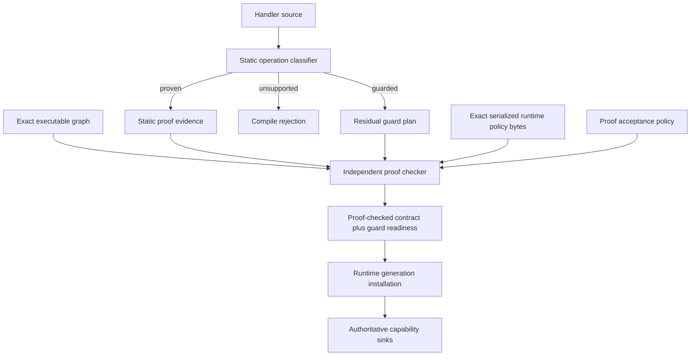
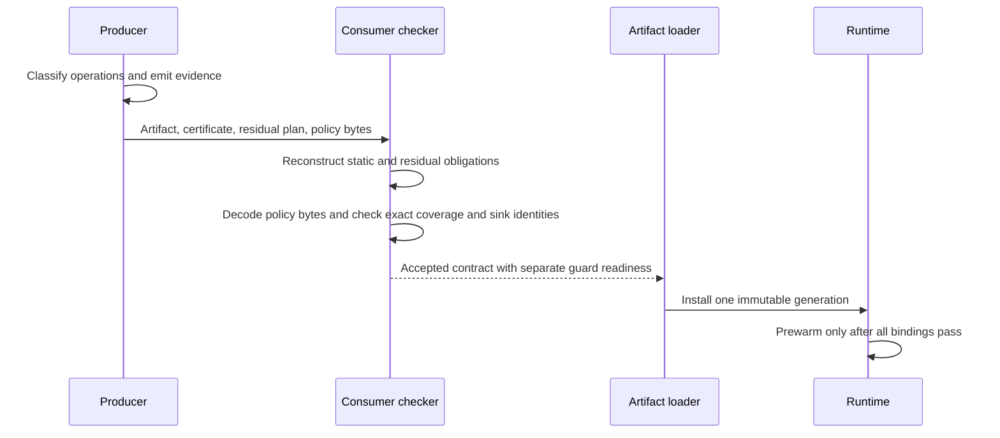
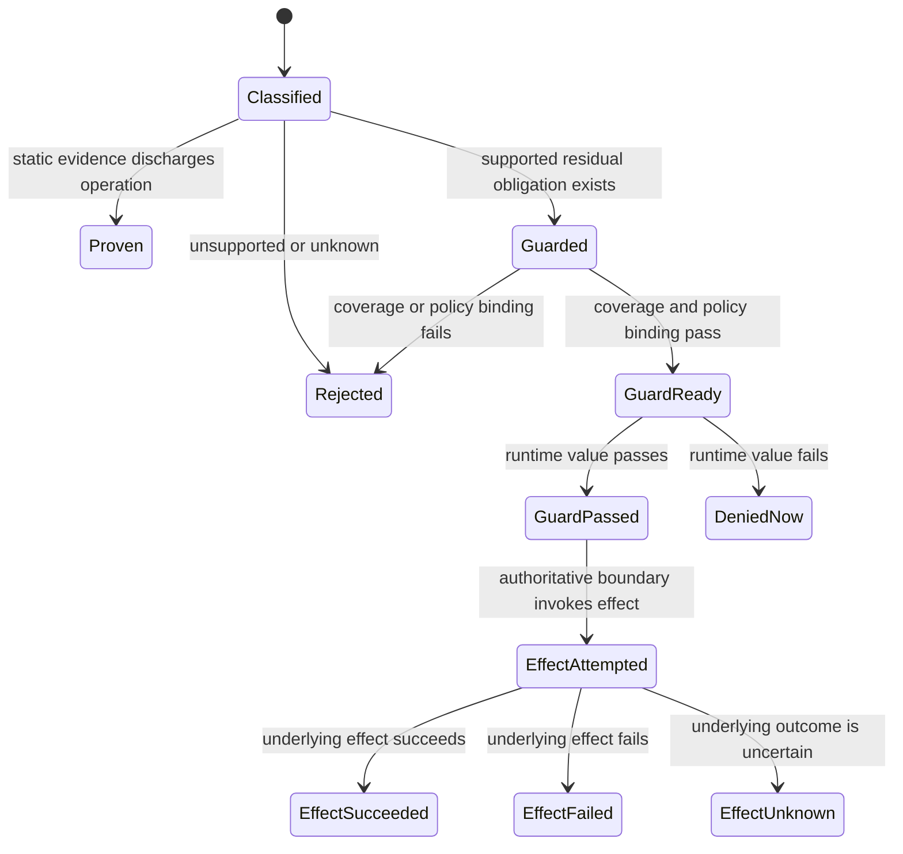
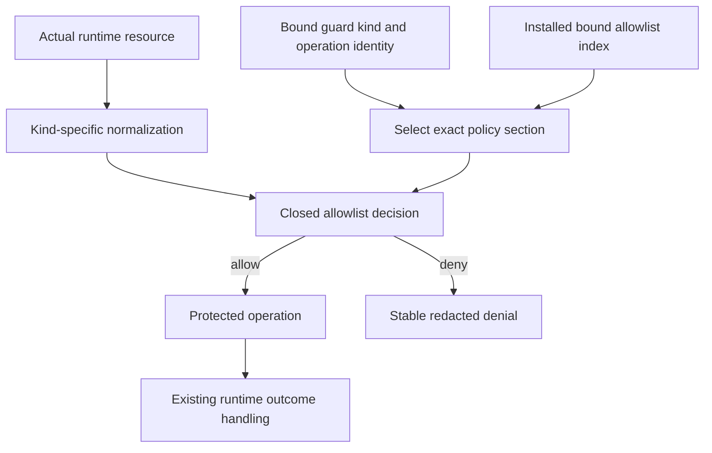
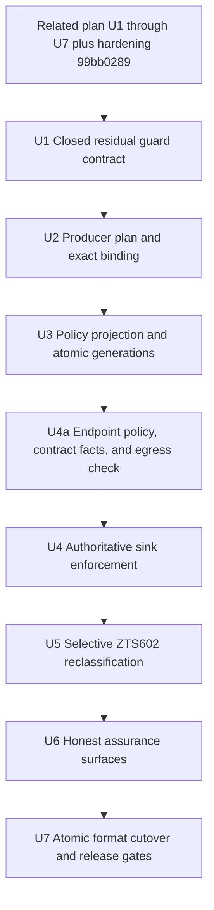

# Residual Runtime Guard Addendum - Plan

## Goal Capsule

- **Objective:** Zttp developers can safely ship useful handlers with runtime-selected capability resources, while consumers retain exact proof claims and fail-closed control over every live resource decision.
- **Means:** Add a closed residual-guard contract to the proof-carrying artifact, bind it to an independently decoded capability policy, remove the permissive dynamic policy projection, enforce at the authoritative sinks, and only then reclassify supported `ZTS602` cases. (KTD1, KTD2, KTD3, KTD5)
- **Authority:** Static proof owns Property claims. The proof checker owns residual-guard coverage. The configured capability policy owns finite resource allowlists. The runtime sink owns each live guard decision. A guarded operation is never a proven Property.
- **Execution profile:** The artifact-level PCC prerequisite is complete and hardened. Implement the seven dependency-ordered units without reopening its accepted checker and runtime boundaries.
- **Stop conditions:** Stop if the runtime cannot observe the actual resource before the effect, if a producer can omit a guard obligation, if an absent policy becomes allow-all, or if guarded evidence can unlock a proof-only optimization.
- **Tail ownership:** Complete local implementation, verification, review, and local commits. Remote push, release, and deployment remain user-owned.

---

## Re-Resolution Against The Delivered Code

The related plan landed in ten commits ending at `a101dbac`, and a follow-up
hardening commit `99bb0289` changed several identities this addendum builds on.
Everything below is read from the tree, not from the earlier draft.

**Predecessor identities now in the tree**

| Thing | Symbol | Value |
|---|---|---|
| Certificate schema | `proof_system.schema_version` | `2` |
| Proof system | `proof_system.ProofSystem` | `zttp_pcc_v1 = 1` |
| Semantics epoch | `proof_system.semantics_epoch` | `1` |
| Certificate container | `certificate.magic` | `0x5A54_5043_4331_0000` |
| Self-extract payload | `self_extract.FORMAT_VERSION` | `2` |
| Attestation envelope | `attest.envelope.version_tag` | `zttp-attest-v3` |
| Proof bundle | `proofs.bundle.tool_version` | `zttp-bundle-2` |
| Graph member kinds | `executable_graph.MemberKind` | `1 .. 15`, highest `proof_certificate = 15` |
| Certificate sections | `certificate.SectionTag` | `1 .. 9`, highest `solver = 9` |

**Successor identities this addendum assigns (R15)**

| Thing | Successor |
|---|---|
| Certificate schema | `3` |
| Proof system | `zttp_pcc_v2 = 2` |
| Self-extract payload | `3` |
| Attestation envelope | `zttp-attest-v4` |
| Proof bundle | `zttp-bundle-3` |
| New graph member kind | `residual_plan = 16` |
| New certificate sections | `residual = 10` |

**What the hardening commit changed that this plan depends on**

- `verdict.Assessment` now carries `PropertyVerdicts`: a per-property grade plus
  the accepted subset. `contract_runtime.promote` intersects the contract's
  claimed properties with that accepted subset, so runtime behavior already
  consumes only accepted properties. Guard coverage becomes a third orthogonal
  axis beside those two, not a fourth grade.
- `MemberKind.proof_certificate` commits the whole certificate with its
  recursive root fields normalized. The residual section is therefore already
  committed transitively; `residual_plan = 16` is added for a per-member
  diagnostic, not to close a hole.
- New reason codes exist for depth, certificate digest, evidence shape, IR
  parent, and solver-query mismatch. Residual codes extend that alphabet.

**Corrections to the earlier draft's problem frame**

- `strict_checker.checkCall` emits `ZTS602` through `literalRequiredArg`, which
  today names five module surfaces at argument position 0: `zttp:env` `env`,
  `zttp:fetch` `fetch` and `fetchSync`, `zttp:service` `serviceCall`, all of
  `zttp:sql`, and all of `zttp:cache`. Only the first, second, fourth, and fifth
  are in scope; `zttp:service` stays rejected under R10.
- `handler_policy.contractToRuntimePolicy` maps a dynamic section to `.{}`,
  whose `enabled` is false, and `RuntimeAllowList.allows` returns true
  unconditionally when `enabled` is false. The fail-open is confirmed exactly as
  described.
- The env, cache, and SQL sinks **already** check policy immediately before
  their effects: `capabilities.readEnvForActiveModule` checks before
  `std.c.getenv`, `cache.denyIfNamespaceBlocked` runs before every get, set,
  delete, incr, and stats, and `sql.executeQuery` checks before
  `getOrCreateStore`, `ensureDb`, `sqlitePrepare`, and any step. U4 is therefore
  mostly verification, bypass probes, and the endpoint work - not four new
  checks.
- Egress is the real gap. `runtime_http.outboundHostViolation` checks the host
  only. The scheme is constrained to http/https by
  `std.http.Client.Protocol.fromUri`, the port defaults to 80/443 without a
  policy check, and no resolved address is inspected. **Redirects are already
  not followed** (`redirect_behavior = .unhandled`), so a redirect reaches the
  handler as an ordinary 3xx response and any follow-up fetch passes the same
  guard. The earlier draft's "validate every redirect target" is therefore
  satisfied by construction; what is missing is scheme, effective port, and
  resolved-address scope. Retries do exist, in `fetch.fetchWithRetryImpl`.
- A configured capability policy already exists: `zttp.json` carries a `policy`
  path, and `handler_policy.parsePolicyJson` reads a file with exactly the keys
  `env.allow`, `egress.allow_hosts`, `cache.allow_namespaces`, and
  `sql.allow_queries` into `HandlerPolicy`. This addendum extends that format
  rather than inventing one, and `egress` needs a richer shape than a host list.
- The deployed runtime policy is `self_extract` section 4, produced by
  `contractToRuntimePolicy` at build time and installed through
  `runtime_config.applyEmbeddedCapabilityPolicy`. Its exact bytes are already a
  graph member (`runtime_policy_bytes = 8`), so R16's "bounded exact canonical
  runtime-capability-policy bytes" are bytes the artifact already commits to.

---

## Product Contract

### Summary

This addendum introduces a CCured-style hybrid acceptance path for a narrow class of Zttp operations. The compiler continues to prove every Property it claims. When it cannot resolve the resource selected by a supported capability operation, it may emit a residual runtime obligation instead of rejecting the handler, but only when the consumer proves complete guard coverage and the runtime enforces the bound policy before the operation crosses its effect boundary.

This is a separate companion to the completed
`docs/plans/2026-08-31-1147-feat-artifact-proof-carrying-code-plan.md`. It does
not amend or renumber that plan. It starts from the checker, executable-graph
binding, and proof-checked runtime contract that plan delivered.

### Problem Frame

The strict checker reports every non-literal capability argument as `ZTS602`. That unconditional refusal prevents an unsafe path: `contractToRuntimePolicy` maps a dynamic contract section to a disabled allowlist, and a disabled allowlist permits every value. The current build is safe only because strict checking returns before such a dynamic contract reaches runtime policy construction. The fail-open is one edit away at all times.

The runtime already observes three of the four resource values immediately before their effects, and the fourth - the outbound endpoint - is observed only as a hostname. CCured shows how to preserve static assurance while assigning only residual uncertainty to runtime checks. Zttp can use that pattern if guard coverage is consumer-checked, policy is explicit, and guarded operations remain distinct from proven Properties.

### Key Decisions

- **Ship this work as a separate companion plan.** (session-settled: user-directed - chosen over updating the in-flight artifact-level PCC plan: implementation of that plan had already started.) Governs R12.
- **Guard only locally observable capability resources in the first release.** (session-settled: user-approved - chosen over treating all unproved properties as runtime-checkable: global semantic properties cannot be established at one effect boundary.) Governs R2, R5, R10.
- **Keep guarded and proven assurance distinct.** (session-settled: user-approved - chosen over one accepted state: a passing runtime allowlist check does not prove noninterference, determinism, retry safety, or translation correctness.) Governs R1, R2, R3, R11.
- **An unnamed address scope denies.** (session-settled: user-approved - chosen over an unconfigured-means-unconstrained flag and over a fixed default set: an empty scope set must mean one thing wherever it is read, and neither a contract nor a default can establish what a name resolves to.) A policy that names no `egress.allow_address_scopes` permits no connection, including the struct default and the contract-only projection. Governs R11, R17.

### Requirements

**Assurance classification**

- R1. Every proof-relevant capability operation must have one exhaustive disposition: `proven`, `guarded`, or `rejected`; an unknown or unclassified disposition must reject.
- R2. A residual guard may authorize one locally observed operation, but it must not discharge a Property or strengthen a static assurance grade.
- R3. Contracts, checker verdicts, CLI output, attestations, and agent protocol results must report proven Properties and guarded operations as separate fields.
- R4. A guarded artifact may reach policy acceptance only when static obligations pass and every residual guard obligation is covered; any request-time guard may still deny that operation.

**Residual guard contract**

- R5. The residual guard schema is closed to five kinds: dynamic environment keys, effective egress endpoints, cache namespaces, named SQL reads, and named SQL writes. An endpoint is scheme, canonical host, effective port, and allowed resolved-address scope.
- R6. The consumer must reconstruct the exact residual obligation set from the proof IR, the executable graph, a checker-owned supported-capability catalog, and the decoded runtime capability policy instead of trusting the producer's list or metadata.
- R7. Each residual obligation must bind its guard kind, operation identity, resource normalization rule, policy section, authoritative sink identity, guard implementation identity, and semantics epoch. The certificate identity must associate the canonical residual-plan digest with the artifact root and the runtime-policy digest, and no graph-committed guard record may contain the final root.
- R8. Every guarded category must have an explicit configured allowlist, including an explicit empty deny-all list; an absent, malformed, or disabled category must reject production acceptance.
- R9. The authoritative runtime boundary must evaluate the actual normalized resource before any protected read, write, DNS resolution, socket attempt, transport, or query and must deny with a stable redacted reason when the value is outside policy.

**Language and rollout boundary**

- R10. Dynamic route paths, service names, durable keys, schemas, reflection, arbitrary predicates, and non-local semantic properties must remain rejected until a separate plan proves a complete enforcement boundary.
- R11. Compiler-visible literals must retain the existing static analysis path and must not pay an additional residual-obligation lookup; existing mandatory runtime capability checks remain in force. The address-scope grant is not one of those literals: no contract can prove what a name resolves to, so a literal-only handler needs the same explicit scope policy a computed one does, and its egress is denied without it.
- R12. U1 through U7 of the related artifact-level PCC plan and its required gates are complete, including hardening commit `99bb0289`; the addendum must preserve that plan's stable IDs and acceptance semantics.
- R13. Startup and live reload must reject a missing, stale, mismatched, unknown, or uncovered guard plan before pool prewarm or handler swap. Live reload must atomically install one generation containing the executable root, proof-checked contract, residual plan, and policy; a failed candidate leaves the prior generation intact, and each in-flight request remains pinned to one generation.
- R14. Guard coverage and failure telemetry must use non-empty tested registries, stable guard IDs, bounded counters, and redacted resource data.
- R15. The implementation must assign the successor versions named in the re-resolution table, cut all strict production artifacts to them, and reject predecessor evidence after cutover instead of maintaining mixed strict formats.
- R16. The leaf checker must receive the bounded exact serialized runtime-policy bytes as a separate `RuntimeCapabilityPolicyInput`, independently recompute their digest against the certificate identity and the `runtime_policy_bytes` graph member, decode them with checker-owned code, and keep this resource authority distinct from its proof-acceptance `Policy`.
- R17. Egress checks must authorize the normalized endpoint before any DNS resolution or socket attempt, and must validate the resolved address scope after resolution but before connection, preventing scheme, port, DNS-rebinding, loopback, link-local, or private-network substitution outside explicit policy. Redirect following stays disabled, so a redirect target reaches the guard as an ordinary new request rather than as an unchecked hop.
- R18. The format must cap serialized runtime-policy input at 256 KiB, each guard category at 256 entries, non-endpoint resource identifiers at 255 bytes, and normalized endpoints at 512 bytes. Runtime lookup must use a verified immutable sorted index with at most eight key comparisons at the category maximum; oversized or duplicate-normalized input rejects before activation.
- R19. Before enabling a guard family, the frozen corpus, the stand-in defect seeds, or a checked-in real-handler fixture must contain at least one previously rejected operation from that family that becomes guarded without changing any proven Property. An unobserved family remains rejected.
- R20. Supported `ZTS602` diagnostics must name the residual guard kind, required policy section, assurance consequence, and exact next verification command; unsupported and literal-only cases must explain why no residual policy edit applies.

### Success Criteria

- A computed environment key, egress endpoint, cache namespace, or registered SQL query name can ship only with an explicit matching policy section and a consumer-checked residual guard plan.
- A producer cannot gain acceptance by omitting an operation, changing its guard kind, pointing it at a weaker sink, or changing the supplied obligation order.
- A disallowed runtime value is denied before the protected operation and does not change externally visible state.
- A guarded operation never appears in the proven Property set and never enables proof-only caching, pooling, result-safety, isolation, or workflow behavior.
- Literal-only handlers keep their current proof results and do not carry residual obligations.
- Removing a guard, disabling its test corpus, or changing the guard implementation identity makes the corresponding gate fail.
- A strict production artifact cannot use a predecessor certificate or proof-system identity after cutover and receives a rebuild diagnostic instead of fallback interpretation.
- A live-reload failure leaves the complete prior generation installed, and concurrent requests never mix executable, contract, residual-plan, or policy generations.
- A passing guard is reported as guard authorization only; the underlying effect may still succeed, fail, or become unknown under its existing outcome model.
- Every enabled guard family converts at least one measured real or seeded rejection into a guarded artifact without reducing static proof results.
- A developer can move from a supported `ZTS602` diagnostic to the exact policy edit and verification command without consulting compiler internals.

### Key Flows

- F1. Build a guarded artifact
  - **Trigger:** A supported capability export receives a resource that is not compiler-visible.
  - **Steps:** The producer marks the operation guarded. It emits a residual obligation. The consumer reconstructs the set, checks exact coverage and policy binding, and produces a proof-checked contract with separate guard readiness.
  - **Outcome:** The artifact is accepted only when static proof and residual coverage both pass.
  - **Covered by:** R1, R2, R4, R5, R6, R7, R8.
- F2. Execute a guarded operation
  - **Trigger:** An accepted handler supplies the actual resource to a protected operation.
  - **Steps:** The authoritative sink normalizes the resource, selects the bound policy section, evaluates the allowlist, and either performs the operation or returns a stable denial before the effect.
  - **Outcome:** Only a policy-allowed runtime resource crosses the boundary.
  - **Covered by:** R7, R8, R9, R13, R14.
- F3. Report assurance
  - **Trigger:** A developer, operator, verifier, or agent inspects the artifact or a runtime denial.
  - **Steps:** The surface reports proof stages, proven Properties, residual guard coverage, and live denial separately.
  - **Outcome:** No consumer mistakes guarded execution for a static theorem.
  - **Covered by:** R2, R3, R4, R14.
- F4. Atomically activate a guarded generation
  - **Trigger:** Startup or live reload receives a candidate executable and its proof material.
  - **Steps:** The loader validates one candidate tuple containing executable root, proof-checked contract, residual plan, and policy. It prewarms and swaps only that accepted tuple. Failure preserves the entire previous tuple, while in-flight requests retain their pinned generation.
  - **Outcome:** No request can combine code or proof evidence from one generation with policy or guard evidence from another.
  - **Covered by:** R7, R8, R12, R13.
- F5. Resolve a supported authoring rejection
  - **Trigger:** A developer receives `ZTS602` for a computed capability resource.
  - **Steps:** The diagnostic identifies the supported guard kind, exact policy section, assurance change from static to guarded, and the check command. The developer supplies an explicit allowlist or deny-all list and reruns verification.
  - **Outcome:** Supported cases become consumer-checked guarded operations; unsupported cases remain compile-time errors with no misleading policy workaround.
  - **Covered by:** R1, R3, R8, R10, R19, R20.

### Acceptance Examples

| ID | Given | When | Then | Covers |
|---|---|---|---|---|
| AE1 | `env(requestedKey)` and an explicit env allowlist | The exact key is allowed at runtime | The read proceeds and the operation is reported as guarded, not proven | R2, R3, R5, R8, R9 |
| AE2 | `env(requestedKey)` and no env policy section | Production acceptance runs | Acceptance rejects before activation | R4, R8, R13 |
| AE3 | A guarded environment read outside the allowlist | The module attempts the read | `getenv` is not called and a redacted guard denial is emitted | R9, R14 |
| AE4 | A computed outbound URL | Its normalized endpoint and resolved-address scope are allowed | Transport may proceed under existing capability and transport checks | R5, R9, R11, R17 |
| AE5 | A computed outbound URL whose endpoint or resolved-address scope is denied | The fetch path runs | The request is rejected before DNS resolution or socket connection | R5, R9, R17 |
| AE6 | A computed cache namespace or SQL name | The actual value is outside policy | The cache mutation or SQL store creation, open, preparation, and execution do not occur | R5, R9 |
| AE7 | A producer omits one guarded call from its certificate | The consumer reconstructs obligations | Exact-set comparison rejects the artifact | R6, R7 |
| AE8 | A certificate points a cache obligation at a non-authoritative sink identity | The checker validates sink identity against its own catalog | Coverage rejects because the effect boundary is not the one named | R7, R9 |
| AE9 | A valid guard plan is attached to different bytecode or policy bytes | Startup validates it | Artifact-root or policy-digest binding rejects before prewarm | R7, R13 |
| AE10 | A handler uses a dynamic route, service name, durable key, or arbitrary predicate | Strict checking runs | The existing fail-closed diagnostic remains an error | R1, R10 |
| AE11 | A literal-only handler | Build and runtime verification run | The artifact has no residual obligations and keeps its current proof results; its outbound connections still need an explicit address-scope grant, which no literal can supply | R1, R11 |
| AE12 | A guarded artifact passes startup and later sees a denied value | Assurance is reported | Static proof remains valid, the operation is denied, and the artifact is not relabeled unproven | R2, R3, R4, R9 |
| AE13 | A predecessor certificate, payload, envelope, or bundle is presented after cutover | The strict path runs | The artifact is rejected with a rebuild diagnostic | R13, R15 |
| AE14 | A guarded live-reload candidate has a missing contract, contract-diff failure, upgrade-analysis failure, or plain-swap fallback | Reload runs while the old generation serves requests | The candidate cannot bypass verification, the old tuple remains intact, and in-flight requests stay pinned | R7, R8, R13 |
| AE15 | An outbound request retries after a connection failure or retryable response | Each DNS or socket attempt begins | The attempt uses the request's pinned generation and rechecks the bound endpoint and resolved-address scope before transport | R7, R9, R13, R17 |
| AE16 | An allowed host appears under a disallowed scheme, port, or resolved address scope | The request reaches the authoritative network boundary | The endpoint is denied before DNS resolution or socket connection | R5, R9, R17 |
| AE17 | Runtime policy bytes are missing, oversized, digest-mismatched, malformed, or decode differently from the producer's | The leaf checker runs | Independent policy decoding rejects before activation | R6, R8, R16, R18 |
| AE18 | A supported computed-resource diagnostic is shown | The developer follows it | The message identifies the guard kind, policy section, assurance consequence, and exact check command | R19, R20 |

### Scope Boundaries

**In scope**

- A closed residual guard schema, exact coverage checking, configured policy binding, fail-closed dynamic policy projection, authoritative sink checks, selective `ZTS602` reclassification, assurance output, and release gates.
- A direct-cutover capability policy file for env, normalized egress endpoints and address scopes, cache, and SQL as the external source of finite allowlists.
- A bounded checker-owned runtime-policy input and immutable runtime lookup index.
- Startup, self-extract, development serve, in-process dispatch, and live reload paths that install runtime policy.

**Deferred to follow-up work**

- Additional locally guardable resource families after each has an authoritative sink and a mutation-tested checker rule.
- Lookup representations beyond the fixed 256-entry category limit.
- Portable guard receipts for remote per-request audit beyond bounded aggregate telemetry.
- Following redirects at all. They stay unhandled, which is the strongest available posture and the reason no separate redirect guard exists.

**Outside this plan**

- Runtime substitutes for noninterference, determinism, retry safety, result safety, isolation, termination, translation correctness, or full functional correctness.
- A general predicate language, producer-defined guard code, unrestricted callbacks, or an allow-all development escape hatch.
- Changes to the related artifact-level PCC plan or a shared protocol with Metadoor.

### Sources

- Necula, [Proof-Carrying Code, POPL 1997](https://homes.cs.washington.edu/~mernst/teaching/6.893/readings/necula-popl97.pdf), for consumer-owned policy, obligation generation, small independent checking, and safe activation only after acceptance.
- Necula, McPeak, and Weimer, [CCured: Type-Safe Retrofitting of Legacy Code](https://dl.acm.org/doi/10.1145/2442776.2442786), for inferring the minimum dynamic portion and inserting runtime checks for residual uncertainty.
- `docs/plans/2026-08-31-1147-feat-artifact-proof-carrying-code-plan.md` for the independent checker, executable-graph binding, proof-checked contract, and unchanged dynamic-control boundary this addendum requires.
- `packages/zts/src/strict_checker.zig` `checkCall` and `literalRequiredArg` for the current unconditional `ZTS602` rejection and its five module surfaces.
- `packages/zts/src/handler_policy.zig` `contractToRuntimePolicy`, `RuntimeAllowList.allows`, `parsePolicyJson` for the permissive dynamic projection and the configured policy format.
- `packages/zts/src/module_binding/capabilities.zig` `readEnvForActiveModule`, `packages/modules/src/data/cache.zig` `denyIfNamespaceBlocked`, and `packages/modules/src/data/sql.zig` `executeQuery` for the three sinks that already check before their effects.
- `packages/runtime/src/runtime_http.zig` `outboundHostViolation` and the `connectTcpOptions` path for the host-only egress check and the absent port and address-scope checks.
- `docs/internals/capabilities.md` and `docs/contracts-and-sandboxing.md` for the separate module-capability, per-resource policy, and sandbox authority layers.
- `docs/solutions/security-issues/self-extract-runtime-policy-attestation-binding.md` for serialize-once policy binding at activation.
- `docs/solutions/conventions/a-gate-that-counts-nothing-still-reports-a-pass.md` for non-empty coverage floors and deliberate invalidation.

---

## Planning Contract

### Key Technical Decisions

- KTD1. **Represent residual guards as a closed consumer-owned obligation set in a successor certificate version.** Assign certificate schema `3` and proof system `zttp_pcc_v2 = 2`, rather than adding optional semantics to the delivered formats. Build successor readers and writers behind non-authoritative test entry points, then make U7 the only strict cutover. The independent checker reconstructs obligations from owned artifact data and rejects unknown, missing, extra, duplicate, or mismatched members. Implements R1, R4, R5, R6, R7, R15.
- KTD2. **Use independently decoded runtime capability policy as guard authority.** A dynamic contract category requires its corresponding policy section. The leaf checker receives the exact serialized policy bytes, recomputes their digest against both the certificate identity and the `runtime_policy_bytes` graph member, and decodes them with its own code. No dynamic section may construct an allow-all runtime policy. Implements R7, R8, R13, R16, R18.
- KTD3. **Enforce at the authoritative operation boundary.** Env reads, normalized egress endpoints and resolved address scopes, cache operations, and named SQL execution evaluate the actual resource immediately before the protected operation, and retries repeat the network check. Optional pre-check helpers do not count as coverage. Implements R5, R7, R9, R17.
- KTD4. **Keep assurance three-dimensional.** (session-settled: user-approved - chosen over promoting a passing guard to proof: static theorems, guard coverage, and live authorization decisions answer three different questions.) Preserve the related plan's acceptance stages and its `PropertyVerdicts`, and add guard coverage beside them rather than inside them. Implements R2, R3, R4, R11.
- KTD5. **Relax `ZTS602` only after fail-closed guard infrastructure exists.** (session-settled: user-approved - chosen over a broad dynamic mode: the language may admit only the closed export and argument positions covered by R5.) Unsupported dynamic capability uses remain compile errors. Implements R1, R5, R10, R13.
- KTD6. **Layer the addendum after the completed PCC plan.** (session-settled: user-directed - chosen over editing its stable units.) Reuse its checker, certificate, artifact root, policy digest, and proof-checked runtime types. Do not create a parallel certificate or activation path. Implements R12.
- KTD7. **Move the egress format, the contract's egress facts, and the runtime egress check in one step.** (measured during U2: the policy file, the runtime comparison, and the contract all name hostnames, and changing any one alone leaves a policy that reads as configured and permits nothing it names.) `parsePolicyJson` already reads `env.allow`, `cache.allow_namespaces`, and `sql.allow_queries`; those keep their names and move independently. `egress.allow_hosts` is replaced by `egress.allow_endpoints` and `egress.allow_address_scopes` **together with** `EgressInfo` recording normalized endpoints and `outboundHostViolation` becoming an endpoint check - and the normalizer must be reachable from `packages/zts`, which cannot import the acceptance kernel. That is U4a below, not a part of U2. Implements R5, R8, R17.
- KTD8. **Extend the existing capability policy file rather than inventing a format.** `parsePolicyJson` already reads `env.allow`, `cache.allow_namespaces`, and `sql.allow_queries`; those keep their names. `egress.allow_hosts` is replaced outright by `egress.allow_endpoints` and `egress.allow_address_scopes`, because a host list cannot express the scheme, port, and scope that R17 requires. The parser already rejects unknown keys, so the old key becomes a clear error rather than a silent weakening. Implements R5, R8, R17.

### High-Level Technical Design

These sketches describe boundaries, stages, and assurance relationships. They do not prescribe exact APIs.

**Component topology**

**Build and activation sequence**

**Operation disposition**

**Request-time guard data flow**

A `GuardPassed` event is not a durable effect receipt. It proves neither effect application, idempotency, retry safety, nor the final effect outcome.

### Implementation Constraints

- Preserve the related plan's checker leaf boundary: `packages/proof-checker` imports `std` and its own siblings, allocates nothing, and reaches no ambient capability. `scripts/check-proof-checker.sh` enforces this and must keep passing.
- Treat guard coverage as certificate evidence about enforcement placement, not evidence that a future runtime value will pass.
- Keep guard kinds, normalization rules, sink identities, policy sections, address scopes, and verdicts as closed tagged unions with exhaustive handling and a `fromWire` that returns null outside the set.
- Maintain a checker-owned guard catalog keyed by module specifier, export, and argument position, yielding normalization rule, policy section, sink identity, and guard implementation identity. Compare it against `literalRequiredArg` and the module bindings without trusting producer-declared coverage.
- Keep graph commitments acyclic. `proof_certificate` already normalizes recursive root fields; `residual_plan` commits the residual section's own bytes, and the certificate identity binds that digest to the graph root and the policy digest.
- Reuse the configured capability policy file. Reject a missing category for a guarded operation instead of deriving permissions from observed runtime values.
- Pass the exact serialized runtime-policy bytes and let the checker recompute the digest. Never substitute proof-acceptance policy, producer metadata, or a digest without bytes.
- Replace the permissive dynamic branches in `contractToRuntimePolicy` before any `ZTS602` case becomes non-fatal.
- Count only checks inside the authoritative env, HTTP, cache, and SQL operation paths. A caller-visible `allows*` helper alone is insufficient.
- Enforce R18's byte, entry, and comparison limits before allocation or expensive parsing. Build one immutable sorted index per installed generation; static-only handlers allocate and consult none.
- Keep resource values and resource-derived hashes out of default logs, receipts, and portable evidence. Report only guard kind, stable obligation ID, outcome, and policy generation.
- Preserve all existing capability, active-module-scope, bytecode, isolation, request, authorization, limit, lease, and workflow checks.
- Treat the executable root, proof-checked contract, residual plan, and policy as one immutable runtime generation. Reject guarded candidates on missing-contract, contract-diff, upgrade-analysis, and plain-swap fallback branches. Failed candidates preserve the prior tuple, and requests pin a generation for their full lifetime.
- Re-evaluate scheme, canonical host, effective port, and allowed address scope at every actual DNS or socket attempt, including retry attempts. A cached result that performs no transport must not emit a transport guard pass.
- Keep guard telemetry separate from effect outcome and receipt semantics.
- Do not hand-edit generated coverage documents or other generated artifacts.

### Sequencing

### Risks and Dependencies

- **Fail-open ordering:** Relaxing `ZTS602` before removing permissive dynamic policy projection creates an allow-all path. U5 depends on mutation-tested completion of U3 and U4.
- **Check-placement drift:** A refactor can leave a pre-check intact while moving the effect around it. U4 and U7 must prove denial prevents the observable operation, not only that a helper returned false.
- **Normalization mismatch:** Producer, checker, policy parser, and runtime can disagree on host case, URL parsing, or identifier bytes. U1 owns one versioned rule per guard kind, in one file, and every other layer calls it.
- **Assurance inflation:** Existing summaries may aggregate accepted operations. U6 must audit every public assurance surface and keep guarded counts separate.
- **Policy cardinality:** Large allowlists can increase startup time and per-operation lookup cost. U3 and U7 enforce R18's deterministic limits and lookup-work bound.
- **Checker input confusion:** A policy digest alone cannot prove category presence or normalization. U1 and U2 keep runtime capability policy bytes separate from proof-acceptance policy and mutation-test both inputs independently.
- **Network endpoint substitution:** Host-only checks do not prevent scheme, port, or DNS-rebinding attacks. U4 owns endpoint and post-resolution address-scope enforcement at every transport attempt, which requires resolving the name in the runtime rather than inside `std.http.Client`.
- **Cutover ordering:** Successor decoders and producers cannot become the strict default in separate commits. U7 switches all strict producer, checker, loader, CLI, fixture, and runtime paths atomically.
- **Unobserved families:** R19 may leave a family disabled if no measured rejection exists for it. The stand-in seeds carry a `dynamic-capability` case for `zttp:env`; the other three families must be measured in U5 and left rejected if absent.
- **Service-registry gap:** Dynamic service names remain rejected because the executable graph does not bind the loaded service registry and a registry check alone does not cover the final egress effect.

### System-Wide Impact

- **Authoring:** Supported computed resources move from unconditional `ZTS602` rejection to a guarded disposition only when the configured policy supplies the required category and the family has a measured use. Diagnostics give the exact policy and verification path.
- **Artifacts:** Certificate schema `3`, proof system `zttp_pcc_v2`, self-extract `3`, `zttp-attest-v4`, and `zttp-bundle-3` add one residual section and one graph member and reject predecessor evidence.
- **Runtime:** Self-extract, serve, in-process dispatch, prewarm, and live reload install one atomic executable, contract, residual plan, decoded policy index, and policy generation before execution. Requests remain pinned across retries.
- **Assurance surfaces:** Contracts, CLI, bundles, attestations, agent protocol, and documentation report static Properties and guarded operations independently.
- **Operations:** Denial telemetry gains bounded guard identities and redacted outcomes.

---

## Implementation Units

### U1. Define the closed residual guard contract

- **Goal:** Give the consumer checker an exhaustive successor-format representation of guarded operations, runtime policy, normalization, authoritative sinks, and exact coverage without changing the current strict default.
- **Requirements:** R1, R2, R4, R5, R6, R7, R12, R15, R16, R18. Implements KTD1, KTD4, and KTD6.
- **Dependencies:** Related plan complete through `99bb0289`.
- **Files:** `packages/proof-checker/src/residual.zig` (new), `packages/proof-checker/src/capability_policy.zig` (new), `packages/proof-checker/src/certificate.zig`, `packages/proof-checker/src/proof_system.zig`, `packages/proof-checker/src/executable_graph.zig`, `packages/proof-checker/src/policy.zig`, `packages/proof-checker/src/limits.zig`, `packages/proof-checker/src/checker.zig`, `packages/proof-checker/src/verdict.zig`, `packages/proof-checker/src/root.zig`, `packages/proof-checker/src/test_root.zig`, `scripts/check-proof-checker.sh`.
- **Approach:** Add `GuardKind`, `Normalization`, `SinkId`, `PolicySection`, `AddressScope`, and `guard_impl_id` as closed alphabets in `residual.zig`, together with the one canonical normalization function per kind. Add a checker-owned catalog keyed by module specifier, export, and argument position. Add `capability_policy.zig`: a bounded decoder for the exact serialized runtime-policy bytes, owned by the checker and independent of `handler_policy.zig`. Add certificate section `residual = 10`, member kind `residual_plan = 16`, and the two new identity digests. Add `RuntimeCapabilityPolicyInput` to `checker.Inputs` and `GuardVerdicts` to `Assessment`. Keep schema `3` and `zttp_pcc_v2` reachable only from checker-internal test entry points.
- **Execution note:** Write failing decode, exact-set, sink-identity, and policy-decode tests before the first positive guarded fixture.
- **Test scenarios:**
  - One fixture for each of the five guard kinds reconstructs the expected obligation and reaches guard coverage only with an exact member.
  - Missing, extra, duplicate, reordered, unknown, malformed, or unsupported guard members reject with stable reasons.
  - Changing guard kind, operation identity, normalization rule, sink identity, guard implementation identity, policy section, semantics epoch, artifact root, policy bytes, or policy digest rejects.
  - Missing, malformed, oversized, duplicate-normalized, or digest-mismatched runtime policy input rejects independently from proof-acceptance policy, including a digest supplied with no bytes.
  - Env, endpoint, cache, SQL, entry-count, and policy byte limits reject at their exact boundaries.
  - A valid residual obligation changes no `PropertyVerdicts` entry and cannot satisfy a proof-only consumer policy requirement.
  - Zero guarded operations produce an explicit empty residual set without weakening the static-obligation floor.
  - Successor evidence decodes only through the internal test path; predecessor evidence retains current strict behavior until U7.
  - Normalization is idempotent and collision-free across the fixtures for every kind.
- **Verification:** `zig build test-proof-checker` proves exhaustive decoding, consumer reconstruction, exact coverage, assurance separation, resource bounds, and non-zero collection for every guard kind. `scripts/check-proof-checker.sh` still reports the kernel a leaf with a non-empty suite.

### U2. Emit and bind the exact residual guard plan

- **Goal:** Make producer output identify every supported dynamic capability operation and bind the plan to the final artifact and configured policy.
- **Requirements:** R1, R3, R5, R6, R7, R8, R12, R15, R16, R18. Implements KTD1, KTD2, KTD6, and KTD7.
- **Dependencies:** U1.
- **Files:** `packages/zts/src/handler_policy.zig`, `packages/zts/src/contract_types.zig`, `packages/zts/src/contract_builder.zig`, `packages/zts/src/contract_json_writer.zig`, `packages/zts/src/contract_json_parser.zig`, `packages/zts/src/proof_ir.zig`, `packages/tools/src/precompile.zig`, `packages/runtime/src/proof_certificate.zig`, `packages/runtime/src/artifact_graph.zig`, `packages/runtime/src/build_command.zig`, `packages/runtime/src/self_extract.zig`.
- **Approach:** Extend the policy file format per KTD7 and keep `parsePolicyJson` strict about unknown keys. Preserve dynamic call-site facts through contract construction so each guarded call keeps a distinct operation identity tied to a proof-IR node. Emit one residual member per guarded operation through an explicit non-authoritative test path, require the matching configured policy section, and bind the residual-plan digest, the graph root, and the policy digest through the certificate identity.
- **Execution note:** Keep `ZTS602` fatal while building this unit. Producer fixtures may construct dynamic contracts directly until U3 proves fail-closed runtime behavior.
- **Test scenarios:**
  - Repeated builds over the same handler and policy emit identical residual plan and binding bytes.
  - Multiple guarded calls in the same category retain distinct operation identities, and omitting either changes the plan.
  - A missing policy file, missing guarded category, malformed policy, or unbounded entry rejects build and check paths.
  - An explicit empty list encodes as enabled deny-all and stays distinguishable from an absent section.
  - Policy, artifact, contract, proof IR, or guard-plan mutation changes the bound identity and rejects prior evidence.
  - Literal-only handlers emit an explicit empty residual plan and keep their current contract projection and certificate bytes.
  - The old `egress.allow_hosts` key is a policy error naming its replacement.
- **Verification:** `zig build test-zts`, `test-precompile`, and `test-cli` pass, with deterministic serialization and mutation coverage, while user-facing `ZTS602` behavior is unchanged.

### U3. Install fail-closed policy as an atomic generation

- **Goal:** Make verified policy projection and activation non-bypassable before any guarded operation is admitted.
- **Requirements:** R7, R8, R12, R13, R15, R16, R18. Implements KTD2 and KTD6.
- **Dependencies:** U1, U2.
- **Files:** `packages/zts/src/handler_policy.zig`, `packages/runtime/src/contract_runtime.zig`, `packages/runtime/src/runtime_config.zig`, `packages/runtime/src/proof_activation.zig`, `packages/runtime/src/server.zig`, `packages/runtime/src/handler_instance.zig`, `packages/runtime/src/runtime_pool.zig`, `packages/runtime/src/live_reload.zig`, `packages/runtime/src/in_process_dispatch.zig`, `packages/runtime/src/self_extract.zig`, `packages/runtime/src/zruntime_tests.zig`.
- **Approach:** Change every dynamic branch of `contractToRuntimePolicy` from `.{}` to an enabled empty allowlist, and take the configured `HandlerPolicy` as the source of entries for a dynamic category. Add a bounded immutable sorted index per category, built once per generation. Carry the residual plan and the policy digest into `ProofCheckedContract` so the executable root, contract, residual plan, and policy install and swap as one tuple. Pin each request to its generation.
- **Execution note:** First turn the current permissive dynamic-policy behavior into a failing security probe, then make the explicit-policy path pass without changing literal-only behavior.
- **Test scenarios:**
  - A dynamic category with no configured policy installs no handler and cannot fall back to an allow-all list.
  - A guard-plan, policy-digest, sink-identity, or implementation-identity mismatch rejects startup and live reload before prewarm or swap.
  - Missing-contract, contract-diff, upgrade-analysis, and plain-swap reload branches cannot activate a guarded candidate; failure preserves the complete old generation and in-flight pins.
  - An explicit empty category installs deny-all, while an absent, malformed, or oversized category rejects activation.
  - The maximum policy builds one immutable index with bounded construction work and at most eight key comparisons per lookup.
  - Literal-only handlers preserve current mandatory enforcement and perform no residual lookup.
- **Verification:** `zig build test-zts`, `test-server`, `test-cli`, and `test-zruntime` prove fail-closed atomic installation.

### U4a. Move egress from host names to endpoints in one step

- **Goal:** Make the policy file, the contract's egress facts, and the runtime egress check all name `scheme://host:port` and an address scope, in a single change, so no layer is left describing a destination a neighbouring layer cannot.
- **Requirements:** R5, R8, R9, R17, R18. Implements KTD7.
- **Dependencies:** U3.
- **Files:** `packages/zts/src/handler_policy.zig`, `packages/zts/src/contract_types.zig`, `packages/zts/src/contract_builder.zig`, `packages/zts/src/contract_json_writer.zig`, `packages/zts/src/contract_json_parser.zig`, `packages/zts/src/policy.zig`, `packages/zts/src/endpoint.zig` (new), `packages/runtime/src/runtime_http.zig`, `packages/runtime/src/self_extract.zig`, `packages/pi/src/standin/defect_seeds.zig`, `docs/contracts-and-sandboxing.md`.
- **Approach:** The acceptance kernel owns the canonical endpoint rule and `packages/zts` cannot import it, so the rule moves to a base-tier `endpoint.zig` that both sides call, pinned by a test in `packages/runtime`, which sees both. `EgressInfo` records normalized endpoints rather than bare hosts. `contractToRuntimePolicy` projects those. `outboundHostViolation` becomes `outboundEndpointViolation` and normalizes the request URL with the same rule. Every fixture that names a host moves with it, including the ones that build a dynamic port at run time.
- **Execution note:** Measured in U2: nineteen fixtures name egress hosts, several of them derived from a test server's dynamic port. Splitting this across commits leaves the tree with a policy format one layer understands.
- **Test scenarios:**
  - The same host under a different scheme or port is a different endpoint and is denied.
  - A trailing dot and mixed case are the same endpoint.
  - A URL the rule cannot canonicalize - userinfo, a scheme outside the set - is refused rather than connected to.
  - The old `egress.allow_hosts` key is a policy error naming its replacement.
  - An egress section with no address scope permits no connection.
  - The kernel's rule and the base-tier rule agree on a shared corpus.
- **Verification:** `zig build test-zts`, `test-modules`, `test-server`, `test-zruntime`, and `test-standin` pass with every egress fixture on endpoints.

### U4. Enforce guards at authoritative capability sinks

- **Goal:** Check the actual normalized env, endpoint, cache, or SQL resource immediately before its protected operation, and close the egress gap.
- **Requirements:** R5, R7, R8, R9, R11, R13, R14, R17, R18. Implements KTD2 and KTD3.
- **Dependencies:** U4a.
- **Files:** `packages/runtime/src/runtime_http.zig`, `packages/zts/src/module_binding/capabilities.zig`, `packages/modules/src/data/cache.zig`, `packages/modules/src/data/sql.zig`, `packages/modules/src/net/fetch.zig`, `packages/zts/src/security_events.zig`, `packages/runtime/src/security_logger.zig`, `packages/runtime/src/zruntime_tests.zig`.
- **Approach:** The env, cache, and SQL sinks already check before their effects; this unit pins that placement with bypass probes and moves them onto the shared normalization from U1. The egress sink gains real work: normalize scheme, canonical host, and effective port into one endpoint string, authorize it before resolution, resolve the name in the runtime, validate the resolved address scope before connecting, and repeat both on every retry attempt. The connection is then opened to the classified address itself, passed as a literal, with the real host name carried alongside it so TLS still verifies the certificate against the name the policy named. Handing `std.http.Client` the name again would let it resolve a second time, and the address it reached would not be the address that was checked. Emit only guard kind, obligation ID, outcome, and generation.
- **Execution note:** Land one sink family at a time with a bypass probe, and keep `ZTS602` fatal and successor activation non-production until every family passes.
- **Test scenarios:**
  - Allowed and denied environment keys are distinguished before `getenv`, including a module that skips optional helpers.
  - Scheme, canonical host, effective port, and resolved public, private, loopback, and link-local scopes enforce exact endpoint policy before network I/O.
  - DNS rebinding between attempts, connection failures, retryable responses, and sequential calls cannot change generation or bypass the endpoint guard.
  - A cached result performs no transport and emits no false endpoint-guard pass.
  - Cache get, set, delete, increment, and namespaced stats deny before reading or mutating store state.
  - SQL read and write names deny before store creation, database open, preparation, and execution, preserving the read-versus-write distinction.
  - Guard success remains separate from effect success, failure, and unknown outcome.
  - Maximum-length valid resources pass; the first oversized byte rejects before protected work.
- **Verification:** `zig build test-zts`, `test-modules`, `test-server`, and `test-zruntime` prove denial before every named observable operation.

### U5. Reclassify only supported dynamic capability calls

- **Goal:** Replace unconditional `ZTS602` rejection with residual classification only for measured export argument positions that U4 guards completely.
- **Requirements:** R1, R4, R5, R8, R10, R11, R13, R19, R20. Implements KTD5.
- **Dependencies:** U4.
- **Files:** `packages/zts/src/strict_checker.zig`, `packages/zts/src/rule_registry.zig`, `packages/zts/src/diagnostic_catalog.zig`, `packages/zts/src/contract_builder.zig`, `packages/zts/src/contract_types.zig`, `packages/zts/src/pipeline.zig`, `packages/pi/src/standin/defect_seeds.zig`, `scripts/unseeded-rules.allow`, `docs/coverage.md`.
- **Approach:** Measure, per family, whether a checked-in rejection exists. `zttp:env` has one in `defect_seeds.zig` (`dynamic-capability`). Enable only families with such evidence, and record the measurement. Replace `literalRequiredArg`'s binary decision with an exhaustive classification over the supported registry that returns proven, guarded, or rejected. Emit residual obligations for supported computed resources and diagnostics naming guard kind, policy section, assurance consequence, and exact command.
- **Execution note:** Land only after U4's bypass probes fail correctly. Keep public behavior unchanged until U7. Update seeds and allowlists in both directions.
- **Test scenarios:**
  - Each enabled family has a checked-in measured rejection that converts to the expected residual kind when policy exists.
  - The same calls without the required policy remain build errors and cannot create a development allow-all artifact.
  - Dynamic SQL registration statements, route paths, service names, durable keys, schemas, and unregistered exports remain errors.
  - An unknown virtual module export or changed argument position cannot fall into a generic guarded bucket.
  - Static templates and literals retain current diagnostics, contract literals, and proof results.
  - Supported, unsupported, missing-policy, explicit-deny-all, and literal-only diagnostics give accurate distinct next actions.
  - The stand-in gate fails when the guarded and rejected sides of the classifier are not both exercised.
- **Verification:** `zig build test-zts`, `test-zts-cli`, `test-standin`, and the advertised-rule and unseeded-rule gates pass with explicit positive and negative classifier coverage.

### U6. Expose honest assurance surfaces

- **Goal:** Make every human and machine surface distinguish static proof, residual coverage, live guard denial, and production eligibility.
- **Requirements:** R2, R3, R4, R11, R13, R14, R20. Implements KTD4 and KTD5.
- **Dependencies:** U5.
- **Files:** `packages/runtime/src/proofs/bundle.zig`, `packages/runtime/src/proofs_cli.zig`, `packages/runtime/src/verify_cli.zig`, `packages/runtime/src/attest/envelope.zig`, `packages/runtime/src/attest/build_receipt.zig`, `packages/runtime/src/server.zig`, `packages/tools/src/agent_protocol.zig`.
- **Approach:** Add separate bounded summaries for proven Properties, residual guard coverage, installed policy identity, and denial counters. Audit every current accepted-assurance surface. Preserve resource confidentiality and keep guard authorization separate from effect outcome.
- **Execution note:** Preserve current JSON and text outputs as characterization fixtures, then cut ambiguous aggregate labels directly instead of keeping compatibility aliases.
- **Test scenarios:**
  - A guarded artifact reports its exact guarded operation count and kinds without adding them to the proven Property set.
  - A denied request reports a stable guard ID and kind without raw values or unbounded cardinality.
  - Integrity-valid evidence with missing guard coverage or the wrong policy remains policy-rejected.
  - Static-only and guarded artifacts retain distinct golden CLI, JSON, bundle, attestation, and agent-protocol outputs.
  - Default telemetry contains no raw or resource-derived identifier and cannot claim effect application.
- **Verification:** `zig build test-cli`, `test-agent-protocol`, and the golden-output gates pass for static, guarded, denied, malformed, and mixed-assurance cases.

### U7. Atomically cut strict formats and install release gates

- **Goal:** Switch every strict producer and consumer to the successor chain in one cutover and make coverage regression impossible to report as success.
- **Requirements:** R4, R12, R13, R14, R15, R18, R19, R20. Implements KTD1, KTD4, KTD5, and KTD6.
- **Dependencies:** U1 through U6.
- **Files:** `packages/proof-checker/src/proof_system.zig`, `packages/runtime/src/self_extract.zig`, `packages/runtime/src/attest/envelope.zig`, `packages/runtime/src/proofs/bundle.zig`, `packages/runtime/src/build_command.zig`, `packages/runtime/src/runtime_cli.zig`, `packages/runtime/src/proof_activation.zig`, `packages/runtime/src/proof_ratchet.zig`, `scripts/check-residual-guards.sh` (new), `scripts/check-proof-ratchet.sh`, `scripts/verify.sh`, `build.zig`, `docs/verification.md`, `docs/user-guide.md`, `docs/threat-model.md`, `docs/cli.md`, `docs/internals/architecture.md`, `docs/internals/capabilities.md`, `docs/contracts-and-sandboxing.md`, `docs/internals/testing.md`, `CONCEPTS.md`.
- **Approach:** In one reviewable cutover, switch build, precompile, checker defaults, self-extract, startup, live reload, CLI, fixtures, and documentation to the successor versions. Delete predecessor readers and test-only successor entry points. Add `scripts/check-residual-guards.sh`: a drift gate that compares the checker-owned guard catalog, the enabled families, and the published residual boundary in the documentation, with a non-empty floor and deliberate invalidation in both directions.
- **Execution note:** U1 through U6 may land only while predecessor strict behavior remains authoritative. This unit is the sole format activation point and must not be split across commits that leave producer and checker defaults mismatched.
- **Test scenarios:**
  - Predecessor certificate, payload, envelope, or bundle evidence rejects on every strict production surface with a rebuild diagnostic.
  - Successor producer, checker, startup, reload, CLI, fixture, and documentation versions agree in one commit.
  - Disabling a sink guard, removing a family fixture, emptying a corpus, changing normalization, or making a probe fail to compile causes the named gate to fail nonzero.
  - Maximum policy size respects the fixed construction and lookup-work bounds; one excess entry or byte rejects.
  - Reporting shows at least one safe conversion for every enabled guard family and no loss of proven Properties.
  - No predecessor compatibility alias, permissive dynamic fallback, or production-reachable test entry point remains.
- **Verification:** Stand-in, coverage drift, proof-swallow, module-boundary, ratchet, residual-guard, full repository, optimized build, and `bash scripts/verify.sh` gates pass with deliberate probes restored.

---

## Verification Contract

### Required Commands

| Gate | Command | Proves |
|---|---|---|
| Checker kernel | `zig build test-proof-checker --summary all` | Closed residual decoding, obligation reconstruction, exact coverage, assurance separation, and resource bounds |
| Kernel boundary | `bash scripts/check-proof-checker.sh` | The acceptance kernel is still a leaf with a non-empty suite |
| Trusted boundary | `zig build test-proof-ratchet-drift` | The published residual boundary still matches the kernel |
| Guard boundary | `bash scripts/check-residual-guards.sh` | The guard catalog, enabled families, and documentation agree |
| ZTS compiler | `zig build test-zts --summary all` | Dynamic call classification, contract facts, policy requirements, and unchanged static Properties |
| Modules | `zig build test-modules --summary all` | Cache and SQL sinks deny before their effects |
| Precompile path | `zig build test-precompile --summary all` | Deterministic guard-plan emission and exact artifact and policy binding |
| ZTS CLI | `zig build test-zts-cli --summary all` | Check and build diagnostics for guarded, rejected, and missing-policy cases |
| Runtime CLI | `zig build test-cli --summary all` | Bundle, verification, assurance, and stable denial output |
| Runtime server | `zig build test-server --summary all` | Atomic generation installation and pinning |
| Runtime end to end | `zig build test-zruntime` | Startup, live reload, sink enforcement, and denial before effect |
| Stand-in coverage | `zig build test-standin` | Advertised classifier outcomes have real positive and negative seeds |
| Module boundaries | `zig build test-module-boundary` | Checker and runtime guard authority remain in their intended layers |
| ZTS layering | `zig build test-zts-layering` | Compiler, checker, module, and runtime dependencies remain valid |
| Proof hygiene | `zig build test-proof-swallow` | Proof and coverage decisions do not discard errors without review |
| Aggregate tests | `zig build test -j1` | Repository unit and policy gates pass in the supported serialized mode |
| Optimized build | `zig build -Doptimize=ReleaseFast` | Production artifacts and guard sections build in release mode |
| CI-equivalent gate | `bash scripts/verify.sh` | Format, tests, scripts, generated docs, and release checks pass together |

### Mandatory Adversarial Matrix

- Mutate every guard kind, operation identity, argument position, normalization identity, sink identity, implementation identity, artifact root, policy digest, and semantics epoch independently.
- Compare the checker-owned guard catalog against module metadata and reject producer-only additions, unknown exports, moved argument positions, or sinks with no independent mapping.
- Exercise missing, extra, duplicate, reordered, unknown, malformed, oversized, and mixed-version guard evidence.
- Exercise absent policy sections, explicit deny-all sections, malformed policy, oversized allowlists, duplicate entries, and normalization collisions.
- Substitute proof-acceptance policy for runtime capability policy, provide a digest without bytes, mutate canonical bytes after hashing, and make producer and checker decoders disagree.
- Exercise endpoint scheme, host case and trailing dot, explicit and implicit ports, and public, private, loopback, and link-local resolved addresses on every retry path.
- Bypass optional pre-check helpers and prove each authoritative sink still denies.
- Prove denied env, HTTP, cache, and SQL operations produce no protected read, DNS resolution, connection, store mutation, database open, preparation, or execution.
- Prove static-only handlers carry no residual operations and retain current mandatory runtime checks.
- Prove a guarded operation cannot satisfy a proof-only Property or enable a proof-authoritative optimization.
- Delete each guard corpus in turn and confirm its gate fails on the missing floor.
- Exercise exactly 256 entries and each maximum resource length, then prove the first excess entry or byte rejects and every category lookup stays within eight key comparisons.
- Attempt every intermediate producer/checker/default version ordering and prove only the single U7 cutover can activate successor evidence.

### Review Gates

- Review every guarded export and argument position against the actual sink that observes it.
- Review normalization once across producer, checker, policy parser, and runtime.
- Review every public assurance label against whether it describes static evidence, guard coverage, or a live decision.
- Review denial telemetry for secret leakage, unbounded cardinality, and bypassable event emission.
- Review the exact dependency order that keeps `ZTS602` fatal in production until U7 atomically changes every strict default.

---

## Definition of Done

- The related artifact-level PCC plan remains unchanged and this plan starts from its accepted checker and runtime promotion boundaries.
- Every supported computed capability resource is classified as guarded, reconstructed by the consumer, bound to the exact artifact and policy, and checked at its authoritative sink.
- The checker receives the exact serialized runtime capability policy bytes, decodes them independently from proof-acceptance policy, and rejects missing bytes or digest mismatch.
- Dynamic contract sections never produce an allow-all runtime policy.
- Missing or mismatched guard coverage rejects startup and live reload before prewarm or swap; every failed candidate preserves the complete previous generation and every in-flight request stays pinned.
- Runtime denial occurs before the protected env, endpoint resolution or transport, cache, or SQL operation and emits no raw or resource-derived identifier.
- Proven Properties and guarded operations are separate in contracts, verdicts, CLI output, bundles, attestations, agent protocol, and documentation.
- No guarded operation satisfies a proof-only requirement or enables a proof-authoritative optimization.
- Unsupported dynamic resources and non-local semantic properties remain compile-time rejections.
- All strict production artifacts use certificate schema `3`, proof system `zttp_pcc_v2`, self-extract `3`, `zttp-attest-v4`, and `zttp-bundle-3`, and predecessor evidence is rejected rather than reinterpreted.
- Successor formats become authoritative only in U7's atomic cutover; earlier units leave predecessor strict behavior unchanged.
- Every enabled guard family has a checked-in measured safe conversion and actionable diagnostics; unobserved families remain rejected, and the measurement is recorded.
- Runtime policy and resource limits match R18, and maximum-size lookups remain within the fixed comparison bound.
- Literal-only handlers retain their current proof results and perform no residual lookups.
- Every guard and classifier registry has a non-empty floor and a deliberate invalidation probe.
- All commands and adversarial cases in the Verification Contract pass from a clean checkout.
- Generated documentation is regenerated through its owning scripts, and no generated or vendor artifact is hand-edited.
- Abandoned guard formats, permissive fallbacks, compatibility aliases, and dead bypass paths are absent from the final diff.
- No remote push, release, or deployment is performed by the implementation run.
