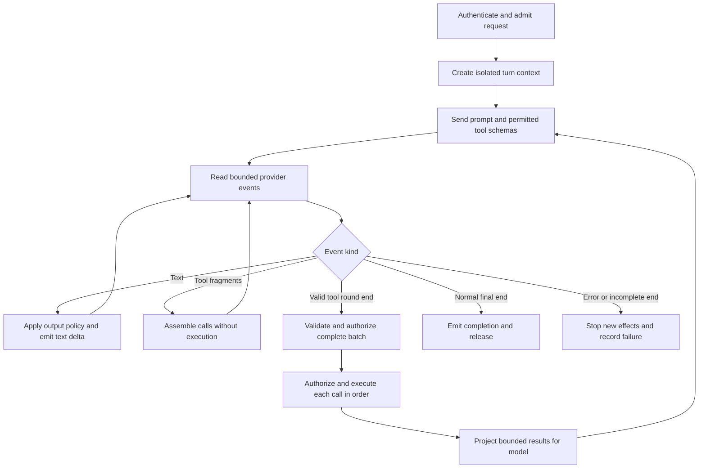

# Custom LLM Agent Handlers - Specification

## Summary

Let an application expose a custom LLM agent through a ZTTP handler. A client
submits a prompt and receives incremental response events. The model can request
only the tools published by that handler. ZTTP validates each request and executes
only a statically bound operation backed by approved built-in modules.

This is a proposed enhancement, not a description of shipped behavior. The user
requirements are streaming responses, ZTTP modules as the only tool authority, and
rejection of all other execution requests. The contracts below specify the
proposed first release. They do not authorize implementation or change the
project's release roadmap.

---

## Goal Capsule

An application developer can serve a useful agent whose external actions stay
within an explicit, reviewable set of permissions. A client can observe progress,
receive partial text, and distinguish completion from interruption or failure.

The model proposes actions. The deployed handler and runtime own execution
authority. A tool catalog, model instruction, or schema alone is not permission.
The trusted boundary includes the accepted application, compiler and checker,
native modules, deployment operator, and authentication system. Model output,
client input, and remote tool content are untrusted data.

The work is complete only when both provider input and client output stream
incrementally through the ordinary handler path. A buffered agent is an internal
delivery milestone, not completion of this enhancement.

---

## Current Baseline

Source inspection against local `main` at `2d57147b` establishes these constraints.
No runtime measurements or new test results are claimed here.

| Existing surface | Consequence for this enhancement |
| --- | --- |
| `packages/runtime/src/http_types.zig`, `HttpResponse` | A response owns one complete byte slice. It has no stream producer. |
| `packages/runtime/src/server_response.zig`, `buildDynamicResponseHeader` | Ordinary responses use the complete body length for framing. An SSE content type alone cannot produce streaming. |
| `packages/runtime/src/runtime_http.zig`, `readResponseBody` and `fetchSyncResult` | Outbound fetch reads the entire body before constructing a JS response. |
| `packages/runtime/src/studio.zig` and the Studio branch in `server.zig` | Studio has a separate SSE socket path. It is not a public handler stream API. |
| `packages/runtime/src/runtime_pool.zig`, borrowed response handles | Response lifetime retains an isolated runtime. A stream needs an explicit ownership and capacity contract. |
| `packages/zts/src/builtin_modules.zig` | Built-in bindings and module metadata exist. The combined registry also contains extensions, so it cannot define the agent allowlist unchanged. |
| `packages/zts/src/handler_policy.zig`, `RuntimePolicy` | Environment, egress, cache, and SQL restrictions exist. Disabled allowlists can permit access; the agent profile must require active restrictions. |
| `scripts/check-runtime-purity.sh` | The runtime template and analyzer must not link the development agent or its provider clients. |

The language does not expose general JavaScript async execution. This feature
must fit the admitted language and native callback model. It must not silently
depend on promises, `async` functions, or browser `ReadableStream` support.

---

## Product Contract

### Scope

The first release supports one authenticated HTTP request per agent turn,
incremental text, sequential tool execution, and a final success or failure event.
The application owns its prompt, provider adapter, model selection, and selected
tool catalog. Deployment configuration bounds each of these choices.
Client prompt ingress remains a complete bounded JSON body. Streaming in this
release means provider-to-handler input and handler-to-client output.

Persistent conversation storage, automatic reconnection, crash recovery, parallel
tool execution, background jobs, model-generated programs, dynamic tool loading,
third-party tool servers, and provider-hosted tools are deferred. Existing
ordinary handlers retain their current behavior.

The reference application starts with read-only tools. Mutating tools are allowed
by the contract only when their authorization and retry behavior are explicit.
There is no general approval workflow in the first release. An operation that
needs additional approval is unavailable unless the application already has a
trusted way to establish that approval.

### Requirements

#### Request and response

R1. An agent endpoint accepts a bounded JSON prompt request through POST. The
application chooses the route and authenticates the request before any model call.
The version 1 body has exactly `version: 1` and a non-empty `prompt` string.
It accepts no client-supplied tool transcript, model name, provider URL, or grants.

R2. Each request uses a server-created turn identity and trusted invocation
context. Client or model fields cannot set the principal, tenant, policy, or budget.

R3. The response uses versioned SSE events over the POST response. Clients consume
the response stream directly; browser EventSource reconnection is not required.

R4. Text must reach the client before the provider finishes the response. Tool
arguments remain private until fully assembled and validated.

R5. Every accepted stream has one logical terminal outcome. A disconnected client
may miss that event, so the server also records the outcome.

#### Tool identity and dispatch

R6. Each deployed agent has a finite tool catalog fixed at build time. Each public
tool name binds to a reviewed wrapper whose effectful calls reach only the selected
built-in ZTTP exports.

R7. One canonical catalog produces the model tool definitions and dispatch
bindings. Descriptions, argument schemas, result schemas, operation identities,
and resource constraints belong to that catalog.

R8. The runtime rejects unknown tools, duplicate call identities, invalid JSON,
duplicate object keys, unknown fields, and arguments outside the declared schema.
It must not coerce malformed arguments into an executable request.

R9. Tools execute only after the provider has completed a valid tool-call round.
All calls in that round pass structural validation and authorization before the
first call starts.
Authorization and remaining budgets are checked again before each execution.

R10. No model output can select source code, a module import, a native symbol, a
shell command, or an arbitrary callable. A generic evaluation or registry lookup
tool is outside the supported profile.

#### Permissions and information flow

R11. A tool call must satisfy the catalog grant, accepted Handler Contract,
installed runtime policy, residual resource guards, and current user scope.
Missing policy or missing identity denies execution.

R12. Tool wrappers bind resource scope from trusted context where possible. A
schema-valid identifier is still subject to authorization for the named resource.

R13. Provider credentials remain outside prompts, tool results, client events,
and ordinary logs. Model tools cannot read credentials or change provider endpoints.

R14. Data sent to the model, client, or another service must pass the application
release policy for that recipient. Successful schema validation does not remove
secret labels or authorize disclosure.

R15. Prompts, conversation text, and tool results cannot grant permissions.
Instructions found in external content remain data even when the model follows them.

#### Limits and failure

R16. Deployment requires finite limits for execution, bytes, calls, and concurrent
turns. The server checks the relevant budget before starting another external effect.

R17. Disconnect, deadline expiry, capacity exhaustion, and protocol failure stop
new model requests and tool calls. Cancellation closes active transport and
releases owned resources when the active native operation has stopped.

R18. A completed side effect is not rolled back by stream cancellation. An operation
whose outcome cannot be established is reported as unknown, never as not executed.

R19. No automatic retry may repeat a tool effect. Retries require an operation
contract with downstream idempotency or established absence of the effect.

R20. Streaming capacity must not consume the capacity reserved for ordinary
requests. A saturated agent endpoint rejects admission before contacting a provider.

#### Evidence and compatibility

R21. The accepted artifact binds the tool catalog and all reachable wrappers and
stream callbacks. A mismatched catalog, policy, or executable generation cannot serve.

R22. Reports distinguish static Properties, runtime restrictions, observed events,
and unknown outcomes. No report claims to prove model intent, answer accuracy,
prompt-injection immunity, or exactly-once external execution.

R23. The deployed runtime remains independent of `packages/pi`. Existing buffered
response behavior and existing artifact acceptance checks remain available.

### Example flow

A customer submits a question about an order. The handler establishes the customer
identity and publishes `getOrder(orderId)`. The model requests that tool. The
dispatcher validates the call, and the wrapper checks ownership using the trusted
customer identity. A registered SQL query reads the permitted order. A result
projection returns only fields allowed for the model. The model then streams its
answer. An order owned by another customer produces no order data and no SQL write.

---

## Planning Contract

### KTD1. Keep the custom agent in application code

The reviewed handler owns the bounded model/tool loop. A provider adapter in the
application translates its protocol into normalized text, tool calls, usage, and
terminal outcomes. Native runtime additions provide generic streaming and checked
dispatch primitives. They do not embed provider clients or the development agent.
This preserves R23 and the current runtime-purity boundary.

The first reference application selects one documented provider protocol and
model through deployment configuration. The library contract stays provider
neutral. Additional adapters are not required for the first release. Provider
hosted execution features must be disabled, and unsupported action block types
must fail the adapter. Plain text that resembles a tool call is never dispatchable.

### KTD2. Bind tools statically and advertise a restricted view

A catalog entry contains a unique public name, description, bounded input and
output schemas, static wrapper binding, reachable built-in operation identities,
resource restrictions, and effect/retry classification. It also names which
result fields may go to the model and client. Credentials are not catalog values.

The model receives only names, descriptions, and input schemas for tools permitted
in the current turn. The dispatcher uses the same filtered view. The underlying
catalog is immutable; a model request cannot add a tool. Use an explicit mapping
from public names to checked bindings, not evaluation or dynamic import.

Generate basic type facts from existing module metadata. The developer supplies
resource scope, descriptions, projections, and bounds that metadata cannot infer.
Reject unsupported schema constructs at build time. The admitted schema subset
must define required versus optional fields, nullability, finite numbers, string
length units, collection bounds, nesting bounds, and closed object fields.

Application wrappers can validate and compose approved built-ins. Their complete
call graph participates in ordinary effect and capability analysis. A wrapper
must not gain the union of unrelated tools' grants. Invocation enters a tool-local
scope and restores the outer scope on every exit. Provider transport has a
separate grant unavailable to tool calls.

Identify each built-in operation by module specifier and export name. Reject an
export that cannot enforce the required tool-local scope. Validate the projected
result against its bounded output schema before it reaches the provider. A
projection or validation failure is a tool failure, not an empty successful result.

### KTD3. Add generic streaming without new language syntax

Introduce a response variant with a native-managed stream producer and a generic
incremental outbound HTTP interface. Public API spelling is an implementation
design task; no example in this document is claimed to compile today.

The producer executes admitted handler code after stream admission. It can receive
bounded provider chunks and emit bounded client events through native callbacks.
Callbacks execute serially within the request's isolated runtime. No other thread
may enter that runtime while a callback is active. Native I/O waits must observe
the turn deadline and cancellation token.

The response, producer, tool catalog, callback closures, and outbound handles all
belong to one accepted runtime generation. Retain the runtime and its request
arena until the producer and all native operations have stopped. A callback or
handle cannot survive arena reset. Reload affects new requests; it cannot replace
code or permissions within an active turn.

For the first release, reserve a separate bounded pool and worker capacity for
streaming turns. Mark a handler as stream-capable in its accepted artifact before
request dispatch, so the server selects this capacity before invoking the handler.
All requests to that handler use the streaming pool, including requests that
return buffered admission errors. Pool selection cannot depend on the response
variant discovered after execution. An active stream retains a runtime slot.
This is a stated cost,
not a multiplexing claim. A later scheduler may release resources during waits
only after it preserves the same lifetime and isolation contract. Separate pools
do not claim process or machine isolation.

### KTD4. Define the client protocol independently of the provider

Use an SSE envelope with `version`, `turn_id`, monotonic `sequence`, `type`, and
`data`. Schema version 1 is the initial protocol version. JSON encoding must escape
content so model text cannot inject SSE fields or frames.
Each SSE `event` field equals the envelope type; its `data` field contains the
encoded envelope. Response content type is `text/event-stream`. The turn identifier
does not grant permission to read or resume a turn.

| Event type | Meaning and data |
| --- | --- |
| `turn.started` | Admission succeeded; includes the public protocol version. |
| `text.delta` | Incremental user-facing text. It is provisional until completion. |
| `tool.started` | An authorized call is about to execute; public tool name and server-scoped call identity only. |
| `tool.finished` | Call identity and safe success/failure classification. Raw arguments and results are not included by default. |
| `turn.completed` | The provider completed normally with no unresolved tool calls; includes provider-reported usage when available. |
| `turn.failed` | Tagged error, safe message, and whether any effect outcome is unknown. |

`turn.completed` and `turn.failed` are terminal. Do not send further application
events after either. Heartbeat comments carry no model content and do not extend
the absolute deadline. A broken socket can prevent terminal delivery. EOF without
a terminal event means interrupted delivery to the client, even if the server
later records completion. Never claim that writing an event proves client receipt.

Before headers, malformed requests use 400, authentication failures use 401 or
403, oversized requests use 413, principal quotas use 429, and exhausted server
capacity uses 503. After headers, failures use `turn.failed` if the socket permits.
Do not append a second HTTP response or change the status after headers.

The stream uses correct framing for the supported HTTP transport, disables
response caching and content transformation, and requests proxy buffering be
disabled where supported. No Content-Length is derived from a partial body. Do
not claim compatibility with a proxy until the incremental-delivery test passes.

### KTD5. Separate provider assembly from execution

Provider network chunks are not message boundaries. The adapter must preserve
UTF-8 sequences, SSE framing, and JSON fragments across arbitrary splits. It
requires an explicit provider completion signal and the matching finish reason;
EOF, output truncation, or malformed frames never authorize pending tool calls.
Reject changes to an assembled call's name or identity and any fragment received
after that call or round has closed.

If a round contains valid and invalid calls, execute none. If all calls are
structurally valid and authorized, execute sequentially in provider order. Stop
the remaining batch on an authorization failure, budget failure, cancellation,
unknown outcome, or tool failure. Earlier effects remain committed. The first release terminates
the turn on these failures; it does not ask the model to repair and retry them.

Assign call identity from turn identity, round ordinal, and the provider call ID.
Reject a duplicate provider ID within a round. A local execution record prevents
the same call from running twice within the live turn. It is not a durable dedup
record and supplies no guarantee across process restart or a new client request.

### KTD6. Bound every wait and retained value

Required configuration covers prompt bytes, provider request and response
bytes, SSE frame bytes, tool-call count, argument bytes and nesting, tool-result
bytes, retained transcript bytes, emitted bytes, queued output bytes, model rounds,
absolute turn deadline, I/O idle deadlines, native operation deadlines, and active
turns per principal and per server. Zero must not mean unlimited in the agent profile.
Limit tool calls per round and open outbound connections as well as total calls.

Check encoded sizes before allocating or sending. Count invalid calls and failed
rounds against attempt budgets. Check provider request size after adding tool
schemas and framing. Do not silently truncate tool JSON, drop unresolved calls,
or discard conversation entries to fit a limit. Return a tagged limit failure.

Backpressure propagates from the client writer to provider reads through bounded
queues. If a queue cannot drain within its deadline, cancel the turn. Reserve
space for terminal bookkeeping so a full content buffer cannot prevent cleanup.
An uninterruptible native call is ineligible for the first tool catalog unless it
has a documented finite bound compatible with the turn deadline. Cancellation
must not free memory still in use by that call.

Provider token limits are requested when supported. Record reported usage as
reported usage. Byte, call, and time ceilings do not prove an exact monetary cost.
Concrete defaults, throughput, memory use, and latency targets need measurement.
The current `cost_bounded` Property concerns module-call multiplicity. It does not
cover native stream parsing, model token consumption, or billed cost. Extend the
analysis before making a broader claim; runtime ceilings remain runtime evidence.

### KTD7. Preserve permissions and proof boundaries at every sink

Use deny-by-default grants for tools and resource names. Bind tenant and principal
outside model arguments. For SQL, keep registered statements and trusted subject
parameters. For HTTP, restrict destination, method, path, headers, body, redirect
behavior, and resolved address scope. A permitted host alone is insufficient.
Bind provider credentials through deployment-owned secret references. Generic
native egress resolves and injects the credential only after authorizing the exact
request. Redirects must not forward it to another destination. This credential
binding is part of U3, not an assumed property of the existing fetch interface.

Tool results are disclosure to the provider. Client text is also a disclosure
sink. Only data already authorized for those recipients enters model context.
Do not rely on a model to redact secrets after it sees them. Output projections
and schema validation retain provenance; they do not automatically declassify.

Streaming introduces irreversible output: bytes already sent cannot be recalled.
Any policy that requires the complete answer must buffer that answer or refuse
streaming for that endpoint. Do not advertise token streaming with a whole-answer
policy that can only run after disclosure.

The compiler and acceptance path must cover deferred producers and static tool
wrappers. Unknown effects or unmodelled callbacks cannot acquire a PROVEN Property.
Runtime observations can establish that a particular call was denied or completed;
they do not promote a static Property. Existing attestation headers identify the
accepted artifact, not the truth of the generated answer or completion of a turn.

The existing `fault_covered` check uses HTTP status. A post-header stream failure
can occur after HTTP 200, so a stream cannot acquire that existing global Property
merely by emitting `turn.failed`. Keep admission fault coverage separate from
deferred producer failure handling. The stream contract requires every deferred
critical failure to reach one recorded failure or disconnect outcome, with no
later effect or event. Any new static claim for that contract needs its own
analysis and acceptance support; event tests alone do not establish it.

Likewise, constructing a stream response does not prove eventual completion.
Do not derive a whole-stream `response_total` claim from admission returning a
handle. Before release, define the stream proof profile and disclose unsupported
Properties. A consumer that requires one of those Properties rejects the artifact;
the runtime must not waive it to enable streaming.

### KTD8. Make interruption and audit outcomes explicit

Expected application failures use tagged Result values. Native Zig code continues
to use error unions at engine boundaries. The public tags include
`invalid_request`, `unauthorized`, `capacity_exhausted`, `unknown_tool`,
`invalid_arguments`, `tool_denied`, `tool_failed`, `provider_failed`,
`provider_protocol_error`, `budget_exhausted`, `deadline_exceeded`, `cancelled`,
and `outcome_unknown`. Stable tags are separate from diagnostic text.

Before a tool effect, record turn/call identity, catalog and policy identity,
operation, and authorization decision. Afterwards record completion, failure, or
unknown outcome. Logs contain bounded metadata by default, not raw prompts,
credentials, arguments, or results. If required audit recording is unavailable,
stop before the next effect. Do not claim that a post-effect recording failure
means the effect did not happen. Durable audit retention is a deployment concern;
the first release does not promise recovery of an interrupted agent loop.

Add a bounded turn recorder with explicit recording success or failure. A request
completion trace or a best-effort logger cannot supply this contract by itself.
Deployment must configure a supported record sink. Reserve terminal record space
at admission, stop effects on sink failure, and surface sink health separately.
Acknowledgement means the sink accepted the complete record under its declared
retention contract, not that an unchecked log call returned. If deployment requires
durability before effects, acknowledgement must include durable storage completion.
Process loss can still lose pending records unless the configured sink confirms
durable storage; neither process loss nor sink failure establishes non-execution.

---

## Delivery Units

These units define the implementation sequence. They are not permission to begin
coding. Proposed new file names can change when the public API is resolved. Open
prerequisites below must be resolved before the dependent units can be executed.
Acceptance coverage names the final behavior each unit contributes to; full
end-to-end checks run after their dependencies exist.

| Unit | Scope and dependencies | Source and test locations | Acceptance coverage |
| --- | --- | --- | --- |
| U1. Catalog and invocation contract | Establish KTD2, schema subset, tool-local grants, artifact identity, and public errors. No dependency. | `packages/zts/src/builtin_modules.zig`, `packages/zts/src/module_binding/`, `packages/zts/src/handler_policy.zig`, and proposed `packages/runtime/src/tool_dispatch.zig`; tests beside these modules. | AE2, AE3, AE4, AE10, AE11 |
| U2. Response stream ownership | Add response variant, static admission classification, producer lifecycle, capacity limits, framing, cancellation, and the KTD8 turn recorder. No dependency on provider code. | `packages/runtime/src/http_types.zig`, `packages/runtime/src/server_response.zig`, `packages/runtime/src/server.zig`, `packages/runtime/src/runtime_pool.zig`, `packages/runtime/src/engine_adapter.zig`, proposed `packages/runtime/src/turn_recorder.zig`; public integration tests in `packages/runtime/src/zruntime_tests.zig`. | AE7, AE8, AE12, AE13; a deterministic producer also proves client delivery before producer completion. |
| U3. Incremental outbound transport | Add bounded chunk delivery, deadlines, and deployment-owned credential resolution/injection after exact-request authorization. Enforce redirect credential restrictions. Depends on U2 lifecycle contract. | `packages/runtime/src/runtime_http.zig`, `packages/runtime/src/fetch_deadline.zig`, `packages/modules/src/net/fetch.zig`, its module spec, and adjacent tests. | AE1, AE5, AE7, AE9, AE17 |
| U4. Buffered reference agent | Connect U1 to a reviewed application adapter and bounded loop; preserve the pi boundary. This is a test milestone. | New `examples/agent-handler/` source and configuration; parser behavior exercised through `packages/runtime/src/zruntime_tests.zig` with an in-memory or loopback provider. | AE2 through AE6, AE9, AE10 |
| U5. Streamed reference agent and evidence | Connect U2/U3/U4, cover deferred code in contracts and artifact acceptance, then document the complete feature. | Handler/compiler verification and contract paths under `packages/zts/src/`; acceptance paths under `packages/proof-checker/src/` and `packages/runtime/src/`; `docs/user-guide.md`, `docs/internals/architecture.md`, `docs/performance.md`, `docs/internals/testing.md`. | All examples below, with real handler and socket paths |

Do not expose a release tool catalog until U1's acceptance and dispatch checks
work together. Do not ship the new response variant until its deferred code is
covered by the existing acceptance boundary. The example application must compile
under the admitted language, without adding general async syntax.

---

## Verification Contract

Use public handler, socket, and module APIs. Test doubles must be simple stores or
deterministic provider peers. Real paid model calls are not CI requirements.
Native unit tests live beside their code and run in under a second individually.
Integration timing uses handshakes rather than guessed sleep intervals.

| Example | Input and expected behavior |
| --- | --- |
| AE1. Actual streaming | A provider sends text and waits for a test signal before finishing. The client receives a text event before releasing that signal. The complete path uses an ordinary handler. Covers R3/R4. |
| AE2. Closed dispatch | Request an unknown name, an extension-only export, an evaluation operation, and an unadvertised built-in. Each is refused with zero tool effects. Covers R6-R10. |
| AE3. Resource scope | Request another tenant's order with a valid ID. Access is denied; no other tenant data reaches the model, client, or logs. Missing policy also denies. Covers R11/R12. |
| AE4. No secret laundering | Pass a labelled secret directly and through validation, projection, serialization, and a helper wrapper. Both disclosure paths remain refused. Covers R13/R14/R22. |
| AE5. Complete arguments | Split UTF-8, SSE delimiters, and argument JSON at different byte positions. Execute only after valid completion. A truncated or mixed valid/invalid round executes nothing. Covers R8/R9. |
| AE6. At most one live-call execution | Deliver duplicate IDs and duplicate completion signals. No repeated effect occurs. A disconnect after a write and before its response produces an unknown outcome without retry. Covers R18/R19. |
| AE7. Cancellation | Disconnect before a tool starts, during provider reads, during a native call, and during client writes. Start no new effect; release resources only after active work stops. Covers R17. |
| AE8. Capacity and slow clients | Route a stream-capable artifact directly to reserved stream capacity, including authentication failures. Fill its admission and output queues. Extra agent requests are rejected and ordinary requests retain reserved capacity. Memory stays within configured bounds. Covers R16/R20. |
| AE9. Provider failure | Send malformed frames, unsupported action types, excessive bodies, usage without completion, and a truncated tool response. Each yields a tagged failure with no pending calls executed. Covers R9/R16/R22. |
| AE10. Budget and batch order | Exhaust a configured boundary before the next request or tool. No next effect occurs. A failure in a sequential batch stops later calls and preserves earlier effects. Covers R16/R18. |
| AE11. Artifact and scope binding | Alter a schema, wrapper, grant, or catalog after acceptance; serving is refused. Enter one tool and attempt another tool's grant; access is refused. Covers R11/R21. |
| AE12. Lifecycle and compatibility | Reload during a stream, reuse a slot after failure, and send normal buffered/HEAD responses. The old stream keeps its generation; no context leaks; existing response semantics remain correct. Covers R21/R23. |
| AE13. Evidence failure | Fail audit recording before and after a tool effect. The first starts no effect; the second never reports not-executed. No raw credential appears in emitted diagnostics. Covers R13/R18/R22. |
| AE14. Output integrity | Inject newlines and fake SSE delimiters in model text. They remain JSON data. Exactly one logical terminal outcome is recorded and no later application event is emitted. Covers R3/R5. |
| AE15. Untrusted instructions | Put requests to read credentials, change tenant, add a tool, or send data to a new URL in the prompt and tool content. Forced model calls still meet the same denial checks; no instruction changes a grant. Covers R10-R15. |
| AE16. Post-header proof limits | Trigger a critical validation or tool failure after HTTP 200. Record and emit the terminal failure when possible, perform no later effect, and do not claim existing global `fault_covered` or whole-stream `response_total` from admission alone. A consumer requiring an unsupported Property refuses activation. Covers R5/R21/R22. |
| AE17. Provider credentials | Inject a configured credential into an authorized provider request. Refuse a model-selected destination, disallowed path, missing secret binding, and redirect to another destination. No credential reaches tool code, events, or logs. Covers R11/R13/R14. |

Run the affected module, ZTS, server, SDK, and proof-checker suites. Run the
standalone `test-zruntime` step for full handler integration. Preserve
`test-runtime-purity`, `test-module-boundary`, `test-capability-audit`,
`test-module-governance`, `test-proof-swallow`, and affected contract/acceptance
gates. Add a reachable defect seed or justified allowance for each new advertised
rule. A new gate must fail when its corpus is removed or no relevant test runs.

Start performance work with a sub-minute deterministic end-to-end run. Confirm
stream delivery, one tool call, final completion, and cleanup before scaling.
Then vary concurrency only, keeping the workload and limits fixed. Measure first
event latency, total turn time, peak memory, retained runtimes, open sockets,
cancellation completion, and the effect on ordinary requests. Choose deployment
defaults from those measurements. No performance target is asserted here.

---

## Open Implementation Decisions

The following are explicit design tasks before dependent implementation units.
They do not prevent review of this specification.

| Decision | Required resolution |
| --- | --- |
| Public stream and catalog API | Before U1/U2, define admitted callback shapes, ownership, Result signatures, schema subset, and compiler recognition. Demonstrate a compile-pass handler and compile-fail misuse cases. |
| Artifact encoding | Before releasing U1/U5, determine how catalog identity and deferred callback reachability enter the existing contract and acceptance graph. Version any changed wire format; unknown formats fail closed. |
| Stream proof profile | Before U5 release, define admission versus producer claims, failure coverage, completion, native work bounds, and the consumer policy that accepts the disclosed evidence. |
| First provider adapter | Before U4, select one provider protocol and verify its current streaming and tool-call completion semantics against official documentation. Do not infer behavior from a provider-compatible label. |
| Deployment limits | Before release, use the prescribed measurements to set finite defaults and supported concurrency. |
| Authentication integration | Before deploying the reference application, select the trusted identity source and demonstrate tenant-scoped authorization. No anonymous production default is specified. |

The proposed dedicated stream pool trades resource use for a simpler lifetime
contract. If measurements show that this cannot meet the intended workload,
revise the ownership design before release rather than claim unsupported capacity.

---

## Definition of Done

The reference application streams through the public handler path, executes only
its declared module-backed tools, and passes every applicable acceptance example.
Its catalog and deferred code pass artifact acceptance. The example explains
credentials, authorization, limits, interruption, and measured deployment capacity.
Buffered handlers retain their existing behavior, and the runtime-purity gate
remains active. No guarantee exceeds the evidence described in R22.

---

## Sources and Design Constraints

Repository paths in this document are relative to the repository root. Current
architecture is described in `docs/internals/architecture.md`; verification gates
are mapped in `docs/internals/testing.md`. `STRATEGY.md` and `CONCEPTS.md` define
the distinction between the development agent, a Handler, its Contract, and a
Property. This enhancement is an application capability, not a replacement for
the development agent.

The prior failure in
`docs/solutions/security-issues/validate-json-strips-the-label-it-was-asked-to-check.md`
requires explicit tests that validation cannot grant disclosure authority. The
failure in
`docs/solutions/conventions/a-gate-that-counts-nothing-still-reports-a-pass.md`
requires non-empty verification inputs.

Tool scoping and independent authorization follow
[OWASP Excessive Agency guidance](https://genai.owasp.org/llmrisk/llm062025-excessive-agency/).
The [OWASP AI Agent Security guidance](https://cheatsheetseries.owasp.org/cheatsheets/AI_Agent_Security_Cheat_Sheet.html)
supports explicit budgets, result handling, and action records. These sources
inform the requirements; they do not establish that ZTTP already implements them.
