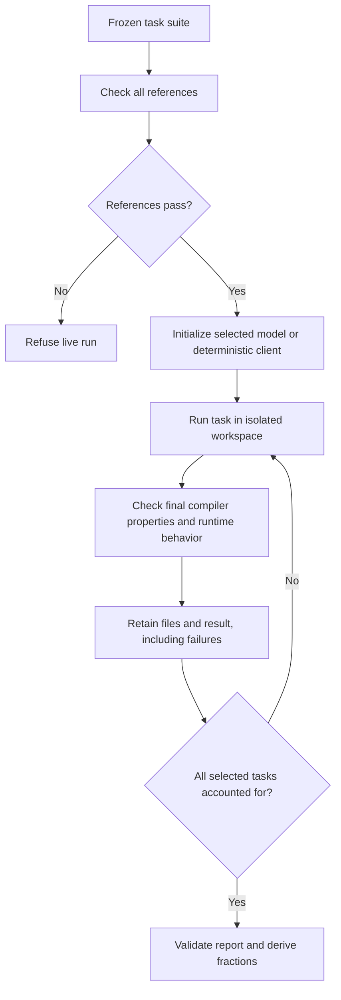

# M3: measure bounded provable-set reach

## Goal Capsule

Objective: report how many previously unused, demonstrably solvable tasks the product's default agent completes correctly within a fixed budget.
Means: a separate reference-backed task suite, the production agent loop, and a failure-inclusive report (KTD1).
Authority: the user's M3 selection and DeepSeek-only decision, then this plan and repository rules.
The main agent owns review, verification, and local commits on `main`; do not push.
Implement and verify the offline path first.
Live model runs require a concrete run proposal and separate cost approval.
Ask before a script that exceeds two minutes, as required by the session's AGENTS instructions.

---

## Product Contract

### Summary

Add a bounded reach measurement with reference solutions, executable acceptance checks, fixed task membership, and retained per-task evidence.
Report whole-handler and typed-hole results separately.

### Problem Frame

`STRATEGY.md` identifies provable-set reach as unmeasured.
The existing 19-case corpus reports recorded draft quality and runtime intent, but it has no reference solution for each task.
A past fixed seed became impossible after a correct checker change and appeared as a model failure.
Reference admission must detect that condition before a live run.

### Key Decisions

Use the current product default only (session-settled: user-directed - chosen over a provider comparison to bound the first measurement).
Governs R1.

### Requirements

| ID | Required behavior |
|---|---|
| R1 | Live runs use the repository's current DeepSeek default model and record its exact model ID and request policy. A default change invalidates the selected run configuration. |
| R2 | Each task has a prompt, input mode, initial files, required proof properties, a reference solution, and non-empty runtime acceptance checks. Both reference and candidate must satisfy the same absolute compiler and runtime checks. |
| R3 | Freeze task membership and input, reference, acceptance, and compiler identities before a model run. Reference programs and acceptance files are absent from the model workspace and tool responses. |
| R4 | Reach is the count of fresh candidates that satisfy R2 within the fixed budget divided by every selected task. Retain no-edit, proof, intent, budget, provider, and harness failures. No retry or omission may replace a failed sample. |
| R5 | Distinguish fresh-model, deterministic-harness, and replay evidence. Only a complete fresh run over the frozen suite can publish the full-suite reach fraction. Report mode subtotals as well. |
| R6 | Retain source revision, task and reference hashes, compiler policy, model request identity, budgets, generated files, runtime-check output, and per-case results. A partial or interrupted run is explicitly incomplete. |
| R7 | Validate the complete pipeline on one deterministic task in under a minute before increasing the task count. Change only the selected count when scaling that check. Live pilot and full runs need explicit authorization. |

### Scope Boundaries

The initial design has four task families, each exercised in whole-handler and typed-hole mode: eight task instances.
This is a design limit, not a statistical sample-size claim.
Choose small deterministic request/response families that are absent from the recorded corpus; preserve exact task behavior across modes.
The selected families are request-header classification, optional query combination, bounded uppercase previews, and a seeded label-normalization helper.
An initial reference check showed that `zttp test` substitutes replay values for the proposed HTTP, text, and time module calls.
The admitted design therefore uses built-in request and string operations, with a local helper for the fourth family.
This change precedes suite freezing and leaves runtime behavior unchanged.
Exact fixture values are established by reference admission before the suite is frozen.
Hold them out from the shipped persona, examples, skills, and stand-in playbooks.
Describe this as a repository holdout, with no claim about provider training data.
After inspection or use for tuning, retain its version as regression evidence and require a new suite for a new holdout claim.

Do not change model defaults, compiler rules, the existing convergence corpus, qualification floors, or product behavior.
Provider comparisons and a wider task population are later decisions.
M2's outstanding full local verification remains separate.

---

## Planning Contract

### Key Technical Decisions

KTD1. Keep a separate Zig reach runner and report contract.
Reuse production loop, checker, runtime-intent, capture, and identity APIs where their contracts fit.
Do not reuse the qualification assessor: it hard-codes 19 cases and promotion thresholds, whereas model failures are valid measurement outcomes here.

KTD2. Admit references with the public precompile checker and the real `zttp test` path before provider initialization.
Require zero total errors, a handler contract, and all named task properties.
Use the same check for final candidates; an applied edit alone does not prove absolute correctness.
Reject invalid fixtures as harness failures before live spending.

KTD3. Preserve the existing production limits: 18 model round trips, 16 tool calls, and five verification attempts per task.
Use the existing DeepSeek recording ceiling of 600,000 milliseconds per task.
Record the actual request token policy from the initialized provider; do not invent a dollar estimate.
The deterministic smoke uses these same limits.
The live-run proposal must name the task count and measured pilot usage before a larger run is authorized.

KTD4. Write evidence directly as typed Zig JSON, with a report after each completed case and a final completeness check.
Do not introduce or extend a Python extractor.
Failure rows remain present even when no replayable cassette exists.
Store each run in a new output directory and refuse overwrites.

### High-Level Technical Design

### Source Evidence

`packages/pi/src/expert_codegen_record.zig` owns the existing fixed corpus, live recorder, and failure capture.
`packages/pi/src/expert_codegen_eval.zig` exposes runtime intent checks with captured output.
`packages/pi/src/expert_evidence_identity.zig` provides content and evaluation identities.
`packages/pi/src/expert_qualification.zig` shows the failure-inclusive report pattern.
`packages/pi/src/loop.zig` owns loop limits and the production write path.
`packages/tools/src/precompile.zig` exposes the full checker.
The design follows `docs/solutions/logic-errors/a-stale-cassette-is-loud-and-an-unsatisfiable-seed-is-silent.md` and the gate rules in `AGENTS.md`.

---

## Implementation Units

### U1. Frozen tasks and reference admission

Goal: establish that every selected task is possible and that its acceptance checks distinguish correct behavior from a trivial green handler.
Requirements: R2, R3, R7.
Dependencies: none.
Files: new `packages/pi/src/expert_reach_corpus.zig` with adjacent tests; shared reach types if required.
Approach: define the four task families and paired input modes, with explicit proof requirements and exact runtime assertions.
Validate all reference programs before freezing identities.
Keep task data independent from the existing corpus.

Test scenarios:

- Each reference passes all named properties and every exact runtime assertion.
- The typed-hole seed is incomplete; inserting the reference solution gives the same task behavior as whole-handler mode.
- A constant-success response fails each family's acceptance checks.
- Empty acceptance input, duplicate task IDs, or missing reference data prevents admission.

Verification: unfiltered reference tests pass, and deliberate wrong responses fail for the expected acceptance check.

### U2. Report validation and reach counts

Goal: make the denominator and evidence origin explicit and testable.
Requirements: R3, R4, R5, R6.
Dependencies: U1's task contract; report logic can be authored independently.
Files: new `packages/pi/src/expert_reach_report.zig`, with adjacent tests.
Approach: use closed result and evidence-origin types, validate exact task membership and identities, and derive counts from result rows.
Represent tasks not yet attempted explicitly in checkpoint reports.

Test scenarios:

- A mixed success/failure run retains every task and gives the exact expected numerator and denominator.
- Duplicate, omitted, unknown, or mismatched task identities reject a complete report.
- Replay, deterministic runs, and partial pilots cannot claim a full fresh reach result.
- A success with missing proof, runtime, or artifact evidence is refused.
- Enumerate every failure variant and observe that it remains in the denominator.

Verification: unfiltered report tests pass and deliberate denominator/evidence mutations fail.

### U3. Runner and offline pipeline

Goal: run the selected tasks through the production authoring path and retain reviewable results.
Requirements: R1 through R7.
Dependencies: U1, U2.
Files: new `packages/pi/src/expert_reach.zig` and `expert_reach_main.zig`; `build.zig`; `packages/pi/src/tests.zig`; narrow shared helper changes only if needed.
Approach: expose explicit reference-check, deterministic-smoke, and gated live modes through a repository-only Zig command.
Use isolated task workspaces and the same final evaluator for references and candidates.
Preserve failure artifacts before workspace cleanup, and checkpoint all result rows.
Live mode requires a clean known source revision, the fixed DeepSeek selection, explicit output directory, and confirmation flag.

Test scenarios:

- One deterministic task traverses authoring, proof, runtime checks, and report validation.
- The full deterministic suite changes only task count and retains every result.
- A model error, no edit, wrong response, and exhausted budget produce typed failure rows.
- Reference or acceptance files are absent from model-visible files.
- A missing live confirmation, dirty source, conflicting provider override, or existing output directory fails before a model call.

Verification: measured smoke completes in under one minute; all eight offline task instances pass; unfiltered affected suites and module-boundary checks pass.

### U4. Run guide and measurement handoff

Goal: make the live run concrete and keep the published claims within the evidence.
Requirements: R1, R4 through R7.
Dependencies: U3.
Files: new `docs/provable-reach.md`; `docs/roadmap.md`; `docs/plans/README.md`; `CONCEPTS.md`; `docs/internals/testing.md`; `STRATEGY.md` only when its state claim changes.
Approach: document the exact suite, limits, report locations, holdout boundary, and commands.
Prepare a one-task live pilot proposal; disclose that the actual cost needs measurement.
After approval, retain its usage and failure evidence before proposing the full suite.

Verification: links and documentation gates pass; no offline result is published as model reach.

---

## Verification Contract

Run unfiltered `zig build test-provable-reach` and `zig build test-expert-app` after integration.
Run `zig build test-module-boundary test-docs-drift test-doc-links` for the touched boundaries and documentation.
Run `zig fmt --check` on changed Zig files.
Read build exit codes directly and keep logs outside the tracked tree.
Run a one-task deterministic smoke before the full suite, with the same limits and runtime evaluator.
Observe rejection after deliberate fixture, denominator, and evidence-origin mutations, then restore the files and rerun the affected gate.
If a required check exceeds two minutes, request approval before continuing it.

---

## Definition of Done

The offline implementation is complete when all admitted references pass, the deterministic pipeline works, adversarial report checks reject false claims, affected gates pass, and the run guide names an executable live command.
Each complete unit receives a separate reviewed local commit.
Remove experimental code and temporary fixtures before committing.

M3 itself is complete only after an authorized full fresh run has a retained report covering every task and failure under the frozen identities and budgets.
A low reach result is a valid measurement; an incomplete or invalid report is not.
The user approved the pilot and full live commands in separate handoffs.

## Implementation record

The offline implementation is complete. It used no paid model requests.
The run guide is [docs/provable-reach.md](../provable-reach.md).
M3 is complete with the authorized full fresh measurement recorded below.
Local implementation commits are `eb136afd` for U2, `1796ecd5` for U1, and `c6393566` for U3.

All eight references pass the absolute compiler, named-property, and runtime checks.
All four typed-hole seeds compile but fail acceptance until completed.
A seed with a hole only on an untested branch is refused because it already satisfies acceptance.
Constant-success handlers fail every family's runtime checks.
The paired-mode gate rejects reference, acceptance, or property drift.

The final one-task deterministic smoke completed in 11.63 seconds, including compilation.
The eight-task run completed in 1.76 seconds with cached build products and the same limits.
It retained eight reached outcomes: four whole-handler and four typed-hole tasks.
Both reports have `deterministic_harness` origin and a null headline.
These are harness checks, not model measurements.
Local evidence is retained in `/tmp/zttp-m3-final-one-20260921/` and `/tmp/zttp-m3-final-eight-20260921/`.

Report mutation probes compiled and failed their tests when the headline accepted offline evidence or when its denominator counted only successes.
The restored report passes its unfiltered tests.
Runner regressions cover no edit, wrong intent, provider failure, exhausted budgets, veto exhaustion over a green hole seed, frozen-helper changes, extra source retention, and artifact-write failure after a completed turn.
The last case retains the observed work counts even when the transcript cannot be written.

Final verification passed without test filters: `test-provable-reach` ran 928 tests; `test-expert-app` passed 1,116 tests with one existing skip.
`test-module-boundary`, `test-docs-drift`, `test-doc-links`, Zig formatting, and diff whitespace checks passed.
The full repository verification script was not run; M2's separate approval remains pending.

Independent Sol review and a main-agent line-by-line review identified and closed request-policy drift, session state shared between tasks, omitted generated source, and lost failure counts.
The cleanup pass reused existing path and substring helpers, removed redundant progress state, made build dependencies explicit, and released task scratch memory between cases.
The review left bounded duplicate hashing and failure-recovery I/O unchanged; a performance change needs measured evidence.
Shared production APIs were not widened solely to remove small private wrappers.

Code review: skipped (ce-code-review unavailable). Its required Python scope and stage-log helpers conflict with the repository's no-Python rule. The independent reviews and main-agent verification above are separate evidence, not a completed CE review receipt.

The user approved the one-task live pilot after the offline implementation.
Run `reach-live-1790001297-82545` completed at clean revision `d460a68ab5efe78f845400b416b64d78c3461a9c` with one reached result, three model round trips, four tool calls, and one verification attempt in 19,561 ms.
The provider reported 34,231 input tokens and 3,850 output tokens. No billed dollar amount was returned.
The [run guide](../provable-reach.md#first-live-pilot) records the acceptance checks, raw cache usage, local evidence location, and the next command.
The user then separately approved the full eight-task live run.

## Completion record

Run `reach-live-1790002155-86713` completed on 2026-09-21 at clean revision `d5209b09fd08c8c27956d8afcfc5ced16bf13375`.
The full fresh report records 8/8 reached: whole-handler 4/4 and typed-hole 4/4.
Every selected task is present, every required property passed, and runtime acceptance passed 36/36 checks.
The source remained unchanged during the run. Task, compiler, model, and budget identities matched the approved configuration.
Independent Sol review and the main agent checked the retained evidence.

The command took 167.68 seconds. Raw usage across 46 provider exchanges was 697,398 input tokens and 29,856 output tokens.
Those totals include one context-compaction call omitted by the normalized turn summaries.
No exact billed dollar amount was returned.
No case was replaced, and no agent behavior or task acceptance was changed after the pilot.

The [measurement record](../provable-reach.md#first-full-measurement) contains each outcome and the evidence location.
The [machine-readable report](../provable-reach.json) retains all eight rows and the frozen identities.
M3 is complete for this bounded suite. M2's full verification remains separate and pending.
